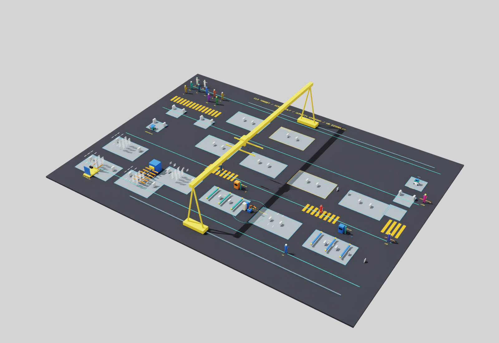
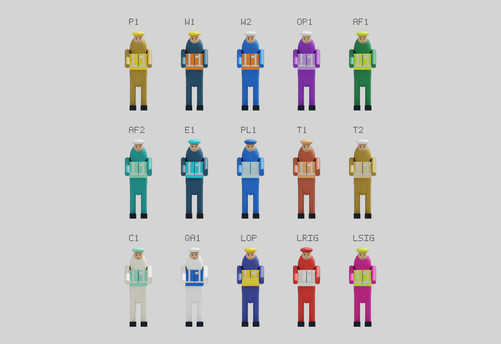

<div align="center">

# Adaptive HRC Scheduling

**面向模块化建筑工厂的人机协作自适应调度研究**

从人员、设备与物料状态出发，联合选择协作模式与作业顺序，
在离散事件和 Isaac Sim 中执行，再用独立审计核对每一次决策。

[](https://github.com/delongwangshu49-hub/adaptive-hrc-scheduling/actions/workflows/ci.yml)
[](pyproject.toml)
[](LICENSE)
[](docs/model/S18_simulation_scope_proposal_r1.md)

[快速开始](#quickstart) · [工作原理](#architecture) · [验证与边界](#validation) · [文档导航](#docs)

</div>



*负责人已通过的 S19A 静态外观实际截图。原几何尺寸和碰撞保持；橘黄色通行条纹采用地面贴图改色。逐项前后对照见[最新图册](docs/validation/S19A_contrast_r2.md)，完整生产闭环证据另见下方验证入口。*



*已通过的人员静态外观；总览排布用于配色展示，实际生产位置和手位保持。*

## 这个项目解决什么问题？

模块化建筑生产的排程同时受到人员技能与疲劳、设备占用、材料到货、运输通道、质量放行和成品接收能力影响。机器人可以执行的工序，不一定在当前状态下适合选择机器人；一个名义可行的计划，也可能因随后发生的故障或通道阻挡而无法派工。

本项目建立可复算的研究闭环：**观察实际状态 → 生成合法计划 → 核验后派工 → 接收执行反馈 → 重排与审计**。研究对象是完整钢结构建筑模块，从结构制造贯通 MEP（机电管线）、内装、质量放行和出厂就绪。

适合研究多资源调度、人机协作模式选择、扰动恢复，以及仿真决策的可追溯性。当前成果属于获批的 **S18-SIM-A1 仿真研究域**；工业工艺、协作安全和实际产能尚未获得验证。

## 已有能力

| 能力 | 实现内容 | 深入阅读 |
| --- | --- | --- |
| 多资源生产模型 | 作业依赖、人员/设备/工装、材料与在制品、空间与通道、成品缓冲及外部接收 | [生产模型](docs/model/specification.md) |
| 状态驱动的调度 | EDD/SPT 等规则、固定合法模式 LNS、仿真域模式与排程联合重排 | [规则基线](docs/algorithms/rule_baselines.md) · [S18](docs/steps/S18.md) |
| 在线预算与回退 | 协作式中止、完整可行候选缓存、版本失效检查、派工前核验与明确 WAIT | [在线策略](docs/algorithms/online_policy.md) |
| 计划稳定性 | 未来承诺保护、未开始动作的顺序/模式/班组变化、名义与实际开始偏差 | [S19](docs/steps/S19.md) |
| 两种执行后端 | Python 离散事件执行；Isaac Sim 的 USD 运动学、障碍与状态读回 | [场景与映射](docs/sim/scene_mapping.md) |
| 独立验证 | 执行轨迹审计、决策因果审计、候选重放、双后端严格比较 | [在线验证](docs/validation/S19_online_r2.md) |
| 简化精确参照 | 与指定简化模型严格匹配的 CP-SAT 参照与完整小规模可行集合核对 | [CP-SAT 映射](docs/algorithms/cpsat_mapping.md) |

人因状态与协作模式用于仿真决策；当前结果没有证明某种方法在一般负载下优于基线，也没有完成正式 A/D 研究实验。

<a id="quickstart"></a>

## 快速开始

**CPU 路径不需要 Isaac Sim 或 GPU。** 使用固定的 Python **3.12.13** 与 uv **0.12.3**；Windows 命令在 PowerShell **7** 中执行。安装工具的详细步骤见[环境说明](docs/setup.md)。

### 1. 安装并检查环境

```powershell
git clone https://github.com/delongwangshu49-hub/adaptive-hrc-scheduling.git
cd adaptive-hrc-scheduling
uv python install 3.12.13
uv sync --locked --link-mode copy
uv run --locked python -m adaptive_hrc_scheduling
```

入口输出安装元数据，例如：

```json
{"package": "adaptive-hrc-scheduling", "python": "3.12.13", "scope": "installation-only", "version": "0.1.0"}
```

默认开发环境包含 Ruff 和用于精确参照的 OR-Tools；基础 wheel 没有运行依赖。包版本 `0.1.0` 与步骤发布标签是不同的版本口径。

### 2. 运行一个在线调度检查点

```powershell
uv run --locked python scripts/verify_production_chain.py --backend light --simulation --products 1 --online-limits-file examples/online/limits.json --online-measure-window-h 1 --output .local/readme-online-light
uv run --locked python scripts/audit_online.py .local/readme-online-light --output .local/readme-online-light/online-audit.json
```

这会在真实事件边界停止，保留状态、决策、在线日志和计时。`1` 是仿真小时阈值，实际停止时刻可能更晚；该检查点不是完整订单完成证明。搜索和决策预算使用仓库内预声明配置，计算时间取决于本机性能。

查看输出目录中的：

| 文件 | 回答的问题 |
| --- | --- |
| `report.json` | 运行何时停止？执行审计和决策审计是否通过？ |
| `online-journal.json` | 何时重排、采用什么计划、为何回退或等待？ |
| `online-timing.json` | 周期耗时、反馈时延与超限情况是什么？ |
| `online-audit.json` | 保存记录的来源绑定与指标复算是否通过？ |

每次运行使用新的输出目录。完整两订单、B+1、非零未来承诺和故障诊断命令见[在线策略与复现入口](docs/algorithms/online_policy.md)；原始大日志留在本地，公开仓库提供配置、机器摘要与审阅记录。

### 3. 运行与 CI 相同的 CPU 检查

```powershell
uv run --locked --no-cache --no-editable --reinstall-package adaptive-hrc-scheduling python scripts/check.py
```

该入口检查锁文件与代码规范，运行全部单元测试，构建分发包，再在独立 wheel 环境重复测试。源码和安装产物分别验证；Isaac 运行不包含在 CPU CI 中。

<details>
<summary><strong>可选：打开 Isaac Sim 工厂场景</strong></summary>

需要已单独配置的 Isaac Sim 环境，`uv sync` 不会安装它。已验证的运行时是指定 RC 构建，版本和限制见[运行验证](docs/validation/runtime.md)与[环境说明](docs/setup.md)。

```powershell
& (Join-Path $env:ISAAC_SIM_ROOT 'python.bat') scripts/view_building_scene.py --output .local/readme-scene-session
```

默认打开暂停的场景检查界面。T1—T4 可检查配送、吊运、人员/推车和 B+1 缓冲；操作方式见[场景试运行指南](docs/sim/S13_trial_guide.md)。该 GUI 与完整生产调度验证入口分别记录，组间 RESET 不构成连续生产历史。

</details>

<a id="architecture"></a>

## 工作原理


调度器只使用已经交付的观察。预算耗尽或没有合法动作时，控制器保留执行事实并返回 WAIT；已发生的装载、资源持有和未来承诺不会因重排而被悄悄清空。Isaac 后端仍可根据实际场景拒绝名义合法的动作，拒绝反馈进入下一轮观察。

审计从保存的事件、决策和候选重建依据。计划摘要、实际开始时刻与执行结果分别绑定，避免把“生成了计划”误计为“成功执行”。

```text
src/adaptive_hrc_scheduling/
├── domain/             # 领域记录
├── contracts/          # 严格输入、序列化与约束
├── algorithms/         # LNS、联合搜索与精确参照
├── planning/           # 规则计划与当前合法性
└── control/            # 执行闭环、在线预算与独立决策审计
scripts/                # 生成、运行、重放与核验入口
sim/                    # Isaac Sim 场景与适配
examples/               # 可公开输入与机器摘要
tests/                  # 契约、算法、执行和审计回归
docs/                   # 模型、方法、验证与步骤记录
```

<a id="validation"></a>

## 验证与已知边界

已发布调度基线为 [`step-S19-r2`](https://github.com/delongwangshu49-hub/adaptive-hrc-scheduling/tree/step-S19-r2)，提交 `5a69646`。该版本在 Ubuntu 和 Windows 的源码/隔离 wheel 环境各通过 **849 项测试**，见[实际 CI](https://github.com/delongwangshu49-hub/adaptive-hrc-scheduling/actions/runs/37934877304)。S19A 静态外观已获验收和发布批准，使用独立标签 `step-S19A-static-r1`；[验收与发布范围](docs/validation/S19A_static_publication_r1.md)明确保留动作与整步验证的未完成项。

| 已保存的验证 | 可支持的结论 |
| --- | --- |
| 同一捕获源码的完整两订单及 B+1 双后端链 | 受测订单全部接收，严格比较与独立执行/因果审计通过，Kit 正常关闭并退出 0 |
| 原 5 s / 50 ms 配置下的在线验证 | 有完整候选和实际派工证据；受测完整生产链的决策周期没有超过 5 s |
| 单列长预算的未来承诺与故障诊断 | 有非零未来承诺、保留比较及实际延迟记录，可与名义计划变化分开检查 |

这些证据的具体输入、源码绑定和历史失败见[S19 合并验证](docs/validation/S19_online_r2.md)。发布后全审发现的三项审计/缓存问题已在受测范围完成修复并随 S19 r2 发布，新增 25 项回归，项目环境与隔离 wheel 各 849 项通过。修复与验证范围见[修复审阅](docs/validation/S19_limited_repair_r2.md)，原审阅见[问题记录](docs/validation/S19_post_release_audit_r1.md)。S19A 外观截图不替代原完整生产链的源码绑定和验证。

- **时限是协作式预算。** 单次 Python 调用不能被强制抢占；50 ms 不是硬实时保证。原 B+1 Kit 最大反馈时延约 5.972 s，不能用决策周期指标替代反馈指标。
- **工业资格仍未建立。** 工业 G2 为 `OPEN / NOT_ESTABLISHED`；仿真中的符号焊接、合成质量和外部接收不构成工业工艺或安全认证。
- **场景有明确抽象。** USD 运动学读回、共用落点和既有 GUI 限制保持；渲染更新不代表实机动力学或真实帧率认证。
- **研究结论保持有限。** 正式方法优势、工业适用性和人因效应尚待后续研究；S19A 静态外观已获验收，动态表现与整步出口尚未完成，S19B、S20—S28 尚未启动。

<a id="docs"></a>

## 文档导航

| 想了解什么 | 从这里开始 |
| --- | --- |
| 研究问题、范围和成功条件 | [研究总纲](docs/PROJECT_CHARTER.md) |
| 产品、工艺和数据依据 | [钢结构规格](docs/model/selected_steel.md) · [证据台账](docs/research/production_evidence.md) |
| 获批仿真假设与工业缺口 | [仿真研究范围](docs/model/S18_simulation_scope_proposal_r1.md) · [G2 证据结论](docs/research/S18_industrial_g2_evidence_r1.md) |
| 算法与在线行为 | [规则](docs/algorithms/rule_baselines.md) · [CP-SAT](docs/algorithms/cpsat_mapping.md) · [在线策略](docs/algorithms/online_policy.md) |
| 当前步骤和后续计划 | [S19A 步骤卡](docs/steps/S19A.md) · [最新外观图审](docs/validation/S19A_contrast_r2.md) · [路线图](docs/roadmap.md) |
| 开发、检查与版本历史 | [开发说明](docs/development.md) · [进度日志](PROGRESS_LOG.md) · [规范化决策记录](PROMPT_LEDGER.md) |

## 贡献与许可

欢迎通过 [Issues](https://github.com/delongwangshu49-hub/adaptive-hrc-scheduling/issues) 报告可复现的问题。请提供步骤标签或提交、最小输入、运行命令、预期与实际行为，以及脱敏后的错误摘要；完整原始日志和机器私有配置不进入公开仓库。

提交改动前阅读[协作规则](AGENTS.md)和[开发说明](docs/development.md)，并运行上述 CPU 检查。研究范围、冻结输入和发布快照由负责人审批；AI 辅助核查、实现和文档工作的记录保留在决策与进度日志中。

自有代码采用 [MIT License](LICENSE)。第三方软件、资产和原件遵循各自许可，具体资产来源见[资产登记](docs/sim/asset_register.tsv)。
