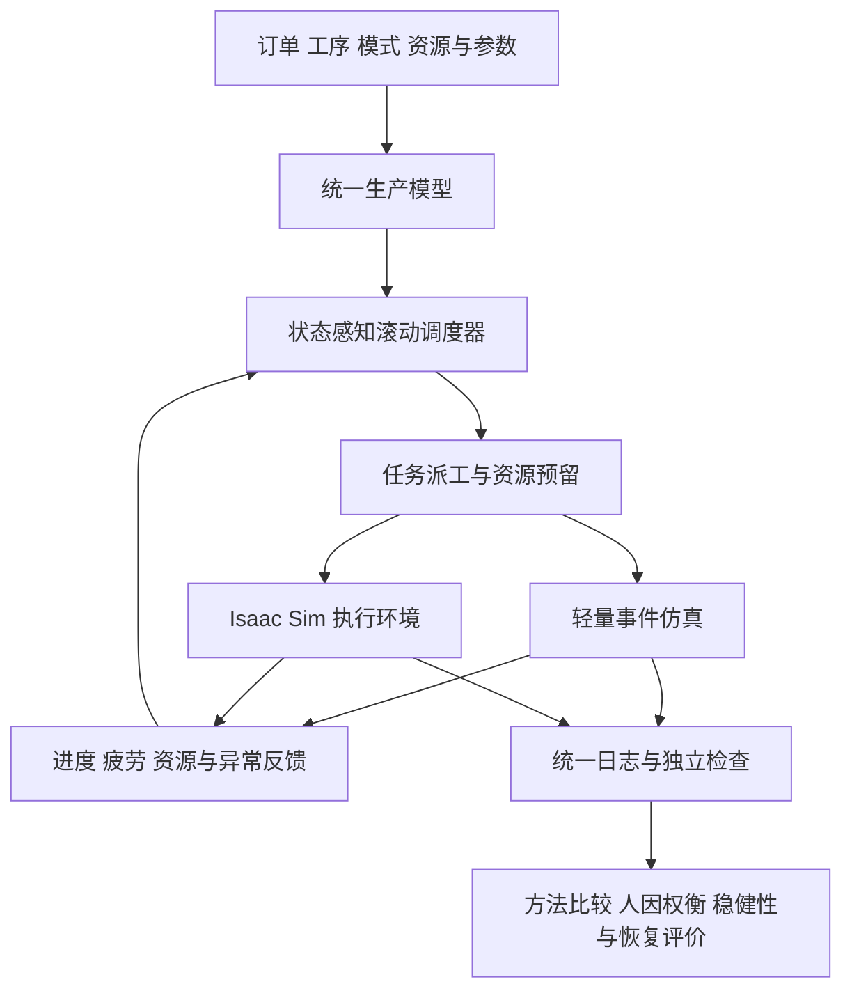

# 模块化建造人机协同生产调度框架

本项目研究人员、机器人、加工设备与吊机共同参与的模块化管道生产调度。系统拟根据工序依赖、资源状态、协作模式与人员疲劳，决定谁在什么时候以何种方式执行任务，并在设备故障或订单变化后更新安排。

核心研究聚焦状态依赖的协作模式选择及其人因权衡：某项工序采用人机协作后更快，是否能改善整条生产线的交付表现？这种收益如何随资源竞争、同步开销和人员负荷变化？

**状态记录（截至 S02 r2 审阅包封存）：研究范围与技术路线 V1.0 已确认，S00 r1/r2 与 S01 r1/r2 均已验收、批准并发布。S02 基础检查与工作流已完成本地验证，待独立人工验收与上传批准；远端 CI 尚未运行。仿真系统、调度算法和实验结果尚未实现或验证。**本文是项目公开总纲，最小可运行内容仅为安装自检。

| 字段 | 内容 |
| --- | --- |
| 文档版本 | 0.4.0 |
| 更新日期 | 2026-10-01 |
| 研究性质 | 基于受控仿真的方法与机制研究 |
| 计划技术栈 | Python、Isaac Sim、OR-Tools CP-SAT |
| 记录 | [项目进度日志](PROGRESS_LOG.md) · [规范化提示词记录](PROMPT_LEDGER.md) |
| 实现与复现入口 | [环境安装与最小自检](docs/setup.md) · [开发检查与 CI](docs/development.md)；无仿真或算法结果 |

## 研究范围

整体成果是一个完整的自适应调度框架。研究组织为一个核心方法、一组人因权衡分析，以及限定的稳健性与恢复表现检验。

| 组成 | 研究职责 | 范围边界 |
| --- | --- | --- |
| 完整框架 | 统一生产模型、资源分配、执行反馈和动态重调度 | 必须贯通人员、机器人、加工设备与吊机 |
| A 核心方法 | 状态依赖的协作模式和任务安排 | 研究局部加工收益与系统表现的关系 |
| D 人因权衡 | 比较总体负荷与个体保护对安排的影响 | 使用可解释的目标及约束设置 |
| B 稳健性检查 | 检查延迟、噪声和缺失反馈下的表现 | 不开发独立感知或主动观测系统 |
| C 恢复评价 | 衡量扰动损失、恢复表现和计划变化 | 不开发主动资源预留优化 |

第一版采用任务级加工模型、固定可行运输路线和阶段边界上的模式调整。真人实验、精细加工物理、多吊机轨迹优化和强化学习训练不属于当前实施范围。

## 研究问题

1. 在何种人员状态和资源负荷下，协作模式的局部时间收益能够转化为系统交付收益？
2. 对准备、同步、交接和资源释放的显式建模，会怎样改变模式选择和执行顺序？
3. 保持相同个体疲劳上限时，控制总疲劳暴露与控制最大个体暴露会产生什么权衡？
4. 核心结论对不完整反馈和生产扰动是否稳健，在哪些条件下失效？

上述问题及任何性能改善均待实验验证。拟采用的大邻域搜索属于通用求解方法；研究贡献候选是模型、状态依赖决策机制及其适用边界，而非算法名称本身。

## 生产模型

生产对象是具有多订单和工序依赖的管道模块。参考流程为管件准备与切割、支架准备、对位装配、焊接、检验和吊运入库。部分准备任务可并行，后续装配需要满足汇合依赖。

起步配置计划包括两名工人、一台加工机器人、切割设备、焊接与检验工位、一台龙门吊和有限缓冲区。资源数量、能力、订单规模和交期均配置化。

任务按订单、工序和执行阶段组织。模式只在能力与工艺允许时提供：

- H：由工人执行。
- R：由机器人执行。
- HR：工人与机器人以定义的顺序或同步关系共同执行。

准备、独立作业、同步作业、交接和释放分别声明所需资源及人员负荷。基础作业时间采用注明来源或假设的参数；等待、资源同步和下游阻塞由执行状态产生。模型不预设协作模式在所有场景中都优越。

人员状态区分工作、搬运、监督、等待和休息。疲劳采用参数化累积恢复模型，并影响人工阶段耗时及可行性；模型参数不能直接解释为已验证的真实人体安全界限。

## 系统架构

轻量事件仿真用于快速调试、搜索评价和批量实验；Isaac Sim 用于代表场景的闭环执行验证。两者共享生产规则和接口，但需要独立核对任务启动、完成、占用及异常行为的一致性。

环境返回的执行状态必须能够改变后续派工。计划时间与实际完成时间分别记录，避免将预先生成的计划回放误当作闭环验证。

## 调度与扰动处理

核心路线为事件驱动滚动调度、状态感知大邻域搜索和可行调度生成器。调度器以当前可见状态修复上一计划，在计算预算内调整任务模式、合格执行者、顺序及休息安排，并下发近期可执行命令。

已完成任务固定；正在执行的阶段按生产规则保留必要约束。搜索无新可行结果时使用统一回退机制，必要时等待或安排恢复，不强行执行不可行任务。

触发事件包括任务完成、故障与修复、订单到达或取消，以及显著状态偏差。故障后的暂停或重做、资源释放与订单取消的停止边界在任务模型中明确，所有对照方法使用相同规则。

CP-SAT 作为一致简化小算例的优化参照。其最优性结论仅适用于对应模型，不代表完整非线性系统的全局最优。

## 人因分析

主实验保持共同的个体疲劳上限，对比：

- 满足上限后优先改善交付表现。
- 进一步控制全部工人的累计疲劳暴露。
- 进一步控制负荷最高工人的累计暴露。

通过疲劳预算扫描或 epsilon 约束呈现取舍。若另行比较硬约束和软惩罚，将明确报告超限，区分放宽保护与算法改善的影响。

## 实验与复现计划

| 对照方法 | 作用 |
| --- | --- |
| 固定初始顺序与必要可行性修复 | 衡量主动适应的价值 |
| EDD 或 SPT 与局部最快模式 | 建立透明的动态规则基线 |
| 相同搜索器与固定模式 | 分离搜索改进与模式选择的贡献 |
| 完整状态感知方法 A | 检验模式与排程联合决策 |

所有方法共享环境、约束、参数依据和评价口径。外生扰动使用可比事件序列，随机加工结果按种子及稳定任务标识管理。调参实例与最终测试实例分离；重复次数由试运行方差和成本决定，保留负结果与失败案例。

主要指标包括加权拖期、完工时间、人员峰值与累计疲劳、个体差异、等待与阻塞、计划变化、扰动恢复及计算成本。订单取消对评价集合的影响单独记录。

计划为每次实验保存代码版本、依赖版本、配置、种子、决策预算与终止状态。公开结果将在实现后提供经过检查的精简复现包。若求解时暂停仿真，单独披露墙钟耗时，不据此宣称满足实际部署的在线时限。

## 工程准备与逐步发布

负责人已确认仓库名 **adaptive-hrc-scheduling**、public 可见性、首次默认分支 main、MIT 许可及提交身份。描述为 “Adaptive human–robot scheduling for modular construction with fatigue and disruptions.”。所有者与隐私提交邮箱已经确认；根项目与远端仓库已建立，首发提交 [c2d7684](https://github.com/delongwangshu49-hub/adaptive-hrc-scheduling/commit/c2d76841758a87d2add110a3342206ba4b194aab) 及标签 step-S00-r1 已核验。

S00 已在原工作目录首次初始化 main，未创建额外工作分支或 worktree；S01、S02 按负责人要求沿用该目录与 main，不创建新分支或 worktree。首发的确切文件、验证范围与发布后检查见 [S00 步骤卡](docs/steps/S00.md)；协作规则见 [AGENTS.md](AGENTS.md)。

S01 的环境骨架与最小安装自检见 [S01 步骤卡](docs/steps/S01.md)；S02 已建立基础检查与 GitHub Actions 候选，见 [S02 步骤卡](docs/steps/S02.md)，远端执行仍待获批推送；后续落实资产许可登记、实验版本冻结、干净环境复现及最终归档。轻量 CPU 检查与 Isaac Sim GPU 验证分别记录。

**每一步本地完成并检查后，提交确切文件、差异和证据，由负责人批准本次上传，再推送该步骤并核验远端。**路线认可不等于上传批准，上一批准不延伸到下一步。临时分支、PR 和附件上传也受该规则约束。最终归档不能替代逐步积累的提交。

每步维护 docs/steps/Sxx.md 和进度日志，使用稳定编号；提交说明形如 step(S07): implement fatigue model，步骤标签形如 step-S07-r1。过大步骤先拆分，再分别审批发布。审批与回执字段见 [进度日志](PROGRESS_LOG.md#步骤记录与发布回执)。

批准绑定确切快照；内容变化须重新审阅。远端提交、标签与必要检查核验后，才标记 PUBLISHED。当前提交不能记录自身最终哈希，真实回执先本地保存并在对话中交付，下次获批日志补录；不为回填日志擅自追加上传。

## 步骤化路线图

P0—P5 只作阶段归类，实际执行和发布以 S00—S28 为单位。下列是预期成果，当前状态见 [步骤台账](PROGRESS_LOG.md#当前步骤台账)。

| 步骤 | 工作及预期产物 | 验收出口 |
| --- | --- | --- |
| S00 | 治理基线与仓库首次发布 | 配置与首发包获批，远端核验 |
| S01 | 开发环境与依赖复现 | 轻量环境可重建，解释器职责明确 |
| S02 | 基础检查与持续集成 | 本地检查通过，上传后核对 CI |
| S03 | Isaac Sim 最小运行验证 | 启动、推进、回调与重置可核对 |
| S04 | 相关工作与研究假设核对 | 已有工作、来源与假设区分 |
| S05 | 生产流程与数学规格冻结 | 小例可手算，约束及参数有依据 |
| S06 | 数据对象与接口契约 | 契约校验、稳定 ID 与序列化通过 |
| S07 | 疲劳与恢复模型 | 轨迹、边界符合方程 |
| S08 | 扰动与信息可见性规则 | 中断一致，无未来信息泄露 |
| S09 | 轻量执行内核 | 同步、容量、缓冲与运输正确 |
| S10 | 独立约束检查与指标核算 | 注入违规可检出，指标与手算一致 |
| S11 | 可行调度生成器与规则基线 | 基线输出合法安排或明确等待 |
| S12 | 轻量闭环与动态重调度 | 事件确实改变后续派工 |
| S13 | 自建 Isaac Sim 工厂场景 | 实体、运输与资产来源明确 |
| S14 | Isaac Sim 派工与反馈适配 | 实际反馈驱动下一次派工 |
| S15 | 双后端一致性与完整闭环验收 | 语义一致，时间差异可解释 |
| S16 | CP-SAT 简化小规模参照 | 匹配简化模型，求解状态真实 |
| S17 | 大邻域搜索骨架 | 预算与种子可追溯，返回解可行 |
| S18 | A 状态感知模式与排程联合决策 | 协作有益和有害场景均能解释 |
| S19 | 在线预算、回退与计划稳定性 | 超时回退合法，时间与变更可追踪 |
| S20 | 实验协议、实例与参数冻结 | 测试隔离，指标、种子和矩阵冻结 |
| S21 | A 主对照与消融实验 | 对照、消融、负结果与不确定性完整 |
| S22 | D 人因权衡实验 | 共同上限下总体与个体权衡明确 |
| S23 | B 反馈缺陷稳健性检查 | 缺陷与性能退化关联可追溯 |
| S24 | C 扰动恢复表现评价 | 恢复基准、未恢复与计划变化明确 |
| S25 | 整合论证与研究边界 | 主张连接证据和限制 |
| S26 | 可复现包与工程复核 | 按版本、配置及说明可重算 |
| S27 | 项目报告与演示材料 | 主张可追溯，公开版本获审阅 |
| S28 | 版本归档与最终交付 | 逐步记录齐备，最终归档单独获批 |

S00 r1 与 r2 已完成；真实回执见 [r1 补录](PROGRESS_LOG.md#2026年9月30日-s00-首发回执补录) 与 [r2 补录](PROGRESS_LOG.md#2026年9月30日-s00-r2-回执补录)。S01 r1 的真实发布事实见 [回执补录](PROGRESS_LOG.md#2026年9月30日-s01-r1-回执补录)，r2 见 [真实回执补录](PROGRESS_LOG.md#2026年9月30日-s01-r2-回执补录)。历史待批字段只描述各自封存时点。S02 本地 VERIFIED，远端 CI 待验证；S03—S28 未开始。尚无 Isaac Sim 场景运行验证或算法实验。

## 研究主导与辅助工具

项目负责人提出研究目标，质疑并修正候选范围，明确整体框架与子课题的层级，选择 A 与 D 的组合并确认技术路线。关键假设、每步验收、结论解释和逐次上传批准由负责人主导。负责人进一步要求将阶段转为步骤，补齐仓库与发布工程流程。

AI 工具用于资料整理、方案推演、文档草拟，并可在授权范围内辅助后续实现与检查。S01 包安装骨架与最小自检、S02 检查入口与工作流由 AI 助手在授权范围内编写和本地检查；不将这些工作表述为负责人手工编码，也不将本地检查表述为人工验收。规范化提示词记录用于呈现实际决策链，不能替代原始实验或人工审阅证据。

## 公开边界与许可

本仓库拟公开自有项目文档、后续自有代码及经检查的实验摘要。个人信息、私有会话、参考材料原件、机器配置与凭据不属于公开内容。公开日志采用角色名和相对路径；经确认的仓库归属、Git 署名与隐私邮箱及 LICENSE 版权署名是必要公开元数据。

负责人已选择 [MIT 许可](LICENSE)，用于本仓库自有内容；许可正文采用 [SPDX MIT 文本](https://spdx.org/licenses/MIT.html)。后续发布前将分别核查自有代码、第三方库、模型资产与数据的使用条件。没有已验证结果时不声称算法优越性、工业有效性或人体安全保证。

## 技术参考

以下链接支撑计划工具的基础用法，不证明本项目已经实现或具备创新性：

- [OR-Tools 调度建模](https://developers.google.com/optimization/scheduling/job_shop)
- [CP-SAT 求解器及状态](https://developers.google.com/optimization/cp/cp_solver)
- [Isaac Sim Python 场景示例](https://docs.isaacsim.omniverse.nvidia.com/6.0.0/core_api_tutorials/tutorial_core_hello_world.html)
- [Isaac Sim 环境要求](https://docs.isaacsim.omniverse.nvidia.com/6.0.0/installation/requirements.html)

工程依据见 [GitHub 创建仓库](https://docs.github.com/en/repositories/creating-and-managing-repositories/creating-a-new-repository) 和 [提交邮箱设置](https://docs.github.com/en/account-and-profile/how-tos/email-preferences/setting-your-commit-email-address)。

正式相关工作综述将在研究实施中补充，并单独区分已有成果与本项目拟检验的贡献。
