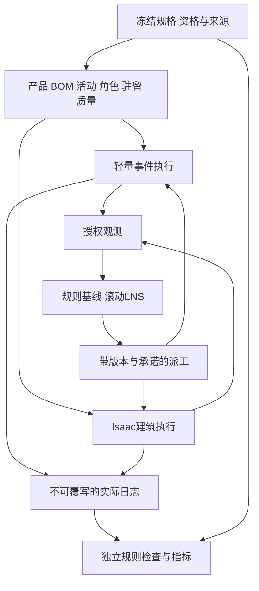

# 完整钢模块下一版架构

2026-10-07有限修复成果（PR132 / LOG170）：S16 F1—F3及C1已完成限定本地修复，候选S16-20261007-r2为VERIFIED_WITH_LIMITS / ACCEPTANCE_PENDING / NOT_APPROVED / NOT_PUBLISHED。源码及隔离wheel各612项、专项37项通过；原七例数值/结果及68组完整集合保持，213个冻结文件摘要不变。1.1参照只绑定独立抽象资源图，原r1发布与所有限制/失败证据保持。新成果验收及确切发布另审，后续步骤未启动。入口：[S16 r2审阅](validation/S16_limited_repair_r2.md)。

2026-10-07现行有限修复授权（PR132 / LOG169）：负责人已批准S16发布后F1—F3及C1必要追溯、回归、治理和新确切审阅包的有限本地修复。沿用现有main/目录，不建分支/worktree，保留原r1发布及全部历史证据和冻结边界。当前LIMITED_REPAIR_IN_PROGRESS；新成果验收与确切发布另审，后续步骤未启动。入口：[S16步骤卡](steps/S16.md)。

2026-10-07现行发布后审阅（PR130—PR131 / LOG167—LOG168）：S16 r1已实际限定验收、批准并发布，提交 `f8ea47cbac96e9663f35dae5a6434693d34f648c`、标签 `step-S16-r1`，双平台各源码/隔离wheel597项成功。全量审阅确认F1时间网格类型/反映射、F2资格标量解码、F3接收EDD及策略区分三组问题，并有布局版本追溯说明待澄清；当前POST_RELEASE_REVIEW_FINDINGS_OPEN。本轮仅审阅及必要治理，未实施修复或新Git/远端发布，后续步骤未启动；原冻结域、限制与历史证据保持。入口：[S16发布后审阅](validation/S16_post_release_audit_r1.md)。

以下早期状态保留各自封存时点，现行发布及审阅结论以上文为准。

2026-10-07本地成果（LOG166）：S16静态匹配参照已完成限定实现与验证，候选S16-20261007-r1为VERIFIED_WITH_LIMITS / ACCEPTANCE_PENDING / NOT_APPROVED / NOT_PUBLISHED。源码及隔离wheel各597项、专项22项通过，四个极小完整可行集合吻合，B=2三件接收背压核验通过；S15 r4已发布事实与全部限制保持。验收/确切发布另审，后续步骤未启动。入口：[S16审阅](validation/S16_reference_r1.md)。

2026-10-07现行补录（PR128 / LOG164）：S15 r4已实际限定验收、批准并发布，提交 `0bba728116797ecece3f6fcbee7109c8bf1624b1`、标签 `step-S15-r4`，双平台CI成功。原批准前候选状态保留历史时点；远端详细日志HTTP403，未提取远端测试条数。先前五文件治理已随r4发布，S19A/S19B仍仅规划认可、实施NOT_STARTED。

2026-10-07现行授权（PR129 / LOG165）：负责人明确创建本对话直接实施S16，沿用现有目录/main，不建分支或worktree。S16正在本地实现、验证及形成确切审阅包，验收和新快照发布另审，S17—S28及S19A/S19B未启动，原冻结规则与全部限制保持。入口：[S16步骤卡](steps/S16.md)。

2026-10-05现行治理（PR124 / LOG159）：已按 `S19AB-VISUAL-REVIEW-20261005-r2` 批准规划增设S19A表现优化、S19B审查前端及薄运行控制职责；依赖S19→S19A→S19B→S20，新增组件均NOT_STARTED，技术选型待最小原型审阅，不因本文落盘启动开发。既有冻结约束、单一后端事实来源及观察隔离保持。

2026-10-05实施事实补录（PR122 / LOG157）：S15 r3已限定验收、批准并发布，提交 `df6bd4e7d57d7b9268e2eaecb8a7150a8b124622`、标签 `step-S15-r3`，双平台各两轮564项通过。有限生产闭环及16条同源码成对见证见[S15审阅](validation/S15_final_review_r1.md)，各例绑定各自源码，r2/r3无新Kit重跑，原限制保持；LNS、CP-SAT、S16—S28和新增两步均未实施。下列旧状态为对应历史时点。

当前实施状态（PR088—PR090，2026-10-02）：S12 r1已验收、批准并发布，回执见LOG090。PR089审阅确认三类独立决策审计漏检；PR090仅授权其有限本地修复、必要回归、说明、治理与新审阅包，沿用现有main，不建分支/worktree。r2须另行验收及发布批准；S13—S28与新快照暂存/提交/标签/推送/PR/附件/远端元数据修改未授权。D01—D06限定冻结、工业证据缺口、J2同产品双框驻留/FIX-J2独占及默认HR禁用保持。以下旧授权描述保留历史时点。

版本 C03-0.1；2026-10-02；C04/C05建筑契约与事件内核已实现合成见证；S09 r2历史接口独立保留。

| 组件 | 职责与输入/输出 | 防止错误耦合 | 交付归属 |
| --- | --- | --- | --- |
| 领域/契约 | 产品/组件/工作单元、资格/版本、角色集合、驻留/质量；10类新版消息 | 不用token或一人元组代表整模块，不把UNKNOWN映射为PASS | 修复C04 |
| 数值/执行 | 逐人积分/日历、原子占用、等待/质量、MOVE/取消清场；事件/实绩 | 人员释放不释放bay，计划完成不写实绩 | 修复C05 |
| 观测 | 仅已观察状态/时戳/未知；隔离未来Scenario | 隐藏真值不旁路进入规划器，保护拒绝不泄漏数值 | 修复C05；S12成对检验 |
| 独立检查/指标 | 从日志重建R01—R18与F/E，不调用执行许可函数 | 实现与检查器不能共享错误谓词自证 | S10 |
| 可行生成/闭环 | 合法基线、事件触发派工与承诺保持 | 无法排程要诊断，不能清空空间强行可行 | S11—S12 |
| Isaac场景/适配 | 建筑产品/起重资源、命令确认与实际占位/失败反馈 | 小机械臂不代替重载吊机；动画不是闭环 | S13场景→S14适配→S15一致性 |
| 参照求解 | 静态匹配简化域、整数化与求解界 | 最优性不外推完整域/非线性人因 | S16 |
| 决策方法 | LNS固定模式骨架→联合模式/角色/次序/休息→在线预算/回退 | G2未关闭不启HR；执行承诺不破坏 | S17→S18→S19 |
| 表现层（计划） | 在已验收流程上改善材质、标识、照明、人物方向及状态表现 | 保护尺寸/碰撞/手位/路径/工时/容量/人因，不以画面覆盖读回 | S19A；A1—A3分别留证后整步验收 |
| 审查前端（计划） | 选案例、状态/新鲜度、相机与信息定位、本地记录和审计证据 | 区分排演/轻量/Kit/回放；诊断真值不进入规划器，不直接改USD | S19B；B1—B3及人工完整任务 |
| 薄运行控制层（计划） | 经能力检查把请求交后端，关联运行身份、请求、确认和状态同步 | 后端确认才生效；幂等、过期隔离、断连未知、重连不重发 | S19B；生产驱动端到端验证后开放控制 |
| 研究/复现 | 协议→A/D/B/C→论证→复现→报告→归档 | 测试集隔离、负结果/截尾保留、发布另批 | S20→S21→S22→S23→S24→S25→S26→S27→S28 |

结构性修复选择与增量/替换成本比较见[修复方案](repair_plan.md)。S10—S28及新增S19A/S19B的每步输入、执行、产物、验证、失败出口及授权见[总纲逐步正文](PROJECT_CHARTER.md#文档职责与执行顺序)，依赖摘要见[路线索引](roadmap.md)；旧C06—C08仅历史映射。C04/C05建筑契约与轻量执行已实现；r2已验收并发布。S10独立日志重建与指标r2已发布，入口为`checker.py`/`metrics.py`，范围及限制见[独立检查](validation/checker.md)。S11静态生成器位于`planning/`，候选完整轨迹经独立核验；S12轻量动态重排位于`control/`；S13—S15的场景、适配及限定生产闭环已实现和发布，保留各自证据边界；S16静态匹配CP-SAT参照已完成本地r1限定实现与验证，验收和确切发布待审，见[S16步骤卡](steps/S16.md)；LNS及S19A/S19B仍未实施。

恢复状态需包含人因、工作单元、准备/资格、实物/锁、事件游标、随机流与观测队列；双后端共享语义而非互写实际状态。规格/规则/参数/实例/代码版本在manifest绑定，避免旧管道实例被新名称误认成建筑产品。

PR070增设C05实现及见证完成后的[工作区与阶段收尾](PROJECT_CHARTER.md#c05-closeout)：核对C00—C05职责、契约、代码、证据与入口自洽，清理冗余后整理GitHub确切上传审阅包并一次请求授权。该流程属于修复收尾，不新增算法层，PR071已授权该本地收尾，实际记录见阶段收尾。

实际建筑实现使用包内`domain/building.py`、`contracts/building.py`、`building_human.py`、`building_backend.py`，以明确入口隔开历史领域；接口与验证见[建筑执行验证](validation/building_execution.md)。

## S12已实现的轻量反馈边界

`control/light_loop.py`将已释放配置和C05当前事实投影为不可变Feedback；控制器只按该输入选择当前合法的一条派工、休息、取消清场或等待。原执行器保管running/驻留/质量/搬运和事件情景，反馈到达后重新观测和选择；没有预生成整条计划回放。单动作提案与实际日志分开，S10核验实际全轨迹，S12另核对决策账及成对非预知测试。具体适用边界见[闭环验证](validation/light_loop.md)。后续S13—S15已实现限定Isaac闭环；LNS仍未实现。

S12 r2的`control/ledger.py`复用S10独立事件重建核对每轮实际前缀，另核对完整可见状态、版本和显式服务动作；不调用控制器或执行器准入，也不替代最终S10物理轨迹检查。

## S19A/S19B计划中的表现、审查和控制边界

表现层消费已确认状态，朝向与动作须符合前向轴、变换、运动方向和手位/控制器/载荷关系；仅增加表现细节不产生新的设备能力。受保护基线取届时S15—S19最终验收版本，不覆盖S15已批准尺寸调整。尺寸、布局、碰撞、路径、手位、工时、容量或资格变化须独立提案并批准重验，不混入美术工作。

推荐前端为复用Isaac视口及现有界面能力的专用简洁面板，必要时附本地启动器；不足时再评估本地桌面或浏览器窗口，最小原型审阅后选型。既有场景面板和排演按钮不能代表生产闭环控制已经可用。首版不默认Web三维、流媒体、公网服务或付费依赖；不含任意脚本执行、拖料改状态、批量实验编排、远程多人控制或真机接入。

前端→薄运行控制层→生产驱动/后端构成请求通路；后端确认及状态同步返回前端。薄层只管理受支持能力、请求关联和确认，不生成第二套调度或生产真值，也不直接修改USD状态。资格、碰撞、容量和调度检查仍归既有后端；自动镜头聚焦列为待实现能力。案例、配置、运行身份、版本、模拟时间、数据新鲜度、完成/等待/失败原因以及证据入口须清晰可查。

控制契约须覆盖运行身份与请求去重、后端确认后显示生效、重置创建新身份并保留旧证据、过期消息隔离。断连显示未知，重连先同步当前运行，不自动补发旧命令。默认观察模式、显式控制模式，限本机单操作者；运行中参数只读，改动生成新配置，干预走已批准且有日志的通道。启动与有序停止必须真实验证；暂停/继续和重置未通过生产端到端验证前禁用并说明原因。暂停、停止、订单取消、重置、关闭窗口分别定义，暂停不擅改生产或人因时间，停止不等于完成，关闭界面不宣称停止，停止按钮不是工业急停。

读回/日志可供审查和明确标注的执行真值诊断视图；规划器仍只能消费原有授权观测通道，界面不得把隐藏真值或未来情景注入规划器。画面和曲线绑定同一运行与时间来源并标示陈旧数据；演示暂停、注入和取消留痕并与正式对照数据隔离。正式图表走冻结分析流程，绑定数据/脚本/版本/配置/种子或配对键/聚合规则，前端截图不能替代统计证据。

验收按[总纲A1—A3、B1—B3](PROJECT_CHARTER.md#s19a)执行；负责人视觉审阅与完整操作任务须真实记录。前端开关及规定负载下核对生产语义、调度/反馈预算和记录精度，不以降低科研记录精度隐藏开销；只读面板完成不等于S19B完成。两步验收及影响重验后再进入S20冻结；冻结后按[图文与变更规则](PROJECT_CHARTER.md#visual-evidence-rules)分级复核，影响生产、观察或统计口径则先审批协议变更再确定重跑范围。
