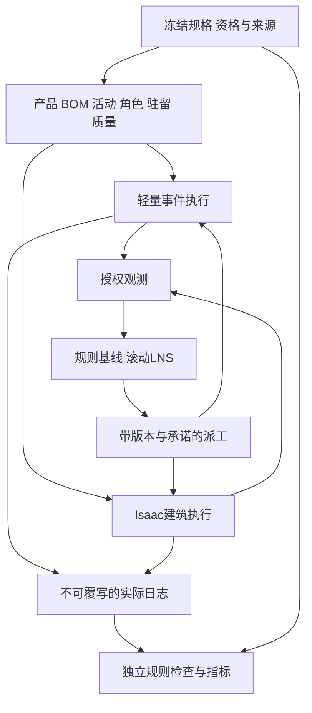

# 完整钢模块下一版架构

版本 C03-0.1；2026-10-02；C04/C05建筑契约与事件内核已实现合成见证；S09 r2历史接口独立保留。

| 组件 | 职责与输入/输出 | 防止错误耦合 | 交付归属 |
| --- | --- | --- | --- |
| 领域/契约 | 产品/组件/工作单元、资格/版本、角色集合、驻留/质量；10类新版消息 | 不用token或一人元组代表整模块，不把UNKNOWN映射为PASS | 修复C04 |
| 数值/执行 | 逐人积分/日历、原子占用、等待/质量、MOVE/取消清场；事件/实绩 | 人员释放不释放bay，计划完成不写实绩 | 修复C05 |
| 观测 | 仅已观察状态/时戳/未知；隔离未来Scenario | 隐藏真值不旁路进入规划器，保护拒绝不泄漏数值 | 修复C05；S12成对检验 |
| 独立检查/指标 | 从日志重建R01—R18与F/E，不调用执行许可函数 | 实现与检查器不能共享错误谓词自证 | S10 |
| 可行生成/闭环 | 合法基线、事件触发派工与承诺保持 | 无法排程要诊断，不能清空空间强行可行 | S11—S12 |
| Isaac场景/适配 | 建筑产品/起重资源、命令确认与实际占位/失败反馈 | 小机械臂不代替重载吊机；动画不是闭环 | S13场景→S14适配→S15一致性 |
| 参照求解 | 静态匹配简化域、整数化与求解界 | 最优性不外推完整域/非线性人因 | S16 |
| 决策方法 | LNS固定模式骨架→联合模式/角色/次序/休息→在线预算/回退 | G2未关闭不启HR；执行承诺不破坏 | S17→S18→S19 |
| 研究/复现 | 协议→A/D/B/C→论证→复现→报告→归档 | 测试集隔离、负结果/截尾保留、发布另批 | S20→S21→S22→S23→S24→S25→S26→S27→S28 |

结构性修复选择与增量/替换成本比较见[修复方案](repair_plan.md)。S10—S28全部为新功能，其每步输入、执行、产物、验证、失败出口及授权见[总纲逐步正文](PROJECT_CHARTER.md#文档职责与执行顺序)，依赖摘要见[路线索引](roadmap.md)；旧C06—C08仅历史映射。C04/C05建筑契约与轻量执行已实现；r2已验收并发布。S10独立日志重建与指标r1已发布，当前PR080授权六组问题的有限本地修复，r2另行审阅，入口为`checker.py`/`metrics.py`，范围及限制见[独立检查](validation/checker.md)；后续算法、Isaac生产闭环仍未实施。

恢复状态需包含人因、工作单元、准备/资格、实物/锁、事件游标、随机流与观测队列；双后端共享语义而非互写实际状态。规格/规则/参数/实例/代码版本在manifest绑定，避免旧管道实例被新名称误认成建筑产品。

PR070增设C05实现及见证完成后的[工作区与阶段收尾](PROJECT_CHARTER.md#c05-closeout)：核对C00—C05职责、契约、代码、证据与入口自洽，清理冗余后整理GitHub确切上传审阅包并一次请求授权。该流程属于修复收尾，不新增算法层，PR071已授权该本地收尾，实际记录见阶段收尾。

实际建筑实现使用包内`domain/building.py`、`contracts/building.py`、`building_human.py`、`building_backend.py`，以明确入口隔开历史领域；接口与验证见[建筑执行验证](validation/building_execution.md)。
