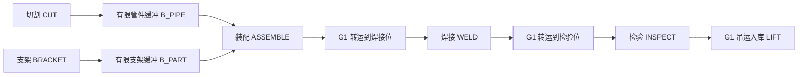

# S05 生产流程与数学规格

版本：0.4-candidate；日期：2026-10-01；状态：LIMITED_CORRECTION / PENDING_REVIEW。S05 r2 已由负责人批准为建模基线并发布，回执见 LOG028；r3 仅修复审阅发现的定位有效性与在线目标两项缺口（LOG029—LOG030）。r2 的既有批准保持有效，以下新增规则待本次快照审阅；不启动 S06 或后续实现。

范围保持完整多资源自适应框架、A 状态依赖模式与排程联合决策、D 人因权衡；B 只作反馈稳健性，C 只作恢复评价。通用结构及证据覆盖见 [实例族与验证层次](instance_families.md)，参数见 [参数台账](parameters.md)，人工见证见 [toy_instance.json](../../examples/toy_instance.json)。JSON 是 S05 规格示例，不是 S06 接口契约、执行日志或求解器结果。

## D01—D05 全面复核与落地选择

| ID | 复核发现 | 修订方案与理由 | 代价、边界与状态 |
| --- | --- | --- | --- |
| D01 布局 | 共用单元/夹具容易把装配、焊接、检验串成单一空间瓶颈，压缩 A 的并行机制 | 独立、可复制的装配/焊接/检验工位与绑定夹具；共享单吊机执行站间及最终运输；有限备料缓冲和多输入接收槽由实例声明 | 人员、机器人和工位数量配置化；主线单吊机，固定路线；不保证无死锁。PROPOSED |
| D02 人员模型 | 线性模型透明但缺生理标定；不能裁剪状态伪造合法；零时保护可能无进展循环 | 保留分段线性合成状态、阶段起点取样耗时；启动前保护覆盖必要释放劳动；等待触 cap 至少显式休息 τ_rest>0，再验可行性 | 指数模型/连续速度以后另审敏感性，当前无实测证据支持更强生理解释。PROPOSED |
| D03 冻结与故障 | 整工序冻结模式比阶段边界调整更保守 | 装配 common setup 后、H work/HR align 前，焊接 common setup 后、work 前可换模式；进入后缀后冻结；人员按加工/运输组绑定 | CUT/WELD.work 故障重做该阶段，其他续作；不任意半途换人/模式。PROPOSED |
| D04 取消 | 做完整工序可能在取消后仍开始本可避免的加工 | 不启动新生产后缀；当前阶段到最近声明安全边界，再做必要交接/清场；已完成 setup 则直接清场，吊载完成卸载和复位 | 已耗成本和残件保留；故障阻碍安全解锁/运输时等待修复。PROPOSED |
| D05 目标 | 把完成绑定空载复位会人为推迟交付；方法相关取消分母不公平 | C_j 取最终卸载到库，reset 另计资源与排空；加权拖期优先、完工破同分；取消集合按外生清单固定 | D 共享峰值上限和窗口，分别扫描总积分/最大个人积分预算；S20 才定统计与恢复阈值。PROPOSED |

D02 保留线性是可核算性选择，不是已证生理优势。D01 的新增运输使小例更长，选择依据是机制表达而非时间改善；不能跨两种布局宣称调度收益。上表 PROPOSED 保留最初提案的历史标记，D01—D05 的 r2 内容已获批准；r3 只补充下述两项规则，补充内容仍待审。

本次补核 [R01 作者机构摘要](https://pure.seoultech.ac.kr/en/publications/production-scheduling-for-humanrobot-collaborative-assembly-works/) 仅支持已有协作疲劳与模型消融的研究背景；[R02 出版商摘要](https://www.sciencedirect.com/science/article/pii/S2213846323001219) 区分团队和个人目标，不能推定等于本项目积分；[R04 机构记录](https://orca.cardiff.ac.uk/id/eprint/174446/) 描述肌肉层面状态。因此未把本合成率改成文献实测值，也未改写 S04 原文或扩大全文核查结论。

## 通用资源、工序与实体规则

人数与设备编号不是模型常数。实例声明订单集 J、每单有限有向无环工序图 O_j、人员集 H、加工机器人集 R、设备集 M、工位集 S、与工位绑定的夹具集 X、缓冲 B、固定路线 L 及单吊机 g。个体人员/机器人/吊机容量为 1；增加可独立作业的设备或工位须新增实体及位置，不能只把同一空间容量改大。所有资源、参数与边均用实例唯一 ID 关联。

每种工序仍限于 CUT、BRACKET、ASSEMBLE、WELD、INSPECT、LIFT 六类，允许同类出现多次。合法模式仍分别是 H/R、H、H/HR、R/HR、H、H；不为扩大搜索空间虚构工艺模式。订单可含多个模块，C_j 为其所有必需成品卸载时刻的最大值；任何必需件未到库则订单未完成。工序数、模式决策数与执行阶段数分别报告，不能用增加固定阶段包装决策规模。

资格以可行分配元组 Q_omg 表达，成员包括该加工或运输组所需的人、机器人、设备、工位/夹具、路线；无需某资源的角色为 null。可行元组同时满足技能、机器能力、机器人对目标站的可达关系、设备与夹具的位置绑定及声明的协作兼容性。非空资格集合只是结构必要条件，不证明多订单可调度。资格集来自实例，不能由调度器临时扩大。

一次加工组绑定一个合格 P、模式所需的一个加工机器人 r 以及工位设备；一次转运的 rig/unload 绑定一个合格 T，P 与 T 可以不同。同一组不在阶段间任意替换身份，故障释放只释放占用、不解除绑定。阶段至多一人、一加工机器人；多工人同时抬举不在本版。机器人可在不同组/工序间改派，但所选位置须可达；首次定位包含于 setup/align，定位失效后的返回必须执行显式 restore，规则如下。

兼容公共前缀后的模式切换还须满足分配兼容性：保持已绑定人员、工位和前缀用过的机器人；前缀未用的机器人可以在 HR.align 前从 Q 绑定。若给定人员/工位没有替代后缀的合法元组，就不能切换。WELD.setup 已绑定机器人，后续 R/HR 切换不更换它。CUT 在 setup 前选定模式与元组。

物料边声明生产者、消费者、实体种类、正整数数量、存放位置、运输方式和释放事件。禁止默认瞬移、复制产出或一件料被两个消费者同时领取；汇合把各输入消耗为一个可追溯输出。原料/成品/废料终端可显式设无容量约束；任何中间位置必须有有限容量，输出缓冲按件型相容且计入预留。

小型 CUT/BRACKET 件经有限备料缓冲及人工 feed 进入 ASSEMBLE；一次 setup 原子领取该节点声明的全部原料输入并占 feed 路线、目标站和 P，正时长随实例中的件数/工艺参数声明，不把四件沿用两件搬运成本。模块边由 g 逐件转运。多模块汇合的 ASSEMBLE 在首个 preposition 前原子预留目标站、夹具及全部接收槽；每槽只容一模块，后续转运共用这一站锁。源站必须不同于目标站且当前被输入占用时不能当空站预留；各源在对应 rig 结束释放。

模块汇合在全部输入卸载且最后一次 g.reset 完成后才启动 setup，所有接收槽在 setup 启动时转成正在合并的工件占位，到 setup 结束消耗输入并产出一个在制模块；同一目标站的槽、预留与工件占位属于一个容器层级，不重复计算工位容量。每个槽的容量另查。要求等待最后 reset 是本版多输入对位的声明前序；单输入 WELD/INSPECT 仍可在 unload 后与 reset 并行。实例必须提供至少一个结构相容的汇合站配置；执行中还须检查全部锁与占位，死锁如实报告。无中央无限模块暂存区。

所有非数值章节中的 P/T/r/g、设备/工位/缓冲均指所选元组或实例对象；下节 W1/W2/R1/G1 及固定时长仅是 T0 的具体赋值。通用模板继承 T0 的阶段名称、活动与耗时敏感标志，把其中人/机器人/设备替换为所选元组，站位/夹具替换为绑定位置，时长替换为实例 d0；模块汇合另加逐件入料前缀及其声明的等待最后 reset 前序。CUT 保持所选设备/站位到 handoff，BRACKET 保持备料站到 handoff，WELD 保持设备到 handoff；加工站/夹具从预留到输出 rig 结束保持。固定路线与站点可达图仅为拓扑假设，几何、承重与实际定位时长留待 S13—S15 验证。

### R3-01 机器人准备状态与再定位

机器人身份绑定、静态可达和当前准备有效性分别检查。每台机器人维护 `prep_r=(工序,加工组,工位,有效)`，初始无效；这只是任务级准备状态，不代表已经验证几何位姿。首次 CUT.R.setup、WELD.setup 或 ASSEMBLE.HR.align 完成后，为当前组建立有效状态。机器人 work 启动或续作前，必须匹配同一组、同一工位的有效状态；仅同一机器人或同一工位不足以满足条件。

机器人开始服务其他组时旧状态立即失效，即使新旧组位于同站。机器人自身故障，或其准备状态所指组的必需资源故障，均使该组准备状态失效，包含阶段间等待时发生的故障。正常空闲、人员休息及无故障且未改派的等待保留状态。该组最后一个机器人 work 完成或取消退出后清除其状态。绑定身份和工件/设备保持锁仍按原规则管理，不用准备状态冒充持续资源占用。

原准备前缀已完成但状态失效时，在下次机器人 work 前插入 `restore`：原绑定 P、r、该组原准备阶段所需设备及已绑定工位/夹具原子获取，保持锁取并集不双计；活动和正时长取该实例原机器人准备阶段的值。CUT.R/WELD 对应 setup，ASSEMBLE.HR 对应 align。T0 赋值分别为 1/1/.5 min，人的活动为 work/work/supervise，均不受 F 放大，但 F 仍累积并计入积分和共同启动保护。这是保守合成再定位成本，属于 M04/M11，不增加模式、不重做物料领取、焊接准备产出或已完成的工艺前缀。

restore 完成才建立当前组的有效状态；若完成后再次被改派，则须再次恢复，已耗成本保留。restore 期间机器人被独占，不得同时服务另一组。原 setup/align 尚未完成时，依原续作规则完成它即可建立有效状态，不在它之前额外嵌套 restore。restore 故障后保留剩余量、重新许可并续作，完成前始终无效；不递归生成 restore。取消时不启动新 restore，已执行的 restore 到该阶段边界后清场，不启动 work。

工作故障仍按原规则重做 CUT/WELD.work、续作其他阶段：restore 本身不改变其 work 的剩余量或尝试号。首次 work/重做在 restore 结束且 work 实际启动时重新取 F；续作保留中断前的倍率，仅增加恢复期间的实际 F 和耗时。每次插入 restore 使用稳定 `(工序ID,加工组ID,restore序号)`，其中断续作不重复编号。共享的规则适用于所有方法、公共前缀后的模式选择和故障恢复；静态不可达或资格不符时不能靠 restore 绕过禁止。

## T0 小例流程与数值模板（非规模上限）

本节仅描述 T0 的每单一模块六工序实例；通用订单与实例族遵循上节。无批处理、拆单或检验返工回路；原料在释放时可用。检验为确定性通过的占用阶段，质量/返修不在本步范围。H 表示人工、R 表示加工机器人、HR 表示人机协作；人工引导吊机仍是 H。

六工序边为 CUT→ASSEMBLE、BRACKET→ASSEMBLE、ASSEMBLE→WELD、WELD→INSPECT、INSPECT→LIFT。缓冲为物料状态；两条站间转运分别作为 WELD、INSPECT 的 `in_*` 前缀。空载 reset 可与到货后加工并行，不把表的列举顺序误作全串行链。

两个备料实体在 ASSEMBLE.setup 中同时从缓冲领取、经 Z_FEED 搬入，setup 结束合为一件模块并保留来源关系。加工位相互独立，站间只经 G1 的固定路线 Z_LIFT。机器人位于各加工点可达范围，定位成本在占用 R1 的 setup/align 中；人员的必要移动包含在准备/搬运阶段。这是拓扑假设，几何可达性、承重资格和双后端时间在 S13—S15 才验证，不从令牌容量推导物理安全。

### T0 资源资格与基础阶段

| 资源 | 容量 / 资格 |
| --- | --- |
| W1、W2 | 各 1；均可备料/切割/装配/检验/运输；仅 W2 可焊接准备、协作及交接 |
| R1 | 1；切割、装配协作、焊接；需要定位的 setup/align 同样占用 |
| M_CUT、M_WELD、M_INSPECT | 各 1；不替代空间/夹具限制 |
| FIX_A、FIX_W、FIX_I | 各 1；分别位于 Z_ASSEMBLE、Z_WELD、Z_INSPECT |
| G1 | 1；从公共停车位出发，每次转运后回到停车位 |
| Z_CUT、Z_PREP、Z_ASSEMBLE、Z_WELD、Z_INSPECT、Z_FEED、Z_LIFT、Z_SCRAP | 各 1 空间令牌；工位按工件占位，同一件内合法 HR 不重复算空间 |
| B_PIPE、B_PART | 各 1 件有限中间缓冲；原料/成品/废料终端容量在本版不约束 |

`P` 为合格加工者，`T` 为 W1/W2 中的运输者。同一加工组绑定一个 P，一次转运的 rig/unload 绑定一个 T；两组可以不同，各组内部不暗中换人。各阶段主动资源之外，还要满足后文保持锁。

| 工序 / 模式 | 基础阶段 d0（min）；主动资源；人的活动 | 耗时敏感阶段 |
| --- | --- | --- | --- |
| CUT / H | setup 1：P+M_CUT，work；work 4：P+M_CUT，work；handoff 1：P+M_CUT，carry | work |
| CUT / R | setup 1：P+R1+M_CUT，work；work 3：R1+M_CUT；handoff 1：P+M_CUT，carry | 无 |
| BRACKET / H | work 3：P，work；handoff 1：P，carry | work |
| ASSEMBLE / H | setup 1：P+Z_FEED，carry；work 4：P，work；handoff 1：P，supervise | work |
| ASSEMBLE / HR | 同一 setup 1；align .5：P+R1，supervise；work 2：P+R1，collaborate；handoff 1：P，supervise | work |
| WELD / R | 转运前缀；setup 1：W2+R1+M_WELD，work；work 3：R1+M_WELD；handoff 1：W2+M_WELD，supervise | 无 |
| WELD / HR | 同一转运和 setup；work 2.5：W2+R1+M_WELD，collaborate；同一 handoff 1 | work |
| INSPECT / H | 转运前缀；work 2：P+M_INSPECT，work | work |
| LIFT / H | 仅转运循环，目标为成品区 | 无 |

每转运循环 6 min：preposition 1（G1 到源位）、rig 1（T+G1，carry）、move 2（G1）、unload 1（T+G1，carry）、reset 1（G1 回停车位）。G1/Z_LIFT 在全循环保持，T 只主动占 rig/unload。目标站/夹具在 preposition 启动时原子预留，到 unload 后转实际占位，只计一个锁；源位在 rig 结束释放。废料清场另占 Z_SCRAP 至 unload 结束；终端无需夹具。

阶段 DAG 为 preposition→rig→move→unload→reset；WELD.setup/INSPECT.work 依赖 `in_unload`，不依赖 `in_reset`。物料可后送时刻 C_o 为生产 handoff 或 INSPECT.work 完成；附属 reset 单独继续占 G1。下游仍必须获得 G1，不能提前启动新 preposition。最终 C_j 为 LIFT.unload。

CUT 从 setup 至 handoff 持有 M_CUT/Z_CUT；BRACKET 持有 Z_PREP；M_WELD 从 setup 至 handoff 保持；各站/夹具从预留到下一转运 rig 结束保持。准备、交接、定位均为正时长，释放事件零时。**等待不重复加入基础耗时；等待不默认休息。**未列模式一律禁止。

## 变量、单位和人员状态

时间统一 min；后续若内部改用秒，耗时、率和积分同步转换。J/O/M_o/P_om 分别为订单/工序/合法模式/阶段 DAG，K/H/B/Z 为资源/人员/缓冲/空间。

| 符号 | 域和含义 |
| --- | --- |
| x_om | 0/1，Σ_m x_om=1；在声明边界提交最终后缀，之前仅暂定计划 |
| y_ogh | 0/1，工序 o 的加工/运输组 g 绑定合格 h |
| z_oγq | 0/1，组 γ 从 Q 中选择分配元组 q；Σ_q z_oγq=1，人的 y 与所选元组投影一致；此处 γ 区别于吊机 g |
| s_p、e_p、u_p | ≥0 min，实际启动、净加工完成、关联锁释放；u_p 可晚于 e_p |
| π_k、I_k | 资源顺序及实际占用区间，含阻塞、锁止、清场 |
| R_h、q_p、attempt_p | 显式休息区间、剩余净工作量、尝试号 |
| F_h、E_h | 合成状态（1）、共同窗口 ∫F_h dt（min） |
| loc_v、n_b、reserved_b | 实体位置、缓冲实际库存及预留；预留转库存不双计 |
| prep_r | 机器人当前服务组/工位的准备有效状态；失效时 work 前需要 restore |
| C_o、C_j、T_j | 物料可后送、最终到库、max(0,C_j-d_j)，min |

这是连续时间执行状态规格，不是已实现整数模型。暂停时 e_p-s_p 含停机，不等于净加工量；同工件同资源的主动占用和保持锁取并集，不双计。

F 为合成工人负荷，不等同肌肉力或临床疲劳。非休息活动 l：F(t+Δ)=F(t)+a_hlΔ；显式休息：F(t+Δ)=max(0,F(t)-b_hΔ)。合法轨迹要求 0≤F≤F_cap<1；不在超限后裁剪 F 来伪造合法。休息触零时分段积分。

敏感阶段一次尝试净耗时 d_p=d0_p(1+κ_h F_h(s_p))，κ_h≥0；其他阶段 d=d0。每阶段至多一人，HR 人机同步整个 d_p，不另加机器工时。阶段内状态继续累积、倍率固定；续作保留原倍率和剩余量，重做另建 attempt 并以重启 F 取样。故障、取消、换任务、滚动重排不清零状态。

人的活动为 work/collaborate/carry/supervise/wait/rest；无主动阶段且未安排休息时使用 a_wait>0。启动保护用真值预测到最近安全释放边界的全部必需劳动，包括必要 handoff；无法保证 cap 则拒绝。任务级模型假设可零时锁止并释放人员，工件/空间锁保持；若真实工艺需持续看护，必须修改规格及保护，不能沿用无看护假设。

等待达到 cap 的最早时刻触发至少 τ_rest>0 的显式保护休息（T0 为 1 min），再核可行性；不够则继续休息。最短值只用于避免零时循环，不是医学建议。保护拒绝只返回统一原因，不向某算法额外提供隐藏 F。所有方法共享执行保护。

E_total=ΣE_h，E_max=max E_h，F_peak=max_h,t F_h(t)，三者不同。共同 [0,T_obs] 在比较前固定；全部生产/reset/取消清场排空后至 T_obs 显式休息，不能在到库或各自完工时删积分尾部。未排空则记录真实活动至窗口终点并报截尾。

## 编号硬约束

| 编号 | 数学/事件要求 |
| --- | --- |
| HC01 | 唯一合法模式及资格；每组选择 Q 中合法分配元组，人类角色存在时恰选一人；完成不重复计产出 |
| HC02 | s_first(o)≥r_j；工序边要求下游取料/转运不早于 C_o，且实体数量和位置满足 |
| HC03 | 阶段 DAG、净量守恒；续作耗尽剩余量，重做丢本次进度但保留耗用；零时事件有限 |
| HC04 | 任意 t：Σ_i demand_ik·1[t∈I_ik]≤c_k；半开区间 [s,e)，含锁止/阻塞；同一保持锁不双计 |
| HC05 | HR 人、所选机器人 r、设备/空间整段同步；启动原子获取主动资源，不无限扣留一方等另一方；机器人 work/续作检查 prep_r，失效须先完成 R3-01 的 restore |
| HC06 | 实体恰一处或显式在途，合并可追溯；预留转实际占位不增加锁，未吊离不能让新件侵入 |
| HC07 | 转运原子获取吊机 g/路线/源料/目标；rig 后释放源位，单输入接收可在 unload 后加工，多模块汇合须全部到料且最后 reset 完成；reset 前 g 不再派工 |
| HC08 | 0≤n_b+reserved_b≤b_b；handoff 前预留输出槽，满则保持源位/设备和工件，人员/所选机器人 r 不默认扣留 |
| HC09 | F 连续且活动正确，0≤F≤cap；休息/劳动互斥，启动及阈值保护统一，不裁剪或隐式复位 |
| HC10 | 故障资源不继续净加工，必要保持锁计容量；修复后按重做/续作重新获许可 |
| HC11 | 取消不启动新生产后缀，按安全边界清场；保留废件、在途、耗时、状态和到库事实 |
| HC12 | 已完成前缀/进行中阶段不可改，只在兼容边界切换未开始后缀，不任意换组内人员 |
| HC13 | 调度只读授权带时间戳视图和已发生事件；真值只供共同保护/离线核算，不泄露未来 |
| HC14 | 重验旧计划→同资格/预算/观测规则回退→合法等待/休息；无可推进事件的锁定报告 DEADLOCK，不删锁冒充完成 |

## 切换、阻塞与故障

装配 H/HR 共用 setup；之后选 H.work 或 HR.align→HR.work，再接共同 handoff。切换不重做 setup；HR.align 开始即冻结后缀，不删除其声明的正时长成本（T0 为 .5 min）。焊接 R/HR 共用转运和 setup，之后选 work；CUT H/R 的 setup 资源不同，须在 setup 前提交，不把 H 前缀当作 R 前缀。其余工序无选择。

CUT/BRACKET.work 完成且输出槽满时等 handoff，源位保持、工序 C_o 未发生，不重复加工。人员/所选机器人 r 释放，handoff 时重新获得原绑定人员。装配领取节点声明的全部备料、所选 feed 路线、目标站及人员时原子获取，不先取一件占路等另一件。吊机 g 只预留当前即将执行转运的目标；这不是 C 的主动资源预留优化。

| 中断 | 规则 |
| --- | --- |
| CUT/WELD.work 的必需资源故障 | 本 attempt 失效；修复后重做当前 work，setup/更早工艺前缀保留但机器人准备状态失效；需要 restore 时先恢复再开始新 attempt；设备、工件、空间锁不释放；非故障机器人/人员锁止后释放，疲劳/损失保留 |
| 其他阶段 | 保留剩余量及原倍率，修复后重新获取同组人员/资源续作 |
| 吊载故障 | 吊机 g/所选固定路线、目标预留及载荷位置保持；rig 未完成则源位仍锁定；必须恢复合法移动后卸载 |
| 重复故障 | 尚未重启的失效 attempt 不重复丢弃/计损失；新 attempt 只在实际重启创建 |

## 取消与清场

取消先于同刻新派工，不启动新正常后缀。当前阶段按下表到安全边界；不能整单瞬时删除。固定工位失败 work 若已安全锁止且取消，不为产出重做，改清场；故障若阻碍工装安全解锁则等待修复。吊载/吊机 g 故障不可用清场绕过。

| 取消时状态 | 最小后续动作 |
| --- | --- |
| 未开始，或 CUT.setup 完成而 work 未开始 | 禁止 work；原料/部分件按位置清场 |
| CUT/BRACKET/WELD/ASSEMBLE.work 正常执行 | 完成当前 work 及必要 handoff 后清场，不启动下一工序 |
| CUT.setup、ASSEMBLE.setup/align、WELD.setup 正在执行 | 完成该阶段即清场，不启动 work |
| INSPECT.work | 完成当前阶段再按取消件清场 |
| transfer.preposition | 空载完成定位后直接 reset，未开始 rig 则不吊件；撤尚未占用的目标/槽预留，若汇合目标已有料则保留其站锁至清场；原件留源待清场 |
| transfer.rig/move/unload | 完成已提交目标的卸载及 reset，不临时改目标；目标上的取消件再清场，不正常加工 |
| transfer.reset | 完成空载复位再释放 吊机 g/路线；到库或目标工位上的物料事实不回滚 |
| 已到成品区 | 不倒运；保留取消前/后到库事实，评价集合按同一外生清单 |

若 work 已完成但 handoff 未开始，handoff 属必要释放仍执行；handoff 中则完成它。取消的 CUT/BRACKET 成品 handoff 可改投 废料接收位，仍用实例声明的 handoff 时长（T0 为 1 min）、同一人、源设备/空间和废料位；正常生产不能走这条旁路，避免以满缓冲阻止已取消残件退出。

有限备料缓冲或尚未加工备料工位的残件，每件由合格人按声明清场时长（T0 为 1 min）carry 至废料接收位，源位到结束才释放。站点和接收槽中的完整/部分模块用声明的吊机 g 循环（T0 为 6 min）至废料终端，占废料接收位至 unload。模块汇合取消后禁止后续正常入料；已经吊起的输入先完成已提交卸载/reset，再逐件清场；未开始吊运的输入留源清场，未占用接收槽撤销预留，目标站直到已有残件清完才释放。订单取消覆盖其全部未完成节点和实体，已到库事实保留。阶段边界上等待的取消件直接进入相应清场，除必要 handoff/reset 外不启动正常后缀。多个残件分别处理；容量/故障导致等待如实记录。终止须无在途载荷，所有 reset/清场完成，否则记录未排空和截尾。

故障输入必须声明固定工装是否允许安全解锁 `release_allowed`；真/假分别表示可进入清场/须先修复，缺省输入拒绝，不猜测物理状态。此标志只影响工件解锁，不取消人员的任务级锁止释放。吊机 g 故障时即使提供真值，也不能绕过恢复移动/卸载规则。该输入语义属于 M13，具体故障分布待 S20。

## 同刻事件、信息与随机配对

在 t 先积分/加工推进至 t，处理恰在 t 的完成/到库/释放；再按稳定 event_id 处理外生事件，再保护/观测，最后派工。同资源同刻矛盾故障/修复输入拒绝。恰在故障时刻完成算完成；取消恰在新启动时刻阻止启动。B 只改观测，不改共同物理次序。

外生事件按场景种子、稳定订单/资源 ID、类型和发生序号配对；加工扰动按稳定 phase_id，重做显式追加 attempt_id。不同算法随机调用顺序不改变外生世界。本例零延迟/噪声/缺失、确定工时、无扰动；分布/水平待 S20。保护、预算、冻结和授权观测各对照一致。

## 目标、评价与参照

### R3-02 在线目标与离线评价分离

时刻 t 的在线集合 K_t 只含已在授权视图中收到释放通知、释放时刻不晚于 t、且尚未收到取消通知的订单。已知完成订单可保留其已知 C_j 作为常数；其余使用候选计划预测的 Ĉ_j。取消或释放尚未被观察到时，不因后台事件文件中有该记录而提前改变 K_t。旧计划、回退和各对照使用相同信息权限。

滚动决策字典序最小化 `(Σ_{j∈K_t} w_j max(0,Ĉ_j-d_j), max_{j∈K_t} Ĉ_j)`；已知完成项以 C_j 替换 Ĉ_j，空集合无生产目标但仍处理必要清场/复位。对已知未完成订单，候选计划必须给出预测完成或显式报告未能形成完整可行候选，不能把该项删掉、设为零或用窗口下界冒充完成。预测与真实完成分开记录，预测误差不改变事后评分。

该在线代理目标不读全量未来订单、取消、故障清单或未来实际工时；本版不把未释放订单加入 K_t。允许使用共同声明的参数、授权的当前估计和历史信息，若以后增加预测分布须另行声明依据，不得读取本次尚未发生的随机实现。DΣ/Dmax 的在线可行性也按同一授权历史累计量与候选未来活动预测，不能直接读取未来真实积分；真实 cap 保护及离线暴露核算继续独立。预测预算合格不等于实际预算必然合格，实际违反/截尾必须报告。

非预知性要求作用于调度器提出的命令：相同授权历史、内部状态、算法配置、决策随机状态、计算终止条件及并列规则下，仅替换未观察到的未来清单，不得改变当前 K_t、候选评分或拟派工命令。共同执行保护可依据当前真值拒绝命令；拒绝被观察后才成为下一决策的输入。不能把执行保护使用当前真值的权限转给调度器读取隐藏状态或未来。

J_eval **仅供离线评价**，由窗口结束后的外生清单确定：共同窗口内已释放且窗口内无取消请求的订单；窗口外取消不追溯改写该窗评分。某方法抢先到库不改变取消分母，取消前到库量另报；算法不能控制取消事件，也不能在派工前获得 J_eval。全体 J_eval 完成时，用实际完成时刻报告并比较以下字典序绩效：

\[
\left(\sum_{j\in J_{eval}}w_j\max(0,C_j-d_j),\quad \max_{j\in J_{eval}}C_j\right),\qquad w_j>0.
\]

单位为加权 min、min。C_j 是最后卸载；reset 不延期交付但计入排空和资源。空集合 N/A；未完成报完成率/截尾，未完成项 max(0,T_obs-d_j) 仅作拖期下界，已完成项用实际 C_j，不把下界当最终绩效或优胜证据。

规模与机制覆盖要求见 [实例族与验证层次](instance_families.md)，具体结构配置见 [扩展规格示例](../../examples/structural_instance.json)。该示例没有排程或效果结果。

D0 用基础目标；DΣ 另加 E_total≤ε_total；Dmax 加每位 E_h≤ε_max。共享 cap、人数、窗口、尾部和执行规则；同数值预算不等强，S20 冻结扫描并在交付相近区间比较。不可行预算不自动放松峰值。A 固定/可变模式共用搜索器与预算；若单独归因状态信息，须增加状态无关的可变模式消融，继续共享执行保护。B 不开发感知，C 的恢复容差/持续时间/截尾映射待 S20，不扩大为主动储备优化。

CP-SAT 在 S16 才实现；双方严格匹配时标、模式、阶段 DAG、资源、缓冲、状态近似和目标。去掉疲劳/故障等时两边都去掉，列出差异；最优性只属简化模型。本步无求解器、最优值或实验阈值。

## 单订单人工见证

六工序、28 阶段；模式依次 R/H/HR/R/H/H。加工者 W1/W2/W1/W2/W2，三次运输均 W1。转运的五区间按 preposition/rig/move/unload/reset，reset 可与收货后加工重叠。

| 工序 / 阶段 | min 区间 |
| --- | --- |
| CUT setup/work/handoff | 0–1 / 1–4 / 4–5 |
| BRACKET work/handoff | 0–3.6 / 3.6–4.6 |
| ASSEMBLE setup/align/work/handoff | 5–6 / 6–6.5 / 6.5–8.877 / 8.877–9.877 |
| 转运 A→W | 9.877–10.877 / 10.877–11.877 / 11.877–13.877 / 13.877–14.877 / 14.877–15.877 |
| WELD setup/work/handoff | 14.877–15.877 / 15.877–18.877 / 18.877–19.877 |
| 转运 W→I | 19.877–20.877 / 20.877–21.877 / 21.877–23.877 / 23.877–24.877 / 24.877–25.877 |
| INSPECT work | 24.877–27.604108 |
| LIFT I→成品 | 27.604108–28.604108 / 28.604108–29.604108 / 29.604108–31.604108 / 31.604108–32.604108 / 32.604108–33.604108 |

BRACKET.work=3(1+.2)=3.6。W1 在 6 时 F=.1+.02+3×.002+2×.03=.186，align 后为 .1885，故 HR work=2.377。W2 在 INSPECT 前为 .363554，工时 2(1+.363554)=2.727108。

B_PART 在 [4.6,5) 库存 1；B_PIPE 在 t=5 先入后取，瞬时库存仍须查容量。装配站/夹具 [5,11.877)，焊接站/夹具 [9.877,21.877)，检验站/夹具 [19.877,29.604108) 的重叠是不同站点，合法。M_WELD 在 [14.877,19.877) 保持。

释放 0、交期 32、权重 2：C=32.604108，拖期 .604108，加权拖期 1.208216；系统排空 33.604108，两人随后休息到 T_obs=40。逐段状态/积分见 JSON 和参数页。这不是最短排程，未做两布局效果实验。

## 证据与限制

本地另核对满缓冲、资源重叠、不合格人员、HR 缺机器人、前序违规、状态清零和超限反例，以及模式/取消/故障边界推演；不等于 S08—S10 内核或通用检查器。R01/R02 全文、U01/U02 日期不足和两条未审定 DOI 线索继续保留，不宣称首创。速度、疲劳率、工时、锁止、容量与取消工艺均项目选择/合成/待校准，无人体安全证据。小例不能证明多订单无死锁、真实工厂可行、双后端一致或 A/D 有效。

r2 的建模基线已获负责人批准；本次 R3-01/R3-02 两项补充仍待独立验收及新快照上传批准。数值来源等级不因确认而变成实测。S06 未启动，不把有限规格检查写成生产实现或实验结论。
