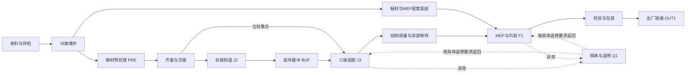

# S13 场景修改与流程衔接方案第四版待审稿

2026-10-03；方案标识 `S13-PLAN-20261003-r4`；依据 PR097 的试运行反馈及 PR098 的方案编写要求。供项目负责人审阅，AI 辅助核查和编写。状态：**DRAFTED_PENDING_REVIEW**。本轮获准编写方案和总纲补丁；交接、实施、最终验收及上传批准尚未发生。

本方案建议在 S13 内完成一次集中的场景修订：补齐收料、储存、预处理与齐套配送的可见空间，重组生产区关系，建立可检查的人员通道、物料路线和设备交接动作，并按扩展后的实际负载打磨品质。生产库存、运输任务、人员到位与完整派工反馈的执行语义由后续步骤承接，已具体写入[总纲补丁](../PROJECT_CHARTER.md#process-layout-patch)。

本方案批准后拟成为 S13 最后一次集中修改的执行依据；“最后一次”是收敛目标，不允许绕过实际失败或隐瞒必要偏差。保持现有目录和 main，不建分支或 worktree。已批准的[r3 原件](S13_scene_proposal.md)保留；本版仅替代其布局、上游空间、检查体验和扩展验证安排，设备性质、研究资格、来源和发布边界继续有效。

## 事实基础与本版目标

现有 S13 已实现七区、六项设备、两套工装、15 人职责映射、完整模块外观、固定搬运路线及真实 Isaac 检查；这些是几何、运动学和合成状态证据。当前可见试运行不是连续生产，切换夹具会重置状态。现有领域基准为 KIT 至 READY 的37项活动，不能据此声称收料至出厂的上游过程已建模。

当前 PRE 含 KIT/CUT 抽象和原料组件；材料有到货、识别、放行和消耗状态，但缺少完整库位、备料、工位配送与运输交接过程。人员以角色与固定位置呈现，WELD1 的跨区转场未展开，R1 仅有局部空载运动见证。固定路线无碰撞不等于工厂组织合理。[场景映射](scene_mapping.md)和[实测报告](../validation/building_scene.md)是本版事实依据。

此前受测负载的整卡显存峰值4974 MiB、中位更新耗时6.065 ms、P95 7.203 ms，仅支持当前负载描述；不能推算可扩展倍数，也不当作未来多产品闭环的帧率保证。新增复杂度优先服务工艺理解、空间冲突与调度问题，其次完善视觉；不把每个紧固件或板件都改成动态刚体。

## S13 与后续步骤的明确分工

| 问题 | 本次 S13 拟完成 | 后续总纲承接 | 本次不得声称 |
| --- | --- | --- | --- |
| 收料与存储缺失 | 可见收料/待检位、分类料架、退料与隔离位置；批次外观、标签和容量参数 | S14 前置契约修订与 S14 库存/放行/预留执行 | 已实现库存守恒或真实收货 |
| 预处理与备料不清 | PRE 的原料输入、CUT1 加工、输出、齐套交接位及代表动作；与工序覆盖表相连 | S14 工序细分、时间/角色/材料状态，S15 连续验证 | 已模拟切削物理或全部预处理工艺 |
| 转运与工位割裂 | 连续空间路径、源/目标落位、装卸与交接几何；空载返回可检查 | S14 运输任务、预约、资源占用与反馈；S15 争用闭环 | 演示到达等于生产完成 |
| 人员缺少动线 | 具名角色起点、可行走路径、作业站位与交叉口；行走代理检查 | S14 人员到位和行走时间；S18/S22 负荷与模式影响 | 行走已计入人因或已满足工业安全 |
| 设备协同缺少过程 | 六设备协作表、WELD1 转场演示、起重交接站位、R1 作业覆盖限制可视化 | S14 交接状态与锁；S18 合法协作选择 | 新增设备令牌、机器人资格或全框可焊 |
| 并发复杂度不足 | 两产品分立布置及受控冲突见证、连续脚本巡检、负载分级实测 | S15 两产品反馈闭环，S19 在线预算 | 脚本排演已完成调度研究 |

S13 可新增 `SCN-` 前缀的场景对象、检查状态和局部通行互斥，但不得把它们写入生产 Configuration、DispatchCommand 或 ExecutionEvent。每个新增对象须标注“既有域对象映射”或“场景预留”；预留空间、子器具、缓存点不自动增加生产容量或可调度资源。D01—D06及既有资格门不在本步改写。

## 工艺覆盖与新增空间

推荐按下列功能链组织空间；这是研究场景的拟议关系，不是已验证的工厂工艺或施工设计：

图中“结构质量与涂装等待”对应既有 J3 工序，“检验与包装”主要对应既有 F1 工序；不把 Q1 改成全部产品必经的正常检验站。虚线返修关系为布局预留，实际适用返修路径须由后续规则审定。上游、外部到货和存储物流为待补充过程，图不表示已新增正式活动。

| 拟增补位置 | 可见对象与关系 | S13 检查重点 |
| --- | --- | --- |
| 收料/待检位 | 边界入口、整批到料、待检和已放行分区标识 | 批次唯一、未放行状态明显，入口不堵通道 |
| 钢材料区 | 长料支承、底顶框原料批次、立柱集合、取料端 | 足尺寸取料空间；4 t立柱集合不得交给3 t HST1 |
| 板材与MEP料区 | 按类别的板材支承和封装配套件，指向 F1 的配送端 | 分类可辨、取放面可接近，不生成重复设备令牌 |
| PRE 预处理区 | CUT1 输入支承、操作位、加工包络、输出及余料位置 | 原料到输出方向清楚，操作位与搬运包络不相交 |
| 齐套与交接位 | 带产品/用途标签的托盘或支承、缺件示意、源/目标接收面 | 场景批次跟随运动；不以颜色变化冒充真实齐套判定 |
| 工位边料位 | J2/J3/F1 的短时交接位置、工具停放和回收位置 | 不占用夹具落位面、人员操作面或模块主通道 |
| 退料/隔离位 | 未用物料、异常物料的独立标识和回流接口 | 不与可用料外观混淆；不将 Q1 产品容量借给原料 |

预处理范围本次明确表达既有 CUT；除锈、钻孔、倒角、板材加工等仅列入“待工艺证据判定”清单，不凭一般经验增设生产设备或宣布全覆盖。每项既有活动均须列入工序覆盖表，说明场景位置、输入输出、设备/人员、可见动作或静态状态、当前抽象和后续责任步骤；不能只为新增区域制作几张截图。

## 布局修订与空间关系

推荐采用“西侧供料带与内部生产回路”的布局，保留 PRE、J2、BUF、J3、F1、Q1、OUT1 的逻辑身份和容量；允许调整世界坐标、辅助设备位置和路线。先给出可执行的候选平面，再用足尺寸扫掠验证修正，不将现有42×34 m外框视为不能改变的工厂条件。

**候选尺寸均为研究假设 A，未经几何验收。** 拟用60×44 m外框，在 x=14—56、y=4—38 范围保留现有生产核心的相对骨架。其初始平移为(+14,+4) m，七区中心拟为 PRE(20,14)、J2(30,14)、BUF(40,14)、J3(50,14)、F1(50,28)、Q1(40,28)、OUT1(30,28)，各8×8 m。现有路线初始同步平移：组件通道中心 y=8、模块通道中心 y=21；这只是求解前的候选，绝非原路线验证可直接沿用。

| 空间带 | 候选范围或位置 | 布置目的 |
| --- | --- | --- |
| 西侧供料带 | x=2—12；收料 y=2—8、钢材 y=10—18、板材 y=20—26、MEP y=28—34 | 上游储存独立可见，出料向东连接 PRE 和工位配送 |
| 补给与交接预留 | x=16—24、y=24—32 的空闲位置 | 汇集配套材料与配送接口；不得误标为新增生产 bay |
| 生产核心 | 上述七区及轨道吊覆盖范围 | 双框、汇合、装配、内装和出厂顺序可追踪 |
| 人员外围通行 | 北侧 y=38—42 及工作区外侧连接带，具体宽度随包络复核 | 从具名起点抵达操作位，控制进入运输交叉口 |
| 出厂方向 | OUT1 向北侧边界的预留出口 | 减少成品回穿原料入口；仅为边界空间表达 |

布置原则：J2与BUF/J3保持短距离交接；PRE同时考虑长料输入与立柱集合的吊运；F1接近配套物料配送端；Q1保留隔离和返回路径；CR1覆盖必要起终点和载荷起落空间，轨道支腿边带独立检查；人员路线与物料路线分别建图，交叉口显式标出。通道宽度根据设备、载荷和人员代理包络核查，不将假设宽度当法规净距。

实施时应比较“原布局加入必要区域”和“推荐供料带布局”两种平面候选。比较各必需起终点路径长度、交叉口数量、吊机覆盖、站位可达和障碍数；不以未执行的生产工期给布局排名。选定一个配置实施，备选保留为参数/示意，不同时维护两套完整场景。若60×44 m内无法满足必需几何条件，先报告具体冲突和调整建议，不靠缩小产品或移除必要障碍通过。

## 设备与人员协作的可检查表达

| 对象 | 本次拟改动 | 必须保持的限制 |
| --- | --- | --- |
| CUT1 | 将输入/输出支承、P1操作位和取料方向一并设计，修正“孤立切割台” | 普通加工设备；不虚构数控无人切割 |
| WELD1 | 保持唯一实体；演示J2至J3的撤离、连续转场、定位及工具准备，显示转场中不可同时作业 | 演示时间非生产工时；气瓶/电缆表达不构成工程设计 |
| R1 | 保留关节/TCP；显示工作包络、候选作业面和已知不可达部分；调整基座须重验碰撞与FK | 不新增导轨或翻转设备，不用放大机械臂消除覆盖缺口；HR仍禁用 |
| HST1 | 演示已允许的组件搬运、交接和空载返回，明确取放及操作者站位 | 保留3 t能力与机械形式未知；不改称AGV/AMR，不承接4 t集合 |
| CR1 | 重验轨道/行程/起终点，增加挂接、人员退出受控区、搬运、落位、摘钩的可见顺序 | 一个设备所有者；不以小车到达代替载荷落位，不声称吊索动力学 |
| TEST1 | 展示工具运入、设置、保持与取回；等待状态仍显示设备被占用 | 一个资源组；不把每件仪表拆成额外可调度设备 |
| FIX-J2/FIX-J3 | 保持定位/夹持界面，与人员及起吊作业面联查 | J2同产品双框驻留不改变FIX-J2独占 |
| 15名人员 | 具名起点、连续走行代理、操作/司索/指挥站位，按阶段显示责任 | 不新增虚假班组；无任务不等于REST；不新增疲劳参数 |

人员交叉口先实现检查用的停止/允许通过顺序，验证人员代理与设备/载荷包络无冲突。路线是固定可重复的场景路径；不引入自主导航、路径寻优或实时避障课题。配套件输送采用明确标识的搬运载体占位代理，装备选择未确定时标记为场景预留，不冒用HST1/CR1资格或给现有人员派发未定义工种。

## 负责人可亲自试运行的场景

拟将现有本地面板收敛为可复现的 S13 场景检查入口，保留暂停、单步、倍速、重置、路线/包络/角色显示和问题快照。正式入口不得写死机器路径；沿用环境配置，固定场景版本、夹具和随机种子。界面持续显示“场景动作排演，生产反馈未接入”，重置和阶段切换必须明确提示。

| 试运行 | 连续检查内容 | 可注入问题与预期 |
| --- | --- | --- |
| T1 原料至双框工位 | 同一批次代理从钢材料位到PRE输入/输出/交接，再由HST1搬到J2；加工形态切换明确标记为抽象 | 交接位被占或路径插障，停止并指出阻挡对象；不得直接出现在终点 |
| T2 人员与吊运交接 | 指挥/司索站位、人员退出、CR1挂接搬运落位和空载返回 | 人员代理留在受控路径时拒绝推进；解除后可继续；不得标称工业安全验证 |
| T3 设备转场与工位供料 | WELD1唯一实体在J2/J3间连续转场；配套件代理沿指定路线送至F1 | 两处同时请求同一设备的检查负例失败；工具/料位遮挡作业面可见 |
| T4 两产品空间与冲突 | 两个不同ID产品分别驻留合法区域，固定脚本请求共享路线/CR1并保留先后状态 | 超容量、重复所有者、跨产品误用组件均检出；不绕过生产资格生成完成事件 |

T1—T4各自有明确初始状态，连续性只承诺同一试运行内部；切换测试会重置，不拼接成虚假的收料至READY生产历史。工序覆盖巡检另覆盖原有10类状态及37项活动映射。用户可以看到供料、人员行走和设备交接实际发生，也能看到当前尚未接入的生产语义边界。

## 品质与性能验证

沿用现有安装和原创参数化建模，无第三方资产下载、扩展安装、驱动或环境升级。必要模型、碰撞和角色标签先完整呈现，再按瓶颈优化；不同显示图层不得改变资源容量或检查结果。

负载分三级：L0为原r1受测基线；L1为新完整布局、分类库存代理和单产品动作；L2为两产品、全部人员代理、供料动作与设备运动的组合负载。每级记录可见对象、网格/碰撞体/活动代理数量、渲染设置、实际回调/渲染计数和计时方法。L0历史数据只供参考；需在同一测量方法下重新取得可比基线。

L1、L2各在暖机30 s后测量不少于120 s，默认1920×1080单视图；分别报告应用更新耗时与可获得的实际渲染帧间隔，不能把每次update调用等同一帧。拟保留中位帧间隔≤33.3 ms的交互目标，新增P95≤50 ms作为待批准目标；若无法读到可靠渲染时间戳，应明确未验证实际帧率，并交付更新耗时与人工交互证据，不替换口径宣称通过。

报告进程内存、整卡显存、可获得的进程显存、长卡顿及加载/截图峰值；无法读取的指标标为不可用。连续10次重置报告趋势，若后5次同状态采样仍持续上升且末值较首次稳定值增长超过10%，进入诊断；阈值是排查触发条件，不是无泄漏证明。L2不代表后续闭环最坏负载，S19仍需重测。

## 验收项目与失败处理

| 编号 | 必须交付的证据 | 失败条件 |
| --- | --- | --- |
| A1 工序与实体映射 | 37项既有活动逐项覆盖；新增场景对象用途/映射/未来责任表；材料与产品ID可追踪 | 原料区只作装饰；预留点被误当生产资源；漏项无解释 |
| A2 布局与连接 | 两候选比较、最终坐标表、人员/物料路径图、足尺寸扫掠及起终点覆盖 | 必需目的地不可达，主要路线依赖穿越实体或禁用碰撞 |
| A3 容量与唯一性 | J2双框/FIX独占、BUF容量、Q1/OUT1容量、WELD1/CR1/TEST1单所有者正反例 | 新增托盘/子器具悄然扩大域容量或复制设备 |
| A4 连续动作 | T1—T4实际读回轨迹、暂停/继续/重置、障碍/人员/占位注入结果 | 同一测试内瞬移，夹具切换冒充连续过程，失败后显示成功 |
| A5 几何与运动回归 | 原r3全部13项协议按新布局复核；FK、完整包络、轨道与载荷检查 | 仅平移截图而未重验；将未证全框可达写成已通过 |
| A6 视觉与可用性 | 总览、供料带、PRE输入输出、双框、三维装配、F1配送、人员交叉、WELD转场、吊机、Q1/OUT1实际截图；负责人入口说明 | 标签难读、关键连接遮挡、模型穿插或GUI关键操作未验证却称完成 |
| A7 实际负载 | L0/L1/L2同口径记录、10次重置趋势、优化前后负载未被偷换 | 使用低负载结果代替组合负载；原目标未达而不列偏差 |
| A8 语义与环境边界 | 未改冻结契约、HR禁用、质量UNKNOWN、无生产事件；现有CPU回归和实际Isaac各自报告 | 新增工艺/资源资格无审批，CPU通过冒充实际运行 |

原有到达、FK、重置等数值门槛沿用r3，新增路径使用同一误差口径；新性能门槛随本方案一并待审。失败保留输入、源码摘要和实际结果；先修复本步问题，若必须改变领域契约、引入新设备或扩大候选外框，则提交具体偏差，不静默扩项或放宽门槛。

## 实施顺序与确切交付

实施前先核对本方案批准和交接决定，再依次完成：①冻结本次对象清单与两候选布局比较；②补齐上游空间与最终坐标；③设备交接、人员路径及T1—T4；④工序覆盖和UI检查；⑤CPU与真实Isaac回归、组合负载和视觉优化；⑥整理确切审阅包。每项以证据出口推进，不承诺未经实测的固定工期。

拟修改或新增的公开产物范围如下；实施后的最终逐文件清单必须重新封签，不能直接沿用本计划清单当实际结果：

- 既有 `sim/isaac/scene/`、`scripts/build_building_scene.py` 和 `tests/test_building_scene.py`：布局、映射、动作与检查。
- 拟新增 `scripts/view_building_scene.py` 和 `docs/sim/S13_trial_guide.md`：可移植试运行入口与操作说明。
- 拟新增 `docs/sim/S13_process_coverage.md`：工序、物料、人员、设备、空间与未来责任的对应表。
- 既有 `docs/sim/scene_mapping.md`、`docs/sim/asset_register.tsv`、`docs/validation/building_scene.md`、`docs/sim/images/`、`examples/building_scene/summary.json`：实际映射、来源及新证据。
- S13步骤卡、README、治理记录与确有必要的检查入口调整；总纲已写入的未来补丁不在S13提前实现。

最终候选拟用 `S13-20261003-r2` 标识修订快照，以区别原r1；原r1压缩包和失败证据保留。对外目标仍为既有仓库main，步骤标签拟递增为 `step-S13-r2`；若负责人选择不同正式编号，须在确切审阅清单中统一。尚无提交、标签或上传授权，不因“随后将批准”预执行。

本轮方案审阅集合为本文件、总纲补丁、路线索引及必要治理入口；本轮不启动Isaac新运行、不修改场景实现。交接材料会区分批准本方案、批准新对话/实施、人工验收修订成果、批准确切发布快照四类决定。任何未实际发生的决定继续保持待审。

## 本轮供负责人审阅的决定

拟请审阅：是否采纳供料带布局及60×44 m候选外框；是否按上述S13边界完成新增空间、连续动作和T1—T4；是否采纳新增性能测量与验收目标；是否接受总纲中S14前置契约修订至S28的承接安排。当前只是呈交具体方案，未记录上述事项已获批准。

方案认可后，后续交接将引用本版逐文件摘要及最新工作区事实；本方案与总纲的规划认可不自动解除D01—D06冻结，也不自动启动S14—S28。S13最终修改完成后仍须用真实结果和完整差异提交验收与独立上传审阅。
