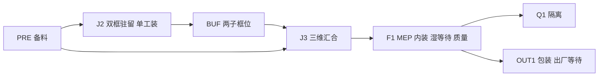

# S13 建筑工厂场景实施方案第三版待批稿

2026-10-03；方案标识 S13-PLAN-20261003-r3；关联PR094。供负责人审阅，由 AI 助手依据现行规格、只读盘点和官方网页整理。**推荐采用原创参数化建筑工厂与轨道式龙门吊，在现有设备上以优异品质为导向实施，并用实测决定性能优化。当前是第三版计划书，按设备性质及作业责任重新组织，负责人查阅确认后才开始正式工作。**

本版纠正r2对生产设备分类与人员责任交代不足的问题：六项设备逐一界定，机器人、普通加工设备、起重搬运设备、检测设备、工装与工具分别建模；控制方式、人员参与、作业能力和调度模式分开记录。保留r2的龙门吊布局、优异品质目标和按实际负载优化性能的原则。r1/r2及检查记录封存，本版尚无场景实现或运行结果。

## 品质目标与取舍原则

负责人要求各方面品质以优异化为导向。S13应交付结构清楚、视觉完整、运动可信、易于检查和复现的研究场景。“最小纵向见证”只规定实施先后，最终交付须达到本节品质要求。正确性、来源真实性和可复现性为硬门，视觉与性能在其上共同优化；不以少画必要对象、取消碰撞或隐藏失败换取速度和漂亮截图。

| 维度 | 拟达到的品质 | 验收方式 |
| --- | --- | --- |
| 建筑与设备建模 | 完整钢模块层次、内装与湿区可辨；六项设备结构、用途、控制和人员责任清楚；R1关节链与龙门吊轴向可信；比例统一 | 总览、局部和剖视检查，逐项对照BOM/设备清单；无明显穿插、悬浮或缺件 |
| 视觉表现 | 统一工业配色；自有金属/板材/地坪材质用颜色、粗糙度等区分；合理照明、阴影、构图与标签 | 默认以1920×1080单视图作为展示目标，原尺寸复核；标签可读，无明显闪烁、破面、过曝、遮挡；达不到时如实列偏差 |
| 运动与空间 | 起升、平移、落位连续；吊具随载荷保持明确关系；支腿和吊载分别检查扫掠空间 | 观察实际位姿轨迹与关键帧，禁止穿越障碍、瞬移或以动画终点代替到达检查 |
| 使用与检查体验 | 具名总览/工位/剖视相机；外观、碰撞包络、工作面、路线可分别检查；状态有文字与颜色 | 使用Isaac原生视图/图层和可复现入口完成检查，不新增自定义产品界面或S14派工功能 |
| 工程与性能 | 参数集中、ID稳定、分层清晰、确定性重置；正常视角运行流畅且无持续资源增长 | 记录实际负载、帧时分布和资源；优先优化无效网格、重复材质、不可见细节，保留必要语义与碰撞 |
| 证据与交付 | 图、配置、源码版本、状态和检查摘要对应；限制与来源清楚 | 正反用例和实际截图齐全，原始日志保留；计划、实测、人工验收分别记录 |

原创建模不等于只交付色块。胶囊体可作为人员碰撞代理，外观拟采用自建简化人体、工服/安全帽色彩与角色标签；这种表现不宣称人体工效标定。细节优先用于影响理解的梁柱、支承、管线接口、吊具与设备连接关系，不追求没有证据支持的工程尺寸。第三方资产仍按原许可边界另审。

## 目标与交付边界

S13拟交付可确定性初始化、重置和读取位置的完整建筑生产场景，覆盖底顶双框、三维汇合、MEP/内装、质量等待、隔离及出厂区。它提供S14需要的实体和空间状态基础。本步不接入DispatchCommand生产派工，不把演示位移当作执行完成反馈，不开展S15完整闭环、LNS、CP-SAT或正式A/D实验。

S12 r2已实际验收并发布；其独立检查和轻量闭环作为语义参照。S03仅证明基础刚体短时运行。二者均不替代S13真实场景见证。D01—D06限定冻结不变；G1/G2/G4/G5/G6/G7保持缺口，HR默认禁用。场景出现机器人不构成模式资格。

最小验收范围拟包括：一个SR-W1正常初始场景；分别加载双框驻留、汇合中、三维结构、MEP/湿区等待、Q1隔离和OUT1状态的明确合成检查夹具；SR-W2内装差异；第二产品用于容量冲突负例。不同阶段夹具分别加载，不在主场景复制同一产品的多个生产阶段。OUT1展示不表示真实READY或质量PASS。

拟产物为`sim/isaac/scene/`自有参数与几何、`scripts/build_building_scene.py`、`docs/sim/scene_mapping.md`、`docs/sim/asset_register.tsv`、必要场景检查与冒烟摘要。当前未创建这些实现产物。

## 资源定义：设备性质与作业模式分开

r2将CUT1、WELD1、R1、TEST1合列为几种外观，并对龙门吊强调运动却未交代操作者，容易把“会运动的机器”当成机器人，把“人使用机器”当成人机机器人协作。本版按下表修正；**人工模式允许使用生产机器，普通机器的自动循环也不自动成为机器人作业。**

工业机器人通常指自动控制、可重编程、可适用于多种用途且至少三轴可编程的操作机；是否使用AI不是判断门槛。IFR亦将笛卡尔/桁架式操作机列为机器人结构类别，因此不能只凭“龙门”名称下结论。本项目CR1是由起重人员操作的起重设备研究表达；其三轴被场景脚本驱动，不构成它成为机器人的依据。[IFR定义与结构分类](https://ifr.org/industrial-robots)

| 分类维度 | 必须区分的内容 | 对本项目的含义 |
| --- | --- | --- |
| 设备性质 | 工业机器人、普通加工设备、起重搬运设备、检测设备、工装、工具 | R1为机器人系统；CUT1/WELD1为普通加工设备；CR1/HST1为起重搬运设备；TEST1为检测设备组；FIX为工装 |
| 控制方式 | 人直接操纵、程序循环、自动控制；具体控制器未知时注明U | 不从“电动”“数控”“脚本驱动”推导机器人身份；未证实CUT1数控/无人切割，不预设此能力 |
| 人员参与 | 持续操作、装卸/设置、检查、等待期间无声明角色 | 按每个工作单元的roles及持有边界表达；设备仍被占用与人员仍忙碌是两件事 |
| 作业能力 | 切割、人工施焊、机器人末端运动、起吊、检测、夹持 | 设备类别不等于具备某工序资格；几何可达不证明加工质量或工业安全 |
| 调度模式 | 既有H、H-team、HR-seq、MOVE、WAIT、GATE | 模式属于具体作业；只引用契约枚举，不新增“自动机器=R”或“人+任意设备=HR”规则 |

契约中六项设备共同使用`kind=EQUIPMENT`是调度资源的通用分类，不能据此认为它们同属机器人。FIX-J2/FIX-J3仍为`FIXTURE`。S13拟在场景映射登记设备子类、控制证据、人员关系、作业与模式、运动表达、占用边界及未知项；这些是说明与场景元数据，不修改冻结契约或增加资源容量。工序表用于解释工艺，具体模式和工作单元以[生成后的配置](../../examples/building_contracts/configuration.json)为准，并对照[生成规则](../../scripts/build_building_contracts.py)。

## 全设备职责与建模清单

以下六项覆盖当前配置的全部EQUIPMENT资源，每项容量沿用1。所列机械形式是待批场景表达A，现有合成数值为E，真实型号、控制器和工艺参数未知项记U；不将可视化选择回写为工业事实。

| 设备ID | 明确定义与控制边界 | 人员、作业和调度对应 | 拟建模内容与不得推导的能力 |
| --- | --- | --- | --- |
| CUT1 | 普通钢材切割设备；当前按P1操作表达，具体锯切/热切及数控形式U | PRE的CUT，P1与CUT1共同占用，模式H-team；此模式名不表示必须多人 | 原创切割工作台、支承/夹持、切割头功能件、控制位置与作业包络；仅作设置/加工状态表达。未选定切割技术，不编造锯片/激光器、无人循环或机器人手臂 |
| WELD1 | 人工焊接设备系统，包括电源、手持焊枪和连接线；自身不是机器人 | W-B/W-T的H由W1操作，配FIX-J2；W-3D的H-team由W1、W2参与，配FIX-J3 | 单一共享设备根，电源、线缆与手持工具分层；工人施焊责任可见。不能在J2/J3各放一台独立可用WELD1；不用机械臂代替人工焊枪 |
| R1 | 机器人焊接系统资源；拟以通用六转动关节工业机械臂、焊枪末端、控制柜及配套电源表达 | 仅对应W-B/W-T候选HR-seq：OP1设置→机器人段→OP1卸载；全程持有R1与FIX-J2，现行模式禁用 | 独立关节链、关节限位、末端坐标与包络，做隔离的几何空载检查；不能仅画静态手臂冒充机器人建模，也不将通过空载检查当成焊接资格 |
| HST1 | 组件起重/搬运设备，能力3 t合成E；按P1操作、司索和指挥参与表达，具体机构/行走驱动U | MV-IN-B/T与MV-B/T；P1、Lrig、Lsig；MOVE及ROUTE-COMP | 原创支承/起升机构、吊钩/吊具、控制位置及载荷关系的功能模型；与CR1区分。撤回r2无依据指定的低位支承运输车，不擅自认定为AGV/AMR、机器人或自主导航设备 |
| CR1 | 全门式轨道龙门起重机；大车/小车/起升三轴为机构自由度，按Lop操纵表达 | JOIN-IN及配置声明的完整模块搬运；Lop、Lrig、Lsig；MOVE及ROUTE-MODULE | 主梁、支腿、轮组、轨道、小车、起升与吊具，并显示操作者/司索/指挥角色；脚本回放不省去领域人员，不宣称自主吊运 |
| TEST1 | 共享检测/试验设备组，非机器人；不同检验使用组内不同功能器具 | Q-MEP、TEST-SET、WAIT-TEST、Q-POND、Q-EXT、Q-FIN；具体人员和持有区间见下表 | 检测工具车/箱与对应仪表、试验接口、蓄水用件等子件；一个资源令牌，不能建成“万能检测机器人”或多个可并行的TEST1；数值和外观不自行决定质量PASS |

WELD1的电源、焊枪、线缆不各生成一个领域资源；R1的配套焊接电源也不自动占用WELD1。当前HR-seq只声明R1与FIX-J2，本版按“R1包含必要配套设备”的研究映射A表达，不声称已证实真实硬件独立。如果后续证据要求两模式共用电源，需另审领域约束，不能靠场景悄悄增加共享锁或允许错误并行。

WELD1在J2/J3的共享关系必须可检查：拟用同一设备及各作业状态夹具展示实际占用位置，不在一次连续回放中瞬移。设备移设时间、方式和电缆覆盖尚未进入当前工艺契约，S13不得编造生产MOVE；本步分别加载位置夹具并标明“移设过程未建模”，后续需要连续生产空间验证时再审该缺口。TEST1跨检验位置同样不得以副本增加可用数量；组内器具只用于解释当前任务。

| 非设备资源/物件 | 定义与拟表达 | 约束 |
| --- | --- | --- |
| FIX-J2 / FIX-J3 | 夹持、定位、支承工装，分别持有独立资源ID；以定位块、支承和夹持结构表达 | 有夹紧动作也不因此成为机器人；J2可驻留同产品双框，但FIX-J2仍单活动独占 |
| 手工具与便携电动工具 | 人员使用的作业器具，可作为外观子件 | 工序未单列设备不等于不用工具；未经定义不得添加独立资源、自动工站或改变人员能力 |
| bay / ROUTE / 工作面 | 空间、通行与作业占用约束 | 不属于生产机器；几何位置不能替代驻留、预留和排他规则 |
| 材料与等待中的产品 | 被加工对象及物理/工艺等待状态 | 固化、干燥、蓄水保持不能画成“机器人正在加工”；产品驻留不能随人员释放消失 |

楼板/围护/MEP/防水/贴砖/涂装/安装/包装等未声明专用机器的工序，按现有人员作业和必要工具表达，不擅自添加铺板机器人、自动喷涂线或包装机。若将来引入普通自动生产设备，也须独立定义其自动段、监督需求和共享资源，不能塞入R1或借用HR-seq名称。

## 人员责任、设备占用与人因评价

以下是现有契约的解释及S13映射要求，不是本步新增生产执行。合成检查夹具须标记夹具身份，不产生派工回执。

| 代表作业/阶段 | 人员责任 | 设备/工装占用 | 正确的解释 |
| --- | --- | --- | --- |
| CUT | P1贯穿当前声明工作单元 | CUT1 | 人操作切割设备，不因切割头运动变为HR |
| W-B/W-T：H | W1设置、施焊、卸载 | WELD1、FIX-J2 | 人工焊接使用机器；不能释放焊工而让焊枪自动完成 |
| W-B/W-T：HR-seq候选 | SETUP为OP1；ROBOT段无声明人员；UNLOAD为OP1 | 三段均R1、FIX-J2，至卸载完成 | 顺序协作候选；无同时共享空间许可，机器人自动段无角色仅是当前抽象，真实监督需求仍待证，模式保持禁用 |
| W-3D | W1、W2 | WELD1、FIX-J3 | 多人配合普通焊接设备；不能动画为R1完成整个三维结构 |
| HST1搬运 / CR1搬运 | 分别P1或Lop操作，均另含Lrig、Lsig | 对应起重设备与路线；按MOVE规则持有 | 起升/平移全过程保留声明角色；遥控或程序回放不等于无人作业 |
| Q-MEP / Q-EXT / Q-FIN | 分别QA1+E1+PL1 / QA1+AF1 / QA1+E1+PL1 | TEST1 | 人员实施/判读检查；质量状态只取合成夹具的显式输入，不由设备亮绿灯自动放行 |
| TEST-SET → WAIT-TEST → Q-POND | T1设置；保持期无角色；QA1、T1复验排水卸载 | TEST1连续持有至排水卸载完成，WET占用保持 | 人员释放与设备释放不同；等待期不是机器人工作，不能把TEST1借给另一检验 |
| WAIT-COAT / WAIT-W、WAIT-TILE、WAIT-PAINT | 表面等待后QA1检查；其余等待无声明角色 | 不额外生成设备；产品/工作面按既有规则保持 | 被动过程与主动操作分开，不凭无人画面推断无人设备自动循环 |

“人员当前未占用”不自动表示正在休息，也不直接意味着疲劳恢复。D人因评价仍取已定义的人员工作、显式休息和恢复规则；设备自动段、等待段、人员步行外观均不能私自改变工作负荷系数或计入休息收益。A研究仍围绕有资格依据的H/HR-seq候选与排程联合决策；普通机器是共享资源及能力约束，不能通过把它们改叫机器人扩大HR样本。B/C定位不变。

## R1机器人本体与场景能力

R1拟采用原创通用六轴串联机械臂研究模型，具备基座、六组关节/连杆、法兰、焊枪、TCP和控制柜；关节零位、轴向、角度单位、范围和连杆尺寸集中登记为A。焊接电源、送丝等配套外观为子几何，细节未证实处保持功能级表达；不贴厂家标识，不伪称匹配某真实型号。

S13拟检查给定关节角的正运动学与USD读回TCP一致、连续关节回放、限位拒绝、连杆/工装/产品碰撞包络，以及确定性重置。用已选关节序列产生短程空载轨迹，目标由正运动学得到，不新增逆解优化或自主焊缝规划任务。独立空载夹具显示`GEOMETRY_DEMO`；生产模式标签显示`HR_MODE_DISABLED / QUALIFICATION_UNVERIFIED`，两者同时保留。

固定基座机械臂不预设能覆盖6 m整框，更不靠缩小产品、无说明移动基座、添加未声明导轨/变位机来伪造覆盖。拟展示已核对的局部可达目标和至少一个不可达或越限反例，并明确完整焊缝覆盖尚未验证。具体型号、安装位、焊接工艺、人员隔离和完整覆盖证据仍为G2等缺口；缺少这些证据不妨碍几何模型做扎实，但禁止把空载表现升级为工业焊接/HR生产能力。

## 布局与尺寸依据

权威输入为[钢规格](../model/selected_steel.md)、[生产证据](../research/production_evidence.md)、[当前契约实例](../../examples/building_contracts/configuration.json)及[总纲S13](../PROJECT_CHARTER.md#s13)。产品名义包络6×3×3.2 m、楼板18 m²、湿区2×1.5 m来自已限定冻结的研究抽象A；截面、板厚、重心、吊点、净距及起重净空仍U。场地与以下坐标是本方案新提出的布局A，待批准，不是实测厂房。

建议场地42×34 m、右手坐标、Z向上，原点为地面西南角，X向东、Y向北，地面顶面z=0。本版沿用r2替代r1的54×40 m所采用的布局，以缩短龙门吊覆盖尺度并给轨道与支腿保留独立边带；不是厂房工程优化结论。所有模块长边沿X；支承面暂取z=0.6 m，产品最高z=3.8 m。支承高度、显示梁厚和门窗尺寸均是可追溯的视觉参数，不写回生产规格，不由体积×密度推算质量。厂房拟有完整轮廓、地坪、柱梁和可切换屋顶/外墙层，检查视角可隐藏遮挡，柱子避开轨道及吊载包络。

| 分区ID | 中心x y 单位m | 区域长宽 单位m | 容量及用途 |
| --- | --- | --- | --- |
| PRE | 6 10 | 8×8 | 1产品；底框、顶框、立柱套件备料 |
| J2 | 16 10 | 8×8 | 1产品；两框驻留，单套FIX-J2独占 |
| BUF | 26 10 | 8×8 | 2子框；两独立落位槽，不能解释为2个完整模块 |
| J3 | 36 10 | 8×8 | 1产品；子件逐次落位与FIX-J3三维装配 |
| F1 | 36 24 | 8×8 | 1产品；楼板、围护、MEP、内装、湿等待与原位质量检查 |
| Q1 | 26 24 | 8×8 | 1产品；隔离，禁止被当成无限等待缓存 |
| OUT1 | 16 24 | 8×8 | 1产品；包装、出厂就绪展示及等待外部接收 |

J2和BUF的两框槽中心分别为(x,7.5)与(x,12.5)，每框平面6×3 m；两槽只是驻留子位置，不新增两个工装。FIX-J2在任一时刻只有一个活动所有者。PRE用组件原料包占位，不提前把原料显示成已焊成品。上述bay只表达有限驻留，8×8 m不证明人员操作净距充分；设备辅助区和人员位置须在场景中另查，不把bay面积当作作业许可。

路线建议在平面分开：ROUTE-COMP主廊中心y=4、宽4 m，服务HST1的PRE→J2与J2→BUF；ROUTE-MODULE主廊中心y=17、宽6 m，服务CR1的JOIN-IN（底/顶框BUF→J3、立柱集合PRE→J3），以及J3→F1、F1→OUT1/Q1和配置明确允许的清场路线。名称中的MODULE不表示它只搬完整模块；必须按现有move字段映射。各bay通过垂直支路接入。物体长轴保持X，按固定折线路径运动，不优化连续路径。路线宽度仅供合成包络试查；加0.5 m可配置检查裕量也不代表安全标准。HST1、吊具或附件的总宽若超出4 m走廊，不缩小碰撞体凑通过，须调整几何布置并记录原因。

两条走廊分离是为避免在现有两个独立路线资源之间悄悄引入未建模交叉口。PRE/BUF内两类设备的取放区域仍须检查实际包络和驻留所有者；HST1不进入J3。不能以画线代替冲突检查；若实现检查发现支路/设备仍交叉，应报告场景不一致并修改待审布局，不擅自改C05容量或增加生产许可。南侧支路在J2/BUF选择实际框槽，不穿越已驻留另一框；必要时改用明确的垂直抬升段，并检查扫掠包络。

人员待命区拟置于北侧y=33，与龙门吊轨道边带分开；工作角色采用自建简化人体外观、胶囊碰撞代理与标签。人员进入工位只用于位置夹具，不实现自主导航，也不宣称通道合规。HOT隔离、MOVE排他和未知工作面并行关闭保持。

## CR1轨道式龙门吊方案

本版推荐CR1采用全门式轨道龙门吊的研究表达，替代r1含糊的桥式起重机示意。龙门吊通过两侧支腿将主梁支承在地面行走机构上；桥式起重机通常由高架轨道承载，两者的支承、占地与冲突检查不同。[Konecranes官方资料](https://www.konecranes.com/sites/default/files/2023-05/brochure_cxt_cranes.pdf)列出全门式/半门式设备类别；此处只据此说明形式，自建几何不复制厂家设计，也不称为该品牌数字孪生。

| 项目 | 待批研究参数或表达 | 必要检查 |
| --- | --- | --- |
| 两条轨道 | 平行X，y=0.75与30.5 m，x∈[0,42] m；轨距29.75 m | 为合成覆盖方案，不是实际型号选型；轨道端部/基础/支腿须明确可见 |
| 支腿与行走机构 | 南边带y∈[0,1.5]、北边带y∈[29.75,31.25]；初拟单侧纵向总包络4 m | 外形不得超出登记包络；边带禁止放料、人员待命或暗作缓冲；不与生产走廊混同 |
| 主梁与运行范围 | 梁沿Y跨接两侧支腿，大车沿X；大车中心x∈[4,38]、小车中心y∈[6.5,27.5] m | PRE、BUF、J3与北排工位实际吊载中心均须可达；靠端位置考虑吊具尺寸，不只查吊钩点 |
| 起升与净空 | 主梁下缘初拟z=8 m；吊钩工作范围初拟z∈[1,7] m；转运时载荷最低点初拟z=1 m | 单独检查3.2 m模块、吊具高度、梁下净空和支承；参数仅A，不能关闭G1/G6 |
| 设备构件 | 主梁、支腿、端梁/轮组、小车、起升机构、吊钩、吊具、绳索示意与行程端部 | 外观分层可读；绳索长度随起升更新，首版无柔索动力学；模拟连接点仅为视觉/运动学锚点 |
| 资源身份 | 整机始终一个CR1；沿用现有12 t合成能力与ROUTE-MODULE | 不新增第二台吊机、不扩大容量，不因小车/大车两个方向生成两个独立资源 |

初步平面复核：南轨支腿边带止于y=1.5，组件走廊从y=2开始；北排bay止于y=28，北轨边带始于y=29.75，待命区在y=33。工位中心与BUF两槽在所列小车范围内。上述仅为区间算术和布置意图，模型加载后仍须对全尺寸碰撞体、吊具和扫掠体核验。真实结构能否实现该跨度、净空和载荷仍是工程证据缺口，不能由动画证明。

演示动作拟分为对位→挂接状态建立→垂直起升→保持方向平移→垂直下放→稳定落位→解除挂接。JOIN-IN仍由CR1分三次搬运底框、顶框和立柱集合；支承/装配定位按组件阶段表达，不能让未组装顶框无说明悬浮。模块搬运时外观、碰撞代理和谱系共同移动，源位置不留副本。

三个轴的位移应连续，起停采用可解释的平滑速度曲线并记录限值；不凭人工插值声称控制器或动力学已验证。工作面的排他、起终点预留与实物驻留沿用领域语义。轨道支腿扫掠体与吊载扫掠体分别检查；若主梁/支腿或路线妨碍既有合法活动，应先修正场景映射，不在S13私自加入新的领域资源锁。

HST1按前述组件起重/搬运设备功能模型表达，机构选型未知处保留U。实施时先用足尺寸功能包络核查起升、支承、吊具、操作者位置与4 m走廊；未能形成连续可行空间见证时记录未通过并修订布局，不用低位车辆外观掩盖既有司索、摘钩语义。其运动学演示不证明真实结构或控制能力。

此图表示逻辑流向；具体坐标以表格为准，不新增工艺边。质量等待主要保持F1，不因画有Q1便自动搬离。

## 产品细节与实体映射

拟以USD Xform分层：`/World/Factory`放静态区与支承，`/World/Entities`放组件/产品，`/World/Resources`放设备/工装，`/World/People`放人员，`/World/Routes`放路线。域ID保存在自定义属性和显式双向映射中；USD路径用稳定安全键，不能依赖简单替换点号或连字符后仍唯一。

| 域对象 | 拟几何与映射规则 |
| --- | --- |
| PRODUCT-1.BOTTOM 与 PRODUCT-1.TOP | 各一个实体根，四边梁加支承示意；细小梁段是子几何，不新增领域组件 |
| PRODUCT-1.COLUMNS | 一个组件集合根、quantity=4，四根子几何；当前mass_t=4是集合值，不给每根重复赋4 t |
| PRODUCT-1 | 汇合前仅逻辑身份UNASSEMBLED，无额外驻留刚体；汇合时只消费已经落位的组件；汇合后一个实体根保留组件谱系，禁止源区还留可碰撞副本 |
| B-FL B-EN B-WT B-ME B-FI B-PR | 楼板、分层围护、湿区、管线/电气、门窗洁具柜体、保护覆盖分别可显示；作为BOM子几何，不伪造新契约ID |
| SR-W2 | 同结构包络；增加洗手盆、支管与插座组的独立可辨几何，工艺增量仍由原域配置负责 |
| CUT1 / WELD1 / R1 / HST1 / CR1 / TEST1 | 六个唯一资源根，分别遵循前述逐设备定义；运动子件、工具和配套单元归属父设备，不生成额外设备容量；只有R1按机器人关节链表达 |
| FIX-J2 FIX-J3 | 单独资源ID和所有者显示，不与bay或框槽容量混同 |
| P1至Lsig共15人 | 沿用契约具名ID及资格角色；自建简化人体外观与胶囊碰撞分离，尺寸为A，不作为人体或可达性测量 |

F1内产品局部坐标以左下底角为(0,0,0)，湿区暂置x∈[4,6]、y∈[0,1.5]，其余为干区。D-E/W-P/WET/DRY/CEIL/EXT以半透明工作面和属性显示，不以几何不相交自动发放并行许可。外墙可隐藏供检查；隐藏外观不删除占位碰撞代理或工序锁。

USD拟显式设置`metersPerUnit=1`、Z-up与kg质量口径，Isaac运行时间使用秒。领域输入仍保持m/t/h，映射层明确t×1000→kg、h×3600→s，不能把工艺小时直接作为物理步长或用动画速度替代工时。OpenUSD未显式设置长度单位时会回落到0.01，因而单位必须进入验收。[OpenUSD单位说明](https://openusd.org/release/api/group___usd_geom_linear_units__group.html)

## 自建与复用的选择

推荐方案A：所有生产对象采用原创参数化几何和自有材质参数，零新增模型下载。分阶段完善轮廓、接合细节、材质、灯光与标识，达到本版品质要求。复用项目自有的S03启动顺序、逐步回调检查、状态读取与关闭判定，以及C04实体语义；保持S03原见证不变。安装中的第三方网格纹理和示例USD不复制入仓库；地坪和分区标线自建，不依赖外部贴图。

方案B：A通过后，另行审批1个品牌机器人或1个人物外观替换；替换不改变碰撞代理、域ID、容量、工艺资格和负载声明。增加下载、依赖展开、许可及渲染检查工作。方案C为厂家CAD/完整仓库与精细动力学优先，当前不推荐：G1/G2/G6资料不足，环境资源与转换链亦未经本步验证。

## 官方资产来源与许可核查

核查日期2026-10-03。以下均未下载、导入或接受新增条款；“候选”不等于已批准使用。获取价格与资产权利分开记录；软件免费不等于模型可以修改或公开。

| 类别与具体候选 | 官方来源与获取方式 | 格式和兼容边界 | 费用与权利处理 |
| --- | --- | --- | --- |
| 厂房 分区 模块 工装 龙门吊 人员外观及碰撞代理 | 自有脚本根据本文及钢规格生成；技术API查[OpenUSD](https://openusd.org/release/api/group___usd_geom_linear_units__group.html) | 原生USD/USDA；在现有RC构建实测后才认兼容 | 无资产采购；原创部分沿用仓库已确认MIT，保留许可，不转授第三方权利 |
| 既有Isaac运行环境 | [官方许可FAQ](https://docs.isaacsim.omniverse.nvidia.com/6.1.0/common/license-faq.html)；复用已安装版本，不重新安装 | 源码与Kit、模型、纹理分属不同许可；6.1网页不证明本地RC二进制逐项相同 | 官方称内部研发免费；不得因此复制运行环境。公开只提供自有代码/几何，运行环境由使用者自行具备 |
| 通用机械臂外观 UR10e | [NVIDIA机械臂目录](https://docs.isaacsim.omniverse.nvidia.com/6.1.0/assets/usd_assets_robots_manipulator.html)，条目`UniversalRobots/ur10e/ur10e.usd`；批准后从匹配版本Content Browser解析资产根获取 | USD、PhysX关节与articulation；实际RC加载及全部依赖待验证；不是焊接资格模型 | 目录标BSD-3，链接至[上游仓库](https://github.com/fmauch/universal_robot)；本轮未取得对应精确资产及全依赖许可，署名/修改/再分发均待逐文件核实。目录无单项售价；不承诺无需账户或条款。非推荐基线 |
| 焊接机器人厂家候选 ABB IRB 2600 | [ABB产品页](https://www.abb.com/global/en/areas/robotics/products/robots/articulated-robots/medium-robots/irb-2600)，厂家CAD渠道待确认；本轮旧CAD页已重定向 | 当前页确认弧焊用途及12/20 kg型号、1.65/1.85 m范围；搜索索引曾列STEP/IGES，当前未确认可用下载，不作为可获取格式承诺；需转换、碰撞与关节重建 | CAD下载价格/账号/许可/署名/修改/再分发均待厂家确切条款；实体设备报价未请求。能力和可达范围不支持宣称覆盖6 m全框，不承担吨级搬运 |
| 重载设备类别参考 Konecranes CXT | [官方CXT资料](https://www.konecranes.com/sites/default/files/2023-05/brochure_cxt_cranes.pdf)说明桥式/门式起重类别；只引用事实，自建无品牌简图 | 本轮只确认PDF资料，未确认可许可的USD/CAD资产、版本或获取渠道；厂家建模需另行资料 | 未见适用模型价目或再分发许可；不采购、不复制图样/PDF。产品系列吨位不作为本项目吊装工程凭据 |
| 仓库外观 Small Warehouse | [NVIDIA环境目录](https://docs.isaacsim.omniverse.nvidia.com/6.1.0/assets/usd_assets_environments.html)，`/Isaac/Environments/Simple_Warehouse/warehouse.usd`；批准后Content Browser或官方资产包 | USD；纹理、材质、引用递归依赖及RC兼容待查；货架仓库布局不直接适合建筑模块线 | 无目录单项售价；附加材料许可限制修改/分发并要求保留权利通知，逐资产例外待查。首版不用；可替代为自建厂房 |
| 人物外观 Male Construction Worker | [NVIDIA人物目录](https://docs.isaacsim.omniverse.nvidia.com/6.1.0/assets/usd_assets_props.html)，`People/Characters/origial_male_adult_construction_03/male_adult_construction_03.usd`，拼写按目录 | USD骨骼人物；动画控制器、纹理及运行兼容未验证；不能承载疲劳/姿态健康结论 | 目录未给本条独立许可，精确获取/署名/修改/再分发待核实；不因NVIDIA托管推断可商用。首版用原创简化人体外观与胶囊碰撞代理 |
| 可选材质 Poly Haven纹理 | [官方资产许可](https://polyhaven.com/license)；如需另选具体资产页，人工批准后按实际视觉用途选择分辨率 | 具体资产未选；文件格式、色彩空间、法线约定及USD材质转换均待定，不引入HDRI或复杂材质作首版依赖 | 官方明确资产为CC0，可修改、商用及再分发且不强制署名；仍保留作者/来源/摘要以便追溯。具体免费获取条件与网站/API条件另核，首版自有材质参数无需下载 |

[NVIDIA资产获取说明](https://docs.isaacsim.omniverse.nvidia.com/6.1.0/installation/accessing_assets.html)区分在线资产根与本地完整包。若以后批准第三方资产，优先逐个必要资产与依赖，不先下载全包；如只能取得完整包，应先重新说明下载体积和范围。[附加软件及材料许可](https://docs.isaacsim.omniverse.nvidia.com/6.1.0/common/license-isaac-sim-additional.html)与源码Apache许可不同，模型目录可能另列许可，须以精确文件及依赖随附条款核对。未知资产不得纳入公开包；仅保留来源链接不能替代实际加载许可。

拟登记字段为asset_id、用途、原创/第三方、来源URL、获取日期/版本、文件摘要、依赖、原始单位、许可证证据、费用/账户限制、允许使用/修改/再分发、署名文本、几何/碰撞/动力学级别、公开处理及待核项。不把未获取文件编造为已登记摘要。

## 表达能力与不能证明的事项

| 层次 | S13拟验证 | 不作的主张 |
| --- | --- | --- |
| 外观展示 | 完整产品各BOM层与工位角色可辨、状态有标签 | 截面设计、建筑性能、安装方法或完工质量合格 |
| 占位与碰撞 | 简化包络、区内包含、相交/障碍、落位槽及有限容量、研究机械臂局部可达可检查 | 工人安全净距、法规符合、真实型号与完整工序可达 |
| 运动学 | HST1/CR1固定路线与机构运动；R1关节链、正运动学/TCP、局部空载回放与限位；实际读回和重置 | 吊索摆动、工业焊缝覆盖/工艺轨迹、载荷力矩或真实设备控制 |
| 动力学与载荷 | 必要基础碰撞冒烟；质量/吊具/额定字段可见且换算正确 | 钢材变形、结构承载、吊点受力、摩擦/稳定性和工程吊装验证 |

当前配置组件BOTTOM/TOP各2 t、COLUMNS集合4 t、HST1能力3 t，模块8 t+吊具1 t、CR1能力12 t均为合成E。已核对JOIN-IN使用CR1与ROUTE-MODULE，分三次稳定落位搬底框、顶框、立柱集合；立柱源位特例为PRE。不得用HST1搬4 t集合，也不得擅自改成四次单柱生产动作。生产许可还依赖质量、重心、吊点和路线证据，数字比较通过仍不能关闭G1。首版起重运动采用明确的运动学代理，不靠伪造质量/惯性得到稳定物理表现。

## 环境只读核查与调整边界

本轮已读取现有安装VERSION、资产文件路径与许可元数据，并查询GPU；没有启动Kit、兼容性检查器或仿真。安装仍为既有6.1 RC构建；历史S03使用其自带Python及CPU PhysX，单进程1/16/64基础刚体短时回调、重置、退出见证已存在。该安装可作为试作候选，S13运行状态仍NOT_RUN。

显存配置与项目是否可运行须分开判断。[官方6.1要求表](https://docs.isaacsim.omniverse.nvidia.com/6.1.0/installation/requirements.html)列16 GB，属于一般系统要求，不是专为大规模集群列出的指标；该页同时指出复杂场景高像素渲染、大量传感器及训练工作流会增加资源需求。低于表列值不意味着本项目必然超显存，本版不将它作为启动阻碍或预先降质依据。

已有[S03运行记录](../validation/runtime.md)中整卡显存采样峰值约3.1—3.3 GB，且包括桌面等其他占用；这是无逐帧渲染基础场景的历史证据，不预测本场景峰值。当前没有证据证明显存不足。单场景、有限设备与人员、无批量并行训练或密集传感器，使复用现有机器成为合理起点；本判断是基于负载结构的推断，须由实际运行确认。

实施策略为先构建必要完整内容，再测量加载、运行、1920×1080单视图渲染及重置负载。单进程与CPU PhysX沿用已验证入口，必要结构采用适合其作用的静态、运动学或动态表达。**取消r1对64刚体规模和640×480截图的预设限制**：64只是历史受测数量，不能当作本机或S13的上限。也不为增加视觉细节而把所有梁段都变成动态刚体。

品质优化按数据推进：记录实际渲染模式、分辨率、几何/碰撞规模、启动及稳定阶段帧时、系统内存、整卡显存与可用时的进程指标；整卡采样不冒称进程独占。目标为正常检查视角交互流畅，初定中位帧时≤33.3 ms（约30 fps），同时报告P95和卡顿，不把该目标写成已满足。加载/截图峰值与稳定运行分开测，重复重置检查是否持续增长。

发生实测瓶颈时，先定位是渲染、资产、CPU物理还是其他进程影响；优先实例化重复几何、合并冗余材质、降低不可见细节与无必要动态体、优化光照和渲染参数，再评估分辨率取舍。影响可读性、完整性或验收阈值的降级必须标为偏差交负责人审阅，不用降质结果冒充原目标达成。没有瓶颈就保留品质，不为了符合估计预算主动删必要内容。

本轮CIM硬件查询被拒绝；部分系统信息来自其他只读接口或历史记录，不称重新实测全部硬件。安装内资产路径不等于获准复用的生产模型库。具体机器配置仅本地留存。本方案无预先升级硬件的要求，也不安装/升级Isaac、驱动、Python、扩展、CAD转换器或购买云GPU；只有确认现有环境无法完成必要出口，才保留失败并提出具体调整。启动遇到新增条款或必需下载时，仍按既定授权边界处理。

## 搭建顺序与工作量估计

以下为AI辅助实施的工作量估计E，不是耗时承诺，均以负责人批准本方案为前提。

| 阶段 | 工作与出口 | 估计 |
| --- | --- | --- |
| 1 定义与纵向场景 | 六设备/两工装及阶段角色映射；固定单位/ID；PRE、J2双槽、BUF、J3；龙门吊与HST功能包络；真实加载起点 | 1.5—2工作日 |
| 2 完整设备与品质打磨 | R1关节链/TCP/空载夹具；普通设备结构与操作者责任；F1/BOM、Q1/OUT1、SR-W2；材质/照明/视角 | 2—3工作日 |
| 3 验证与实测优化 | 设备分类/角色/占用反例、R1运动学、重置/汇合/容量/障碍；实际渲染/资源/帧时优化 | 1.5—2.5工作日 |
| 4 证据与审阅包 | 实际截图逐张检查、运行摘要、资产清单、完整差异/摘要、边界与确切发布方案 | 1—1.5工作日 |

合计约6—9工作日，较r2增加全设备语义核对与R1关节模型/空载见证，不以原工期压缩质量。环境异常另加排查时间，实际进度按完成出口报告。单个第三方外观候选另需约0.5—2工作日及许可不确定性，不纳入A的必要出口；机器人关节运动学已计入；工业焊接、精细机器人驱动力/吊索动力学不在此估计内。

## 验收协议草案

1. **单位与映射**：核对输入配置摘要、每个域ID唯一映射、组件集合数量、域t/h与场景kg/s转换；产品包络6×3×3.2 m误差拟≤1 mm。故意输入厘米当米、重复ID、缺失区/资源必须报错，不能自动猜测修正。
2. **双框与工装**：同产品底/顶框在J2均有位置且只计1产品；第二产品加入拒绝；两个活动争用FIX-J2拒绝。BUF第三个子框拒绝。几何槽不得把工装容量改成2。
3. **汇合守恒**：逐次消费落位组件，未到达者保留源位置；UNASSEMBLED无重复产品体；组装后独立可碰撞组件副本为零且谱系完整。故意同时保留源/目标实体应检出。
4. **位置与路线**：实际读取USD/物理位姿、世界包络与区内包含；记录source、target、reservation、in_transit、landed。到达按实际读回与终点误差≤1 cm、姿态误差≤0.1°判断；插入障碍或错终点不得返回到达。运动演示仅产生S13检查记录，不生成S14执行事件。
5. **工作面与等待**：F1湿等待仍有驻留/面占位；隐藏墙板不释放碰撞；未知并行条件默认关闭；Q1/OUT1容量不扩张。外观“完成”不能设置质量PASS。
6. **确定性重置**：每个固定夹具连续3轮，清除上轮速度/路线进度/残留可视状态/资源所有者，恢复相同ID集合与初始位姿；初始位置误差拟≤1e-5 m、旋转用四元数符号等价比较，运动回放位置误差拟≤1e-4 m。物理步拟1/60 s，每轮240步；每步一次回调且实际时钟匹配。门槛仅适用受测配置，不能称跨硬件位级确定性。
7. **资源与退出**：记录启动/运行/截图实际耗时、进程与显存采样、超时及警告；初步监督上限拟600 s/次，超限先记失败并判因，不自动推断硬件不足。S03已知包装器可能失败仍退出0，故必须场景PASSED、closed=true、退出0且无超时同时成立。
8. **截图与可复现**：至少俯视分区、J2双框单工装、J3汇合、F1剖视/湿区、龙门吊全景与吊具近景、CR1载荷起终点、Q1/OUT1各一张；默认1920×1080，必要局部放大。逐张检查比例、接合、材质/光照、文字和遮挡，无明显破面或穿插才交付；图内标明合成状态与表达级别，实际截图不以示意图替代。公开摘要排除机器配置与原始日志。
9. **龙门吊覆盖与运动**：核对轨距、支腿边带、三轴行程和全部所需起终点；载荷+吊具扫掠与支腿扫掠分别检测；加入轨道障碍、越行程、吊具未挂接、未落位即摘钩反例，要求失败且说明对象。这些是S13场景演示状态机检查，不扩展到S14真实派工。空间未知仍不得宣布工业安全许可。
10. **品质与性能联合复核**：在完整场景与约定渲染设置下记录至少60 s正常视角运行，以及10次重置的资源趋势；报告帧时中位数/P95和显存峰值，目标中位帧时≤33.3 ms。截图、稳定性、性能与语义各自给结果，不能拿其中一项通过替代其余；资源增长或目标未达时先诊断优化，仍未达则列入待审偏差。

11. **设备身份与共享**：从配置枚举全部六个EQUIPMENT和两个FIXTURE，与场景逐一匹配；CUT1/WELD1/TEST1不得附上机器人标签或机械臂功能。故意复制WELD1为两台可用设备、把R1配套电源错误映射为WELD1、把TEST1子器具拆为多个令牌、把夹具槽当作第二套工装时须检出。上述是映射检查，不修改领域执行器。
12. **阶段责任与占用**：检查CUT、人工焊接、HR-seq候选、两类MOVE、试验设置/保持/卸载和被动等待夹具。故意省略起重操作者、在人工焊接中提前释放W1、WAIT-TEST时释放TEST1、将无占用人员直接标为REST、将普通机器作业标为HR均须检出；禁用HR夹具不能产生生产完成回执。质量灯不得自行改PASS。
13. **机器人独立见证**：不少于3个给定关节姿态对照独立正运动学计算与USD读回TCP，初拟位置差≤1 mm、姿态差≤0.1°；一条连续局部空载轨迹；越限/碰撞反例拒绝；已知超出模型最大伸展界的目标标为不可达。重置检查包含关节角与TCP；截图展示关节轴/TCP、普通人工焊接设备与机器人区别、三轴龙门吊及其人员角色。只能证明所用研究模型的几何一致性，不证明真实设备精度和全框可焊。

此协议先于实现提出；若RC API、碰撞或资源限制使阈值/方法需实质变化，保留原失败与变更理由再审，不能事后放宽并声称原协议通过。CPU测试不能替代真实Isaac见证，S13通过不能替代S14/S15。

## 待负责人决定的具体范围

建议采用第三版方案A：沿用42×34 m布局和轨道式龙门吊，按六项设备及两项工装的明确定义实施；R1建立可检查的关节模型，普通加工、起重、检测设备各自承担其任务和人员责任。保持优异品质导向与实测性能优化，接受本版明确的几何/运动学边界及移设、监督和工程资料缺口。第三方模型、安装升级、采购和额外环境改动不在范围内。

负责人在r2交付后指出机器人与普通机器概念混淆，并明确要求覆盖普通生产机器重新思考和修订；PR094据此形成r3。此次仅完成计划书修订。待负责人查阅确认本版后，实施范围为S13自建场景、各类设备及R1关节模型、初始化/重置、映射/资产登记、品质打磨、必要CPU与真实Isaac检查、实际截图、必要治理和确切审阅包，沿用现有main，不建分支/worktree。S14—S28和Git/远端发布仍独立授权。

当前状态：第三版方案DRAFTED / PENDING_LEAD_REVIEW_CONFIRMATION；正式实现NOT_STARTED；S13运行NOT_RUN；发布NOT_APPROVED / NOT_PUBLISHED。负责人查阅确认本版后再开始S13，不沿用r2待审意见推定r3已获确认。
