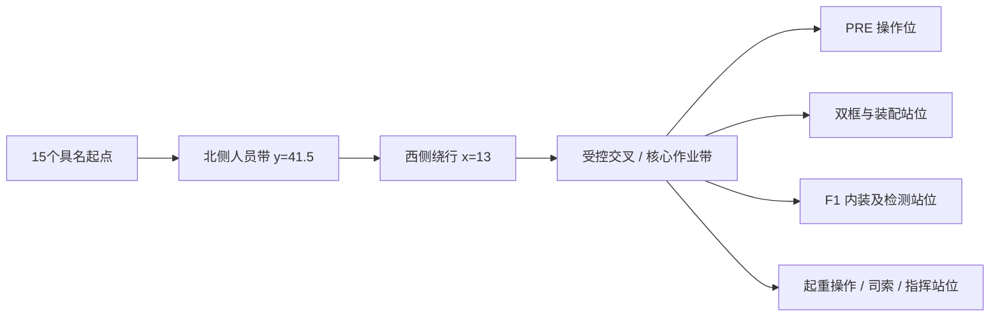
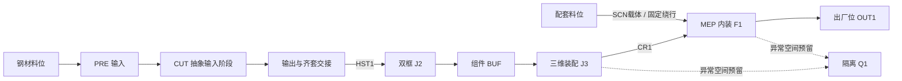

# S13 目标场景映射

现行修复版本为 `S13-TARGET-R5-2`（PR105）。布局坐标、任务数、人员/载荷规模与r3保持；新增两个不可见门架支承碰撞包络，使静止门架参与其他对象的规划/实际扫掠，吊机运动时仅排除自身。QA1按原有限通道图改走合法路径。载具和载荷共用分段进度；操作资源按阶段取得、跨必要区间保持并在结束释放，吊钩占用归入主CR1。下方r3尺寸/映射仍适用，原检查事实按版本保留；新证据见[验证报告](../validation/building_scene.md)及[修复摘要](../../examples/building_scene/target_repair_summary.json)。


现行目标版本 `S13-TARGET-R5-1`，按 PR102 批准的 r5 方向构建。入口和交互见[指南](S13_trial_guide.md)，具体设备比较、操作者、载荷与支承假设见[设备裁定](S13_equipment_decisions.md)。冻结原域保持；下方 r2 的36域ID双射、核心偏移和七区中心检查仅用于旧入口。

新文件 `target_layout.py` 定义世界坐标/任务/通道图，`target_trials.py` 定义场景动作状态，`target_scene.py` 构建 USD 并独立读回；`verify_building_target.py` 实际检查，`build_target_coverage.py` 生成并核对矩阵。目标世界直接为米/Z-up/kg，没有旧 `(14,4,0)` 偏移。所有目标对象只登记唯一 `sceneId`，不写 `domainId` 或生产事件。

| 组 | 世界 X/Y，载荷底 Z（m） | 用途 |
| --- | --- | --- |
| 收料/钢材 | RECEIVE 6/7/.8；STEEL 6/14/.8 | 场景待检放行、分类储存 |
| 预处理 | PRE-IN 15/7.5/.8；CUT1 15/12；PRE-OUT 20/12/.8 | 人工叉运与主吊的交接，CUT抽象 |
| 结构 | J2 30/12/.6；BUF 40/12/.6；J3 50/12/.6 | 固定工装及构件/模块取放 |
| 内装/质量/输出 | F1 50/24/.6；Q1 40/24/.6；OUT1 30/24/.6 | 职责分立，不能借Q1/BUF作成品库 |
| 成品 | FG1 20/24/.6；FG2 20/34/.6；DISPATCH 30/34/.6 | 两个足尺寸模块槽及厂内装载接收接口 |
| 配套 | MEP-RECEIVE 6/23/.8；MEP-STORE 6/29/.8；KIT 13/29/.8；F1-KIT 55/29/.8 | 推车交接代表链 |
| 检测 | TEST-PARK 55/34/0；TEST-USE 55/25/0 | QA1随车、部署保持、取回 |
| 固定设备 | R1 35/12；SCN-WELD-J2 30/16；SCN-WELD-J3 50/16 | 基座不平移，焊接站各自独立身份 |
| 吊机控制 | Lop 57/18；Lrig 45/18；Lsig 58/30 | 具体阶段还包括司索与撤离站位 |

场地60×44 m、模块6×3×3.2 m；主吊钩 x18—54/y8—36，轨道y4/40。吊运载荷底4.1 m、最高模块吊钩7.9 m、限位8.2 m、梁底8.5 m。西侧收料/入库和PRE输入由叉运/推车承接，不宣称主吊覆盖西侧全部物料。

[任务矩阵](S13_transfer_coverage.tsv)含19带载、13空钩接近、19空返和2检测车路线。检查使用完整载荷、吊具、门架/轨道、司机/推行人、车体和装卸支承包络；四个成品任务另保留邻槽占用检查。0.05 m步行余量及其余间隙均为合成参数。

步行图从当前位置出发，以有限图Dijkstra选合法最短路；长度与同图最短距离留在实际轨迹记录。受阻可绕行，无路等待；交叉见证用整段通道互斥和确定性让行。它不是自由空间导航或生产级调度器。运行时固定碰撞体边界按阶段缓存、移动对象逐步读回；注入/解除障碍刷新缓存。外部直接编辑USD角色会被拒绝；不支持在一次运动阶段中任意编辑静态几何。

R1复用原六轴空载几何，HR禁用；旧入口继续保留原FK/资格回归。钢材60 kg代表件和MEP80 kg代表箱具有唯一身份、父批关系/交接支承；不以合成承载值认证真实整机。完整旧域→目标→未来对象表见设备裁定，正式迁移仍待S14独立授权。

以下为旧 r2 记录，其执行命令显式切换旧入口。

---

# S13 r2 场景映射与运行

按PR099批准的S13-PLAN-20261003-r4修订。原r3/r4计划保留获批原件字节，实际状态见[步骤卡](../steps/S13.md)和[验证报告](../validation/building_scene.md)。本场景表达完整模块工厂的空间、几何与运动学，尚未接入生产派工反馈。37项既有活动与新增对象逐项见[覆盖表](S13_process_coverage.md)。

## 运行

在仓库根目录的PowerShell 7中使用已配置的既有Isaac环境，每轮选新输出目录：

```powershell
& (Join-Path $env:ISAAC_SIM_ROOT 'python.bat') scripts/build_building_scene.py --mode verify --output .local/s13-verify
& (Join-Path $env:ISAAC_SIM_ROOT 'python.bat') scripts/build_building_scene.py --mode trials --output .local/s13-trials
& (Join-Path $env:ISAAC_SIM_ROOT 'python.bat') scripts/view_building_scene.py --legacy --output .local/s13-interactive
```

`preview`仅初始截图；`inspection`为10条传统搬运路线与FK/障碍检查；`verify`包含原13项协议所需的10夹具×3轮、真实物理回调、重置、空间/运动学及截图；`trials`为T1—T4连续动作及15人路径。详细交互说明见[试运行指南](S13_trial_guide.md)。

`--mode load --load L1`和`L2`使用30秒暖机、至少120秒测量及10次同状态重置。`L0`必须另传`--baseline-source`，指向本地封存r1源代码快照根；脚本核对并记录其逐源文件摘要，不用修订场景冒充旧基线。三档使用同一测量函数。禁止两个Kit实例或CPU回归同时竞争正式性能窗口。

结果需同时核对脚本PASSED、closed=true、监督器正常退出/未超时；包装器退出0本身不证明通过。`before-close.json`只是退出前检查点。完整原始轨迹、机器信息和错误输出留本地，公开只保留摘要与必要截图。缓存由现有运行时或输出目录管理，不更换环境。

## 世界坐标与布局选择

布局版本`S13-LAYOUT-r2`。60×44 m厂界世界原点位于西南地面，X东、Y北、Z上，单位m/kg。为保持原核心配置可复核，`/World`的平移为(14, 4, 0)；`model.py`和动作折线使用核心局部坐标，世界坐标=局部+原点。`world_position`直接读USD世界变换；`scene_position`/`scene_matrix`只做显式逆平移。实际轨迹同时保存世界读回，不混用坐标口径。

比较A“42×34原布局加入同尺寸必要料区”与B“60×44西侧供料带”。A存在4对料区/生产bay平面冲突，且SCN-RETURN超出厂界；B两者均为0。原核心所需起终点曼哈顿距离两者一致，供料至PRE距离分别5 m与13 m。B的供料与生产空间可分开，随后真实足尺寸扫掠和站位可达检查验证所选方案。没有使用未实现工期为布局排名。具体冲突对、路径长度、交叉口及扫掠数见机器摘要。

| 核心逻辑区 | 世界中心X/Y | 空间及容量 |
| --- | --- | --- |
| PRE | (20, 14) | 8×8 m；既有容量保持 |
| J2 | (30, 14) | 8×8 m；既有容量保持 |
| BUF | (40, 14) | 8×8 m；既有容量保持 |
| J3 | (50, 14) | 8×8 m；既有容量保持 |
| F1 | (50, 28) | 8×8 m；既有容量保持 |
| Q1 | (40, 28) | 8×8 m；既有容量保持 |
| OUT1 | (30, 28) | 8×8 m；既有容量保持 |

| 场景预留区 | 世界中心X/Y | 外框m | 外观参数 |
| --- | --- | --- | --- |
| SCN-RECEIVE | (7, 5) | 10×6 | 2（显示槽） |
| SCN-STEEL | (7, 14) | 10×8 | 3（显示槽） |
| SCN-PANELS | (7, 23) | 10×6 | 2（显示槽） |
| SCN-MEP | (7, 31) | 10×6 | 2（显示槽） |
| SCN-RETURN | (7, 38) | 10×4 | 1（显示槽） |
| SCN-KIT | (20, 28) | 8×8 | 2（显示槽） |

底顶框槽世界y=11.5/16.5；J3另有中心y=14的柱集合落位。组件通道中心世界y=8、宽4；模块通道中心世界y=21、宽6。CR1轨道世界y=4.75/34.5，小车世界y=10.5—31.5，大车世界x=18—52，梁下8 m。人员北侧通道世界y=41.5，西侧通道x=13，从轨道端部绕行，不走穿轨道支腿。

实体名按原ID UTF-8十六进制编码，36个域ID保持双射。新SCN对象只有sceneId，无domainId，不增加域资源。产品包络仍6×3×3.2 m、支承高0.6 m，J2同产品双框且FIX-J2独占，BUF最多2组件，Q1/OUT1各1产品。配套料位不借用这些容量。

## 人员与物流路径

以下为连接关系图，不按比例绘制；准确世界折点、长度和所测包络以表格及实际轨迹为准。人员图的各目的地按角色分别检查，图上的共同节点不表示允许同时穿行。





| 人员 | 具名起点世界X/Y | 独立作业站位世界X/Y | 固定路径长m |
| --- | --- | --- | --- |
| P1 | (16.0, 40) | (15, 15) | 33.0 |
| W1 | (17.5, 40) | (25, 13) | 46.5 |
| W2 | (19.0, 40) | (25, 15.5) | 45.5 |
| OP1 | (20.5, 40) | (34.8, 19) | 53.3 |
| AF1 | (22.0, 40) | (54.5, 26) | 79.9 |
| AF2 | (23.5, 40) | (54.5, 27) | 82.4 |
| E1 | (25.0, 40) | (54.5, 28) | 84.9 |
| PL1 | (26.5, 40) | (54.5, 29) | 87.4 |
| T1 | (28.0, 40) | (54.5, 30) | 89.9 |
| T2 | (29.5, 40) | (54.5, 31) | 92.4 |
| C1 | (31.0, 40) | (45, 18.8) | 74.2 |
| QA1 | (32.5, 40) | (55.5, 30) | 95.4 |
| Lop | (34.0, 40) | (56, 19) | 88.0 |
| Lrig | (35.5, 40) | (55, 16) | 91.5 |
| Lsig | (37.0, 40) | (56, 14) | 96.0 |

15人路径各自在同一静态工厂/其他人归位条件下检查，不声称15条路线可同时无预约通行。路径经西侧外围、核心北边作业带进入工位，SCN-X-MODULE与SCN-X-SUPPLY明示受控交叉。T2先人员接近、挂接、退出，再吊运；人员故障代理留在吊运包络会阻挡。L2的15人同时短程运动限北侧相互分开的站位范围，不能代替未来全工厂多人导航。

| 固定物流/工具路径 | 世界折点（m） | 折线长m |
| --- | --- | --- |
| steel_to_input | (7, 14, 0.6) → (7, 11, 0.6) → (15, 11, 0.6) | 11.0 |
| cut_feed | (15, 11, 0.6) → (15, 12.5, 0.6) | 1.5 |
| cut_to_output | (15, 12.5, 0.6) → (20, 12.5, 0.6) → (20, 11.5, 0.6) | 6.0 |
| mep_to_f1 | (8, 31, 0.6) → (13, 31, 0.6) → (13, 32.8, 0.6) → (45, 32.8, 0.6) → (45, 31.5, 0.6) → (46, 31.5, 0.6) | 41.1 |
| weld_j2_j3 | (26, 14, 0) → (25, 14, 0) → (25, 19.6, 0) → (45, 19.6, 0) → (45, 15, 0) → (46, 15, 0) | 32.2 |
| test_delivery | (45, 30, 0) → (46, 30, 0) → (46, 29, 0) | 2.0 |

输入支承最终设在世界(15,11)，避免HST支腿经过时与原输入位相撞；J3边料位移至世界(42.5,18.5)，避开司索通道。WELD1搬运按含电缆/工具的2.6×1.2×1.5 m保守包络检查。所有调整保持外框、产品尺寸及既有资源容量。

## 设备协作与检查边界

| 对象 | 本轮表达 | 控制/责任及限制 |
| --- | --- | --- |
| CUT1 | 原普通切割台；输入支承、P1站位、输出与齐套交接 | T1代表进出料及明确标注的CUT抽象阶段，无切削物理或无人加工资格 |
| WELD1 | 唯一电源/气瓶/焊枪；T3从J2撤离、连续转到J3、定位/工具准备 | 人工设备，W1/W2责任见逐工序表；检查占用不能双重授予，转场工时未进入生产契约 |
| R1 | 原六轴/TCP/独立配套电源；伸展上界圆与远侧不可达标识 | 基座世界(34.8, 14, 0.5)，局部空载FK，未加导轨、未放大臂长；HR禁用，无全框可焊资格 |
| HST1 | 3t功能包络；T1空载接近、吊载、落位、空载返回 | P1/Lrig/Lsig，机械形式UNKNOWN，非AGV/AMR；4t立柱集合仅CR1 |
| CR1 | 12t轨道龙门吊；T2交接、T4两产品及产品间空载转场 | Lop/Lrig/Lsig；载荷/吊具与轨道支腿分别扫掠，吊钩和载荷分别实际读回 |
| TEST1 | 单工具组运入、设置、保持、取回；T3等待时仍被持有 | 组内仪表不新增令牌；无人工作单元不释放设备，不自动REST |
| FIX-J2/FIX-J3 | 原唯一工装及支承/夹持界面 | 多支承、多框槽不增加工装所有者 |

T1—T4采用独立检查时钟和固定折线，分段五次平滑插值；角色、批次、设备所有者随阶段变化。试运行内部不靠夹具重载跳到目标；切换试运行会显式RESET。CUT及装配形态仍是抽象，几何到达不产生ExecutionEvent、质量PASS或READY回执。

传统10路线保留120秒检查时钟和(2.5,2.5,0.5)m/s峰值检查，实际到达≤1 cm、姿态≤0.1°；R1 TCP≤1 mm/0.1°。连续轴向段用AABB并集保守扫掠，1微米只用于浮点接触容差，0.1 mm穿透仍拒绝。自有轨道接触可排除，外加轨道障碍仍必须拒绝。隐藏外墙/包络只是显示，碰撞API仍在。

原10夹具仍为分立状态：初始批次、双框、J3组件落位、三维结构、MEP等待、SR-W2、隔离、出厂、人工焊接及机器人演示。三组件全部落位后合并为产品谱系，不把该切换解释为完整装配动作。物理动态接触探针只证明基础PhysX接触与重置，产品及设备使用运动学几何表达，无吊索/承载动力学主张。

完整B-ST/B-FL/B-EN/B-WT/B-ME/B-FI/B-PR分层和SR-W2差异保持。全部几何/文字为原创参数化，无第三方纹理/字体/模型下载；见[资产登记](asset_register.tsv)。D01—D06、G缺口及后续逐步授权保持。
