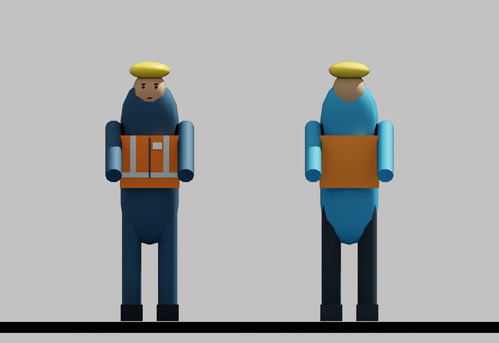
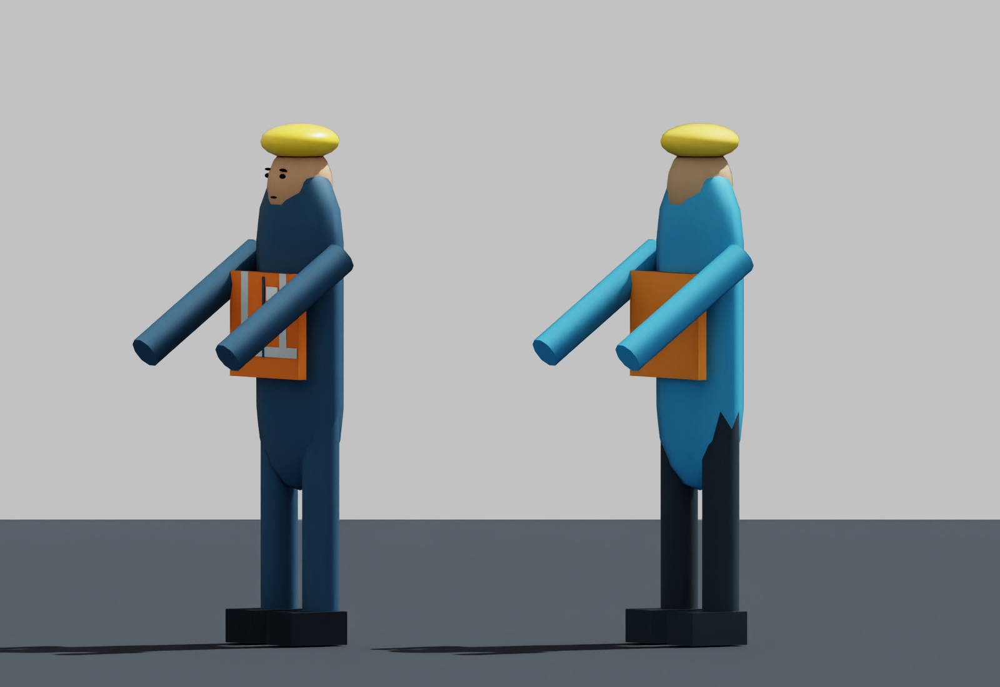
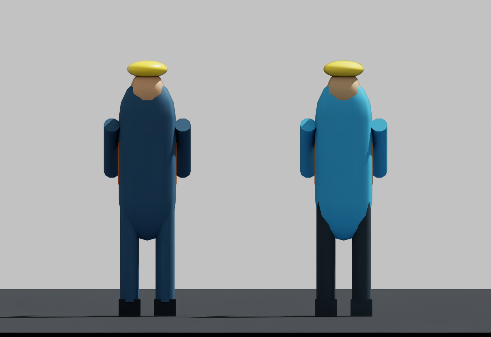
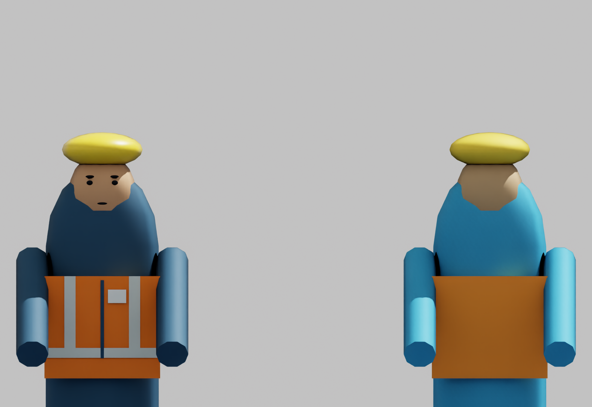
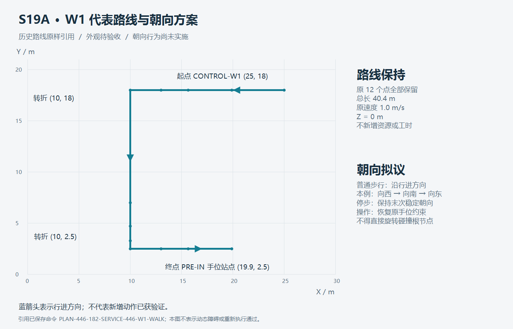

# S19A A1：W1 个体图片与受保护基线

2026-10-09；候选 `S19A-A1-W1-20261009-r1`。**PREVIEW_READY / OWNER_REVIEW_PENDING / NOT_APPLIED / NOT_ACCEPTED / NOT_PUBLISHED**。本次只提交一个人物的外观代表方案与一条原路线；按负责人要求，验收后才落实到正式场景。

## W1 外观方案

全部人物对照图均为**左侧方案、右侧原模型**。使用现有 Isaac Sim 运行时从原 USD 几何复制生成，单位和比例保持；同一镜头、同一照明同时渲染两个副本。摄影位置和审阅地面仅属于独立预览。正面朝本地 +Y；斜侧和背面为两个副本同步旋转的静态肖像，不是已实现的行走动作。

方案将工作服改为深蓝，保留橙色背心和黄色帽体，增加背心浅色条、拉链、胸牌及简化眼眉/口部以辨识正面。原躯干、四肢、头、帽、靴的几何属性和局部变换不改，原操作姿态仍保留。新增10个可视细节无碰撞API，全部位于原身体可视AABB内，不增加尺寸。浅色条是视觉标识，不表示认证防护装备；胸牌未编码新权限或资格。未引入第三方资产。

## 尺寸与语义保护

| 对象/口径 | 原基线 | 方案 | 核验与限制 |
| --- | --- | --- | --- |
| W1身体可视AABB，X×Y×Z | 约0.640 × 0.684408 × 1.875 m | 相同，三个方向增量均0 | 不含地面角色文字及隐藏Occupancy；从USD计算 |
| W1占用盒 | 0.60 × 1.20 × 1.90 m | 原属性、位置和可见性保持 | 不收缩、不扩大、不取消碰撞 |
| 控制手位参考 | 本地(0, 0.5, 1.05) m | 保持 | 正式控制器校验未修改 |
| 其余14人物 | 原几何/位置/占用/角色 | 未改 | 未把W1方案批量套用 |
| 厂界及布局 | 60 × 44 m；原已批准世界坐标 | 未改 | 生产初始化几何清单本地保存 |
| 支承、设备、模块及构件 | S19 r2所承接的生产模型 | 未改 | 保护全部569项原跟踪输入的逐文件原字节摘要 |
| 路径、工时、速度、容量、人因与资格 | S19 r2 / S18-SIM-A1现行值 | 未改 | 原配置与源码摘要保留 |

**基线差异需要如实保留**：原身体可视宽0.64 m，大于占用宽0.60 m；其根源是原双臂几何，不是本次新增。不能把占用尺寸当作原模型的全部可视尺寸，也不能由本次AABB相等推出人体/碰撞一致性或工业安全。新增细节本身位于占用盒内；原有差异尚未修复。本轮遵守“不超出现有模型尺寸”，且未通过扩大占用盒消除差异。

登记依据：`sim/isaac/scene/target_scene.py`的人物几何、`target_layout.py`的人物包络、`production_port.py`的实际生产初始化与控制手位、`production_geometry.py`及`production_pedestrians.py`的路线/朝向契约。完整摘要与核验结果见[机器记录](S19A_a1_visual_review_r1.json)。

## 代表路线与朝向拟议

采用 S19 r2 已保存轻量诊断中的命令 `PLAN-446-182-SERVICE-446-W1-WALK`，决策第182行，`EV-448`为 STARTED 回执；5.436826666666667 h，从 CONTROL-W1 到 PRE-IN。原12点、速度1 m/s、占用及路段全部保留，路径总长40.4 m。对应历史执行/因果审计均PASS；本轮只读提取，不宣称新Kit执行或新路径通过。

拟议普通步行朝向随行进方向，本例向西→向南→向东；停步维持最后有效方向，到位操作服从原手位和工具关系。原实现的普通行走大多维持yaw=0，少数受保护的叉运接近段另有90°例外。直接旋转完整人物会旋转非方形占用和手位，不能作为纯美术调整应用。需先给出包络内的步行姿态和动作预览，再做A2的连续包络/手位/语义验证；本图没有实施上述行为。

独立渲染脚本曾保存一个按通用函数构造的CONTROL-W1→J2草案；该草案未用于本次路线审阅，未取得通行证明，原本地记录保留。当前代表路线以机器摘要中的历史命令为准。

## 实际验证及待审范围

- 本轮真实Kit生成4张1600×1100 PNG，检查完整PNG落盘，人工辅助查看图像；完整关闭回执和外层退出码0已取得。
- 对照人物原11个部件（含Occupancy）的几何/变换/碰撞相关属性保持；新增细节不带碰撞。USD计算身体AABB相等，未替换生产模型。
- 保存生产初始化后的1,148个几何对象属性、世界AABB、碰撞及可见性；这是几何基线登记，不是全生产执行。
- 仅运行本次预览与基线核对，没有新完整生产链、动作矩阵、短视频、回归全集或性能结论。历史849项及旧长链只按各自版本引用。

当前请求审阅的是 **W1静态外观及路线朝向方向**。负责人可分别接受外观、要求调整或否定；任何同意均不能记录为其他14人物、全部设备或S19A整步验收。其余个体先出图再落实的要求持续有效。新动作、正式应用、A2/A3及整步验收按[步骤卡](../steps/S19A.md)推进。工业G2、历史失败和原冻结数值保持；无Git写入，拟远端操作为空。
