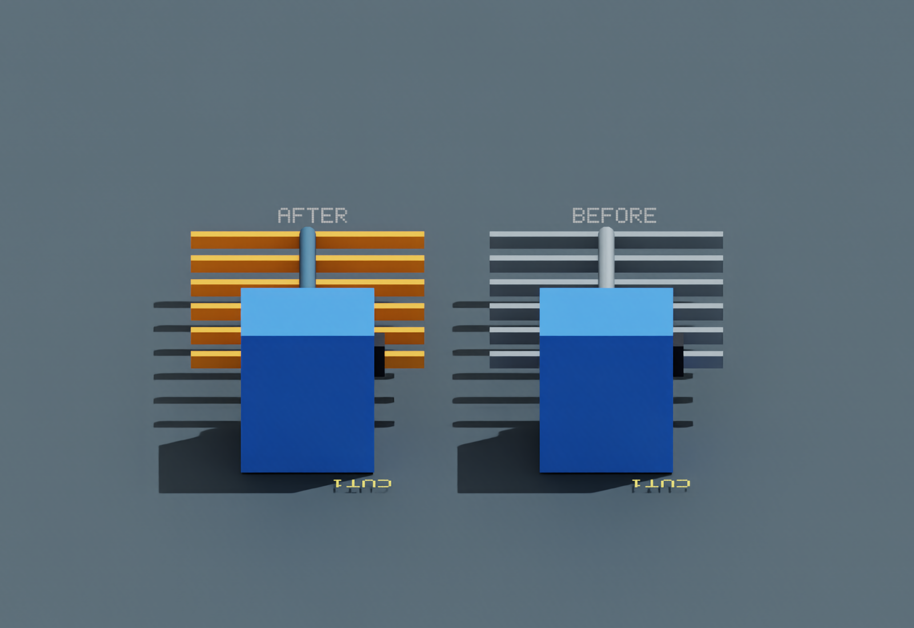
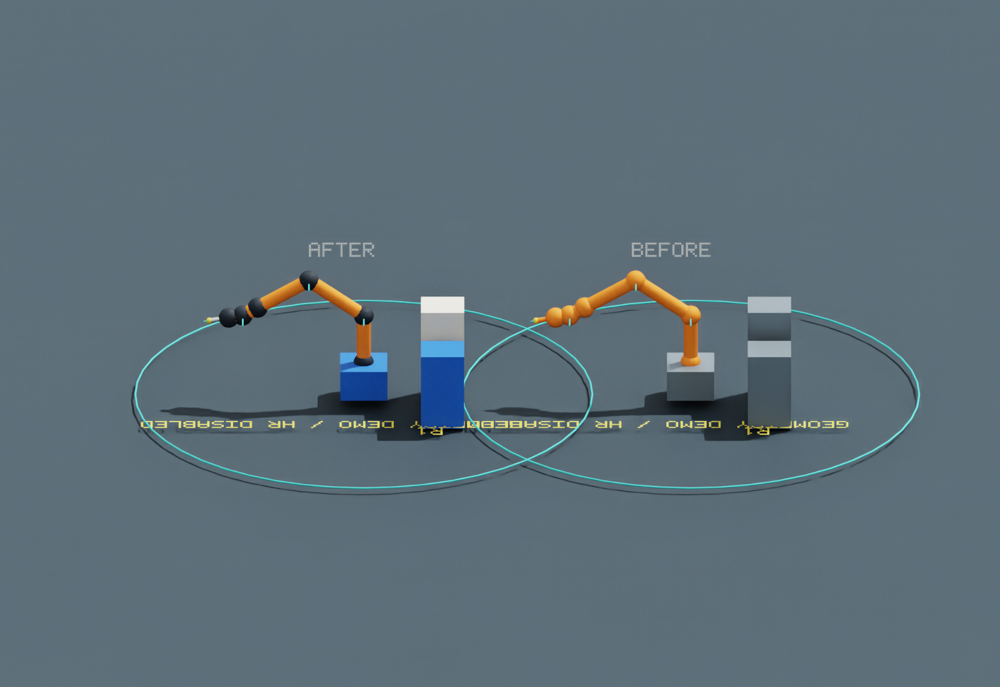
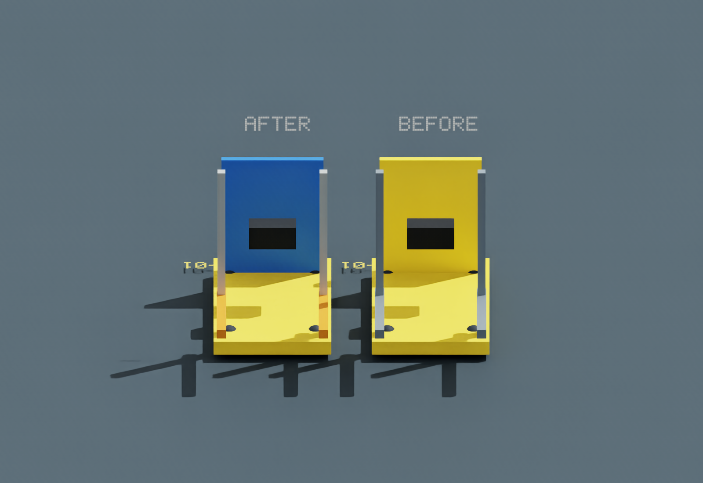
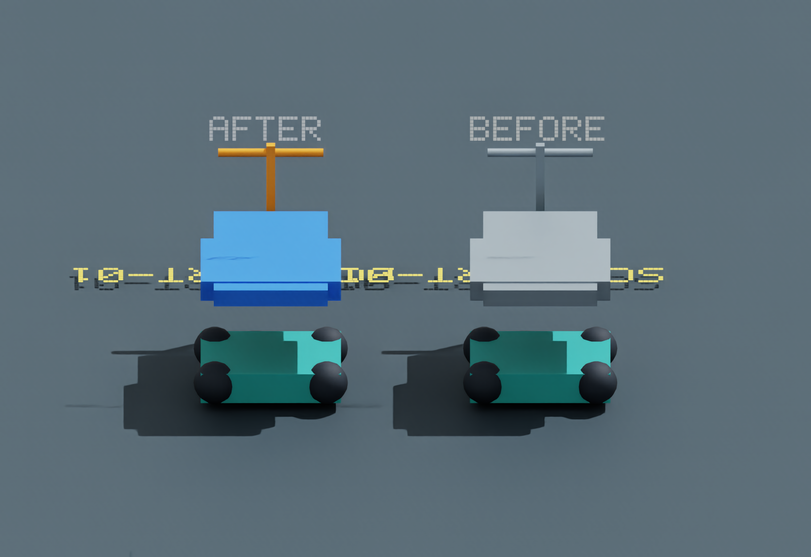
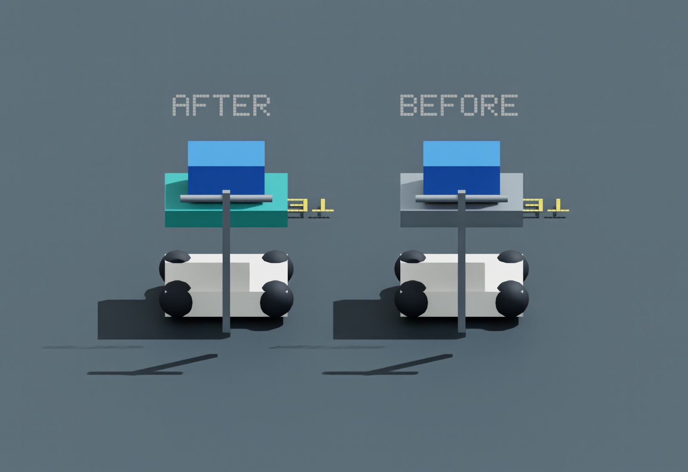
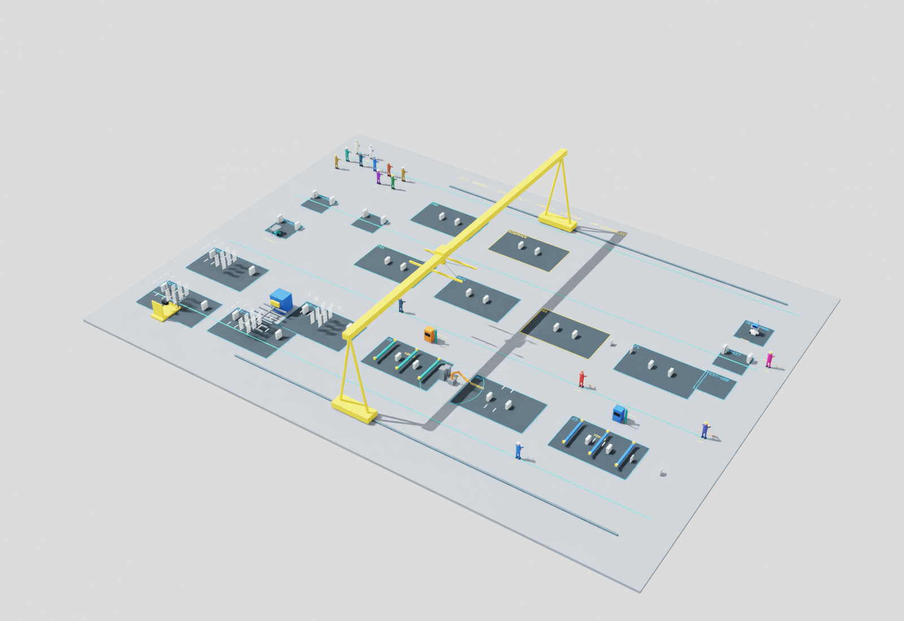
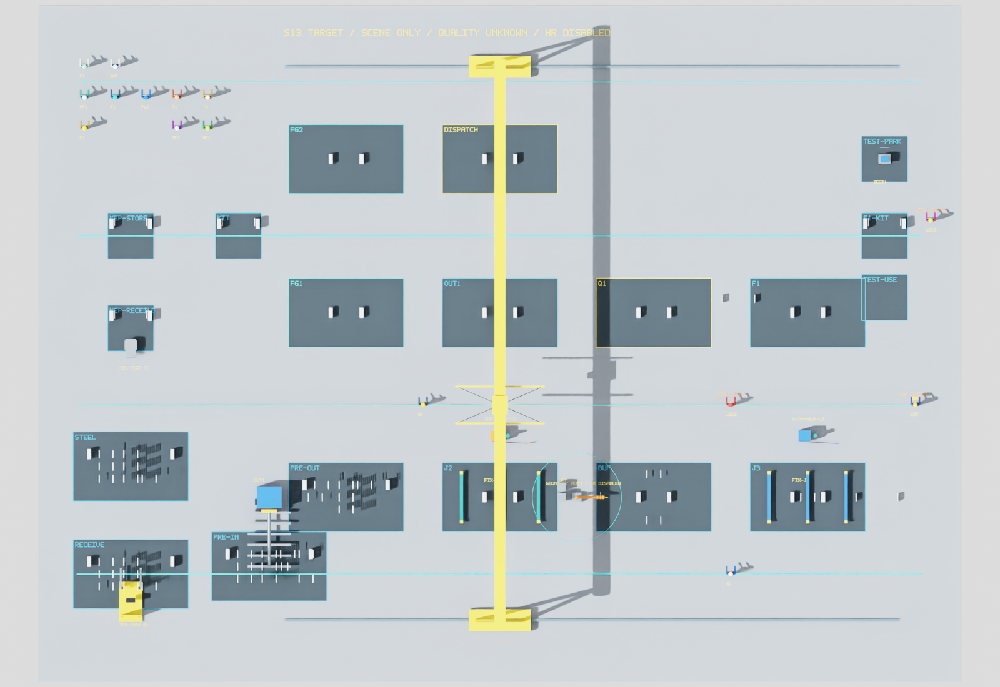
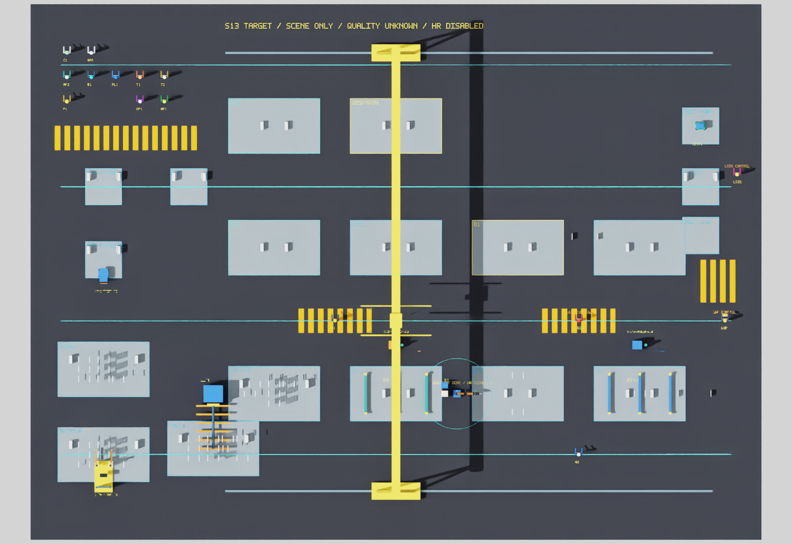
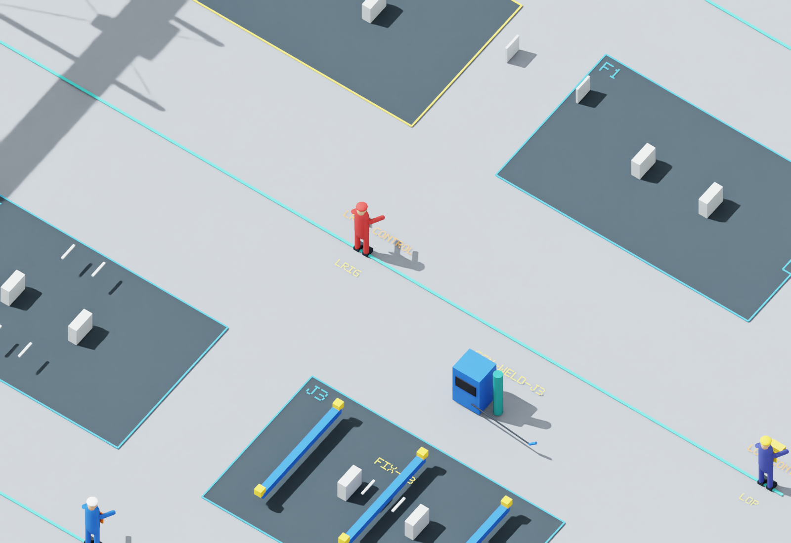
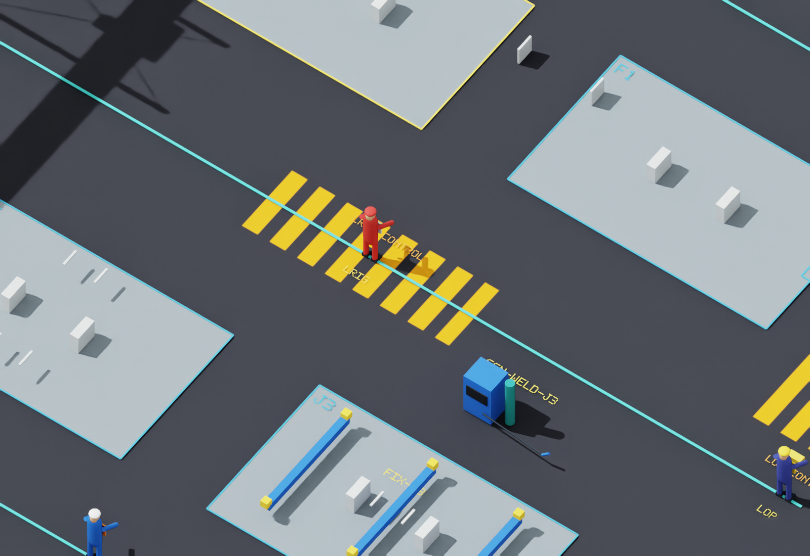

# S19A：设备对比度、地面与打光修订 r2

2026-10-10；PR166 / LOG221—LOG222。负责人已通过15个人物静态外观，决定 **S19A-PEOPLE-VISUAL-ACCEPTANCE-002**，并要求集中修订五项设备、降低打光、采用深黑灰地面及较浅工作区，用纯改色的橘黄色斑马条纹表示部分人员通行位置。已将本次反馈一并落实到本地候选，并集中提供11张实际Kit图片。人物实现、30张原个体对照及上一整组44图保持字节。

当前 **VERIFIED_WITH_LIMITS / REVISED_VISUAL_REVIEW_PENDING / NOT_PUBLISHED**。人物验收回执见[记录](S19A_people_acceptance_r2.json)，本次设备/场景候选仍供图审；不把本次修订授权当作修订后效果已获验收。打开[本次完整图册](../sim/images/s19a/contrast-r2/index.html)可逐项看原图。

**设备对照为左修改后、右上一轮候选**，采用相同的减弱光照和审阅背景；全场及地面图分别展示上一轮、本轮实际光照和地面材质。独立设备副本仅为并排展示平移，不改变生产场景；原悬空件仍保留原位置。

## 五项设备对照

### CUT1 · 承料与钢材区分

承料滚轮改为橙色，送料支承改深蓝；钢材仍沿用原材质。

### R1 · 恢复关节分色

保留橙色机械臂，关节恢复深色、末端杆恢复银色；底座与电源改蓝，控制柜改米白。

### SCN-FORK-01 · 黄色与蓝色搭配

保留黄色底盘，护板改蓝、门架银色、货叉橙色。

### SCN-CART-01 · 托盘与底色区分

托盘及转接板改蓝色，把手和立柱改橙色，保留青绿底盘与深色车轮。

### TEST1 · 测试托盘改色

原金属色托盘改为青绿色，保留蓝色仪表和白色底盘。

## 全场、地面和通行条纹

原Fill/Sun为800/1900，现650/1250，分别降低18.75%与约34.21%。现有工作区块改较浅蓝灰，地面改深黑灰，四处采用橘黄色条纹贴图；不新增斑马线模型、碰撞或厚度，不改变通行路径或生产优先级。

### 全场

修改前：

修改后：

### 地面俯视

修改前：

修改后：

### 通行局部

修改前：

修改后：

## 几何保护与实际核验

独立核验以封存的上一轮生产初始化USD为直接基线，现有1,313个几何对象（包含原发布1,148个及上一轮165个人物视觉细节）的全部几何属性、变换、可见性和世界AABB保持，728碰撞体及实际障碍集合保持。**本轮新增几何对象0，新增碰撞0。**15人物全部原属性、schema及材质绑定保持，个人细节也不返改；其他未点名设备保持上一轮效果。

地面仍是原尺寸的Cube，仅为颜色贴图增加24个faceVarying UV坐标，使用UsdUVTexture连接原表面的漫反射颜色；位置、尺寸、碰撞均不改。这种表面坐标口径参照[OpenUSD材质指南](https://github.com/PixarAnimationStudios/OpenUSD/blob/dev/docs/user_guides/render_user_guide.rst)，Cube顶面顺序核对[OpenUSD官方实现](https://github.com/PixarAnimationStudios/OpenUSD/blob/release/pxr/imaging/geomUtil/cuboidMeshGenerator.cpp)。所用条纹图为项目自行生成的规则改色纹理，无外部图片资产。条纹仅为视觉表示，不新增安全资格、道路规则或行走能力。

57项现有场景回归通过（2.972s），Ruff通过。11张实际Kit PNG逐图记录摘要与相机读回误差小于1e-4，完整关闭、外部进程退出0；渲染日志无Traceback或fatal exception。第一轮核验因旧的无引用地面材质不再创建而中止，保留诊断；明确仅排除该弃用材质后几何/人物核验通过。新纹理生成环境无PIL，采用标准库生成，不改写原渲染图。详见[机器证据](S19A_contrast_r2.json)。

同条件ABBA静态帧样本只作观测，没有负责人认可的性能门限，不能事后宣称性能PASS。本轮未跑完整生产链、849全量或隔离wheel，未修改人物动作或朝向，A2/A3剩余出口保持。工业G2仍OPEN/NOT_ESTABLISHED，S19B和S20—S28未启动。main/目录沿用，无分支/worktree/子代理/Git写入；拟远端操作为空，无新标签或发布批准。
