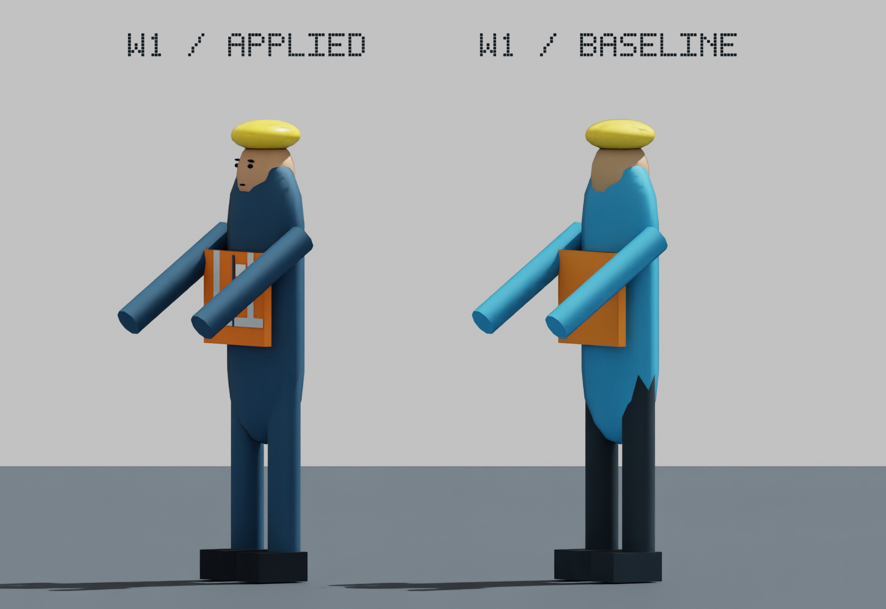
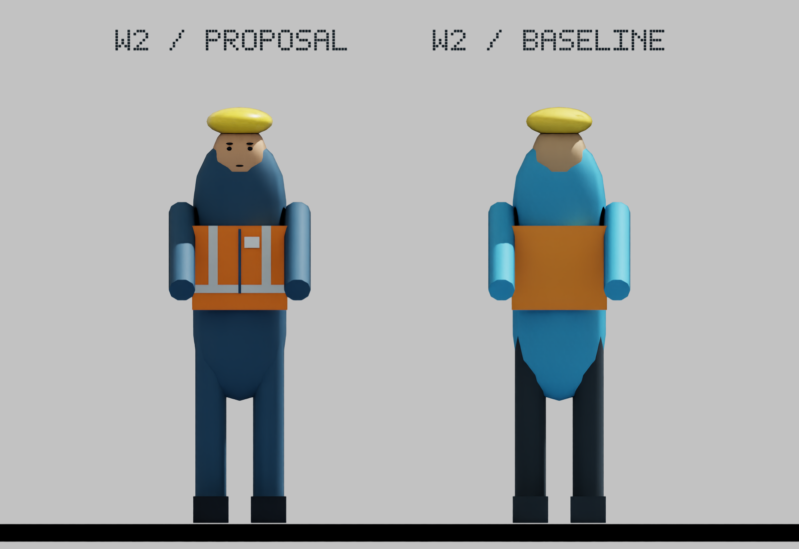
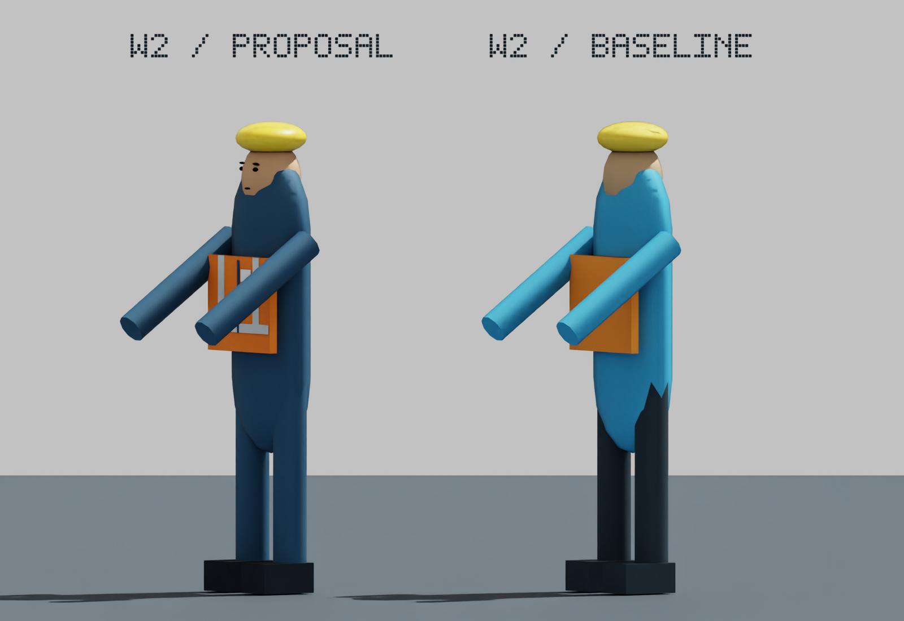
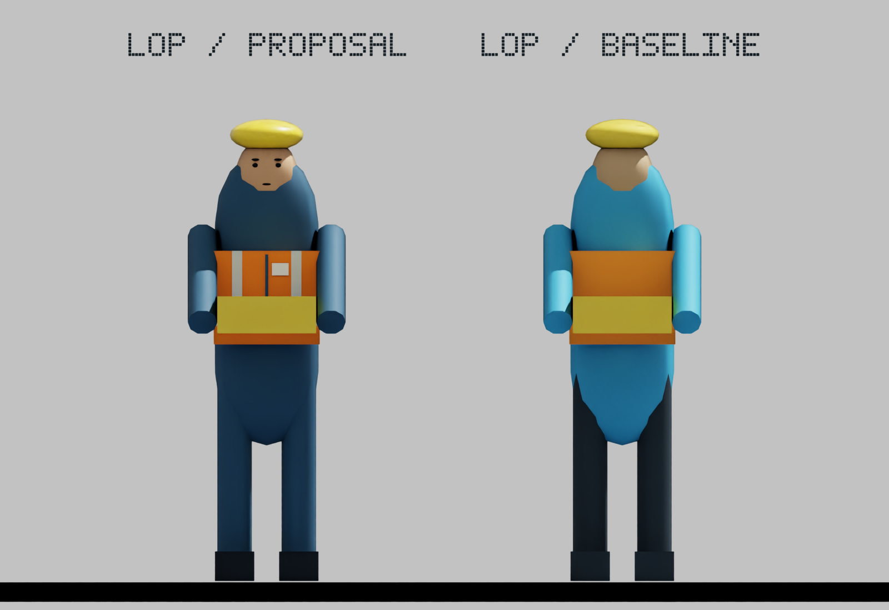
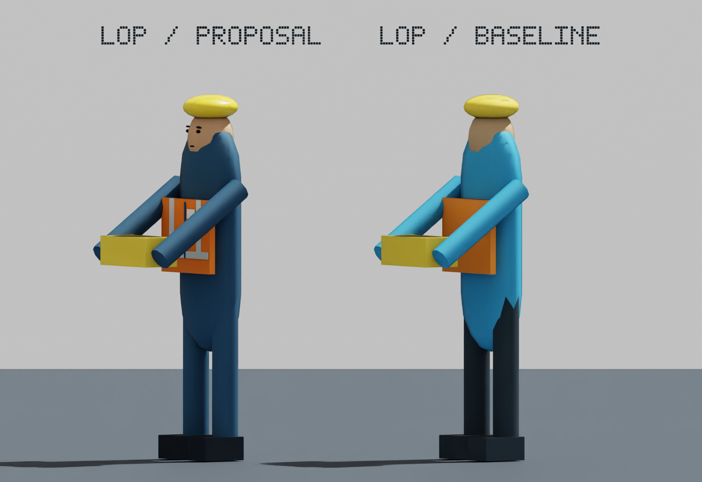

# S19A：W1应用回执与下一组三个个体图审

2026-10-09；PR164 / LOG218。W1外观已获负责人验收，决定 **S19A-W1-VISUAL-ACCEPTANCE-001**，并已在当前本地场景构建中只对W1应用。原[W1审阅](S19A_a1_visual_review_r1.md)及图片保持封存字节。此次“通过”按最后提问绑定W1静态外观，不扩展为新行走动作、其他人物、S19A整步或发布批准。

W1实现与获批USD预览逐部件几何属性及材质参数吻合。与S19 r2生产初始化基线独立比较：原1,148几何对象AABB、原属性和已应用schema保持；仅W1原10部件材质绑定改变，新增10个无碰撞细节。15人物根节点及手位参考保持，其他14人物外观保持。57项现有场景回归、Ruff检查通过。首次核验脚本因USD可选参数调用错误中止，补齐参数后通过，不隐去该诊断。已应用W1在真实Kit再次渲染；8张图片相机矩阵误差均小于1e-4，完整关闭及进程退出0。没有新完整生产链、全849项或性能对照结论。具体结果见[机器回执](S19A_w1_acceptance_and_application_r1.json)。

## 下一组：分别等待验收

以下每个个体均沿用已通过的W1配色/细节方向，**左侧为独立方案、右侧为各自原模型**。P1、W2、Lop尚未应用，生产构建仍只改变W1。三个个体各自可视身体AABB前后相等；占用、原姿态、手位与资格保持。Lop的原遥控器完整保留。图中的审阅旋转不构成实际行走转向实现。原可视宽0.64m与占用宽0.60m的既有差异不作修复或安全结论。

### P1

### W2

### Lop

请按个体ID确认通过或提出调整。通过后只落实对应个体，其他对象继续逐个出图。A2动作矩阵及A3性能/视频/整体视觉验收尚未开始；模型不扩大、前置语义/冻结数值/历史证据保持，S19B和S20—S28未启动，工业G2仍OPEN/NOT_ESTABLISHED。无Git暂存/提交/标签/推送；本地源码调整尚未发布。
