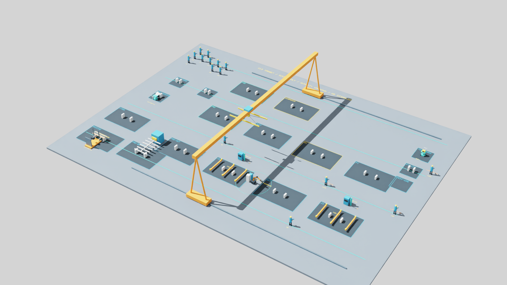
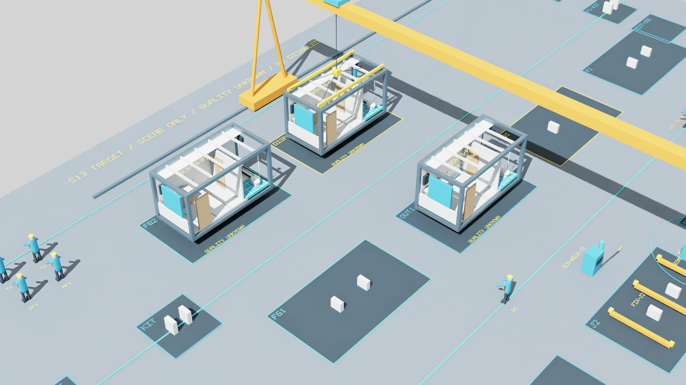

# S13 r3 / r5目标整改实际验证

候选 `S13-20261003-r3`，PR102 / LOG110 授权。**VERIFIED_WITH_LIMITS / ACCEPTANCE_PENDING / NOT_APPROVED / NOT_PUBLISHED**。沿用现有 Isaac 6.1 RC、CPU PhysX；没有安装升级或第三方资产下载。本文顶部为目标配置证据，下方保留完整 r2 报告和原图。

数字和最终源文件/原图摘要见[目标机器记录](../../examples/building_scene/target_summary.json)，可运行入口见[指南](../sim/S13_trial_guide.md)。冻结配置仍是原37活动/六设备；目标演示只写sceneId，没有生产事件。

## 八项门的实际覆盖与边界

| 门 | 实际证据 | 限制 |
| --- | --- | --- |
| G1 设备身份 | CUT/R1基座/工装和两独立焊站固定；15名唯一人员；目标无HST1/WELD1别名；无操作者拒绝 | 原创设备几何，真实工业能力未知 |
| G2 操作关联 | 司机/推行人与设备同步，Lop/Lrig/Lsig到位；缺角色、离位、同人双任务、无支承/未落位拒绝；实际USD操作者偏移被拒绝 | 不模拟紧急制动或未声明岗位资格 |
| G3 路线/并发 | 从当前坐标走有限图最短合法路，距离对照留存；封路绕行/无路拒绝；W1/W2请求交叉、W2让行后继续 | 确定性整段预留，不是任意人群规划；15人身份不等于15人同时作业 |
| G4 物流 | 钢材、MEP各有唯一载荷的接收/储存/交接/配送与空返；真实支承读回、货叉/托盘空返前收回；未放行/源缺/目标满/障碍拒绝 | 钢材60kg单件及MEP80kg合成箱，不覆盖全部原料规格 |
| G5 有限成品 | 两槽满、第三件在OUT1等候；READY信号不腾位，第一件实际搬至DISPATCH后释放FG1，再入第三件 | 三件始终在场，无EXTERNAL/RECEIVED生产事件 |
| G6 运输覆盖 | 53行真实USD静态边界检查，19带载/13空钩接近/19空返/2检测车；4条成品取放另查邻槽占用；越界、净空不足、邻槽碰撞CPU负例 | 全矩阵为几何检查；真实连续排演只覆盖代表链，不能称53项生产执行 |
| G7 基线保护 | 工作区/隔离wheel各456项；旧协议30轮/7200回调、10路线×241读回、35负例、R1三姿态/241点；冻结源码/依赖/旧图及封包摘要不变 | wheel检查仍从仓库读场景脚本；远端CI未运行 |
| G8 体验/负载 | 最终源T1—T4、组合场景、9真实拒绝例、GUI同回调快照及正常关闭；20张最终未编辑原图AI复核；L0/L1/L2实测见下 | 人工鼠标和负责人验收待做；可靠真实帧时间不可得 |

## 连续排演读回

| 组 | 阶段 | 实际读回 | 最短路记录 | 结果 |
| --- | --- | --- | --- | --- |
| T1 | 34 | 255 | 9 | COMPLETE_GEOMETRY_ONLY |
| T2 | 62 | 466 | 20 | COMPLETE_GEOMETRY_ONLY |
| T3 | 35 | 264 | 13 | COMPLETE_GEOMETRY_ONLY |
| T4 | 19 | 146 | 6 | COMPLETE_GEOMETRY_ONLY |

9个真实负例为缺操作者、未放行、源无料、目标满、实体障碍、人员碰撞体、占位碰撞体、真实USD操作者偏移以及空钩路线上支腿障碍。三类实体碰撞注入及准入故障解除后，从保留状态继续；没有移动载荷后再回滚掩盖失败。CPU24项另外覆盖缺吊机角色、司机离车、固定设备移动、双任务、非法落位、满槽覆盖、净空/可达/邻槽、超适配载荷及无路等待。

## 三档独占负载与性能口径

同1920×1080、RayTracedLighting、CPU PhysX、单Kit/单视口，每档30秒暖机、至少120秒测量、10次全场景重建。正式窗口未与CPU回归或另一Kit并跑。L0为本版静态，L1为T1连续链，L2为B+1三产品与W1/W2交叉让行组合。循环完结后的显式重新开始计数单列，不能当作无重置生产。

| 档 | prim/碰撞体 | 测量秒 | 更新数 | 中位ms | P95ms | 最大ms | >50/>100ms | 循环重启（含暖机） |
| --- | --- | --- | --- | --- | --- | --- | --- | --- |
| L0 | 636/70 | 120.005 | 12554 | 9.123 | 10.153 | 70.159 | 87/0 | 0 |
| L1 | 636/70 | 120.005 | 8242 | 13.515 | 15.609 | 1131.852 | 92/4 | 4 |
| L2 | 873/72 | 120.014 | 8029 | 13.480 | 15.262 | 1496.598 | 104/4 | 4 |

以上是含场景推进、物理step和app.update的**应用更新耗时，不是FPS或真实帧耗时**。墙钟相邻更新包含资源采样等额外开销：

| 档 | 墙钟中位ms | P95ms | 最大ms | 物理回调（含暖机） |
| --- | --- | --- | --- | --- |
| L0 | 9.127 | 10.165 | 119.058 | 15687 |
| L1 | 13.519 | 15.650 | 1131.855 | 10351 |
| L2 | 13.484 | 15.280 | 1496.600 | 10162 |

r2同分辨率的应用更新中位/P95分别为L0 5.979/7.018、L1 8.448/12.001、L2 15.415/18.028 ms。新L0是目标静态布局，旧L0是封存r1；新旧L1/L2对象/动作组成亦不同，只可比较同类计时口径，不能据此计算同负载速度提升或采购/扩容收益。可靠渲染逐帧时间仍不可得，33.3ms中位/50ms P95的真实帧目标为UNVERIFIED。

边界构建诊断各160样本：每次重建中位/P95为9.287/11.706 ms，按阶段缓存为3.195/3.486 ms。该诊断与CPU回归有重叠，只用来定位重复USD边界查询开销，不当作正式独占性能比较。采用阶段缓存后仍逐步检查实际角色位置、运动包络和支承；注入/解除故障刷新缓存。未删载荷/人员、未缩小产品或降低分辨率。阶段内任意编辑静态USD几何不受支持。

## 内存和十次重置

下表为监督器约1秒采样覆盖启动、截图、检查和关闭的全程峰值；OS RSS峰值另列。整卡显存包含其他桌面进程，进程显存查询不可用；不能由这些值推断独占显存或长期无泄漏。

| 运行 | RSS采样峰值MiB | OS RSS峰值MiB | Private采样峰值MiB | 整卡显存峰值MiB |
| --- | --- | --- | --- | --- |
| verify-06 | 6709.9 | 6711.8 | 12296.2 | 5608 |
| ui-03 | 7452.4 | 7461.0 | 11332.4 | 3889 |
| legacy-01 | 6678.3 | 6745.2 | 11531.6 | 4869 |
| load-L0-02 | 6756.2 | 6756.2 | 11070.2 | 4431 |
| load-L1-02 | 6762.2 | 6766.7 | 11044.9 | 4318 |
| load-L2-02 | 6728.1 | 6745.8 | 11282.0 | 4579 |

十次完整重建逐项趋势如下；测量期间的显式循环重启也采用完整重建，其长停顿保留在最大耗时和计数中。

| 档/次 | 秒 | RSS MiB | Private MiB | 整卡显存MiB |
| --- | --- | --- | --- | --- |
| L0/1 | 1.283 | 6608.61 | 11052.06 | 4130 |
| L0/2 | 1.108 | 6611.83 | 11054.58 | 4163 |
| L0/3 | 1.096 | 6613.14 | 11057.16 | 4162 |
| L0/4 | 1.045 | 6614.46 | 10941.82 | 4161 |
| L0/5 | 1.069 | 6615.21 | 10928.30 | 4161 |
| L0/6 | 1.038 | 6617.00 | 10933.91 | 4136 |
| L0/7 | 1.089 | 6618.37 | 10934.36 | 4161 |
| L0/8 | 1.113 | 6619.23 | 10934.52 | 4161 |
| L0/9 | 1.108 | 6620.32 | 10947.03 | 4117 |
| L0/10 | 1.048 | 6620.77 | 10945.23 | 4122 |
| L1/1 | 1.060 | 6612.55 | 11023.33 | 4135 |
| L1/2 | 1.056 | 6613.52 | 11026.77 | 4127 |
| L1/3 | 1.077 | 6615.66 | 11026.93 | 4097 |
| L1/4 | 1.175 | 6616.13 | 10895.49 | 4136 |
| L1/5 | 1.154 | 6616.63 | 10898.82 | 4136 |
| L1/6 | 1.057 | 6617.33 | 10899.11 | 4094 |
| L1/7 | 1.052 | 6618.88 | 10901.42 | 4135 |
| L1/8 | 1.071 | 6619.81 | 10904.71 | 4132 |
| L1/9 | 1.091 | 6620.57 | 10904.91 | 4131 |
| L1/10 | 1.071 | 6621.25 | 10905.05 | 4133 |
| L2/1 | 1.349 | 6593.63 | 11281.99 | 4391 |
| L2/2 | 1.366 | 6595.07 | 11281.41 | 4399 |
| L2/3 | 1.348 | 6597.18 | 11235.02 | 4399 |
| L2/4 | 1.336 | 6599.33 | 11155.17 | 4357 |
| L2/5 | 1.399 | 6601.99 | 11156.35 | 4398 |
| L2/6 | 1.321 | 6603.71 | 11156.46 | 4391 |
| L2/7 | 1.326 | 6605.26 | 11156.61 | 4357 |
| L2/8 | 1.326 | 6606.34 | 11155.77 | 4399 |
| L2/9 | 1.331 | 6606.36 | 11155.96 | 4391 |
| L2/10 | 1.369 | 6607.54 | 11157.10 | 4399 |

## 失败、修复与保留的限制

初轮受限启动因运行时缓存访问失败、截图超时，虽写过closed标志仍有Kit子进程存活；监督器判FAILED。核对确切进程后清理该轮子进程，保留全部日志。随后正常缓存权限运行，最终验证、GUI、旧协议及三档负载均有脚本PASSED、closed=true、监督器exit0/未超时/已回收且无fatal的交叉证据。

开发中保留了扩大人物包络后暴露的路径/站位冲突、司索先后顺序和支承检查失败；修正通道、站位和空钩先接近顺序，并加入货叉/托盘收回及完整支承扫掠。最终核对发现空钩路径缺少门架整体扫掠，已将门架/桥梁/小车统一加入带载与空钩运动，并用吊钩路径畅通但支腿受阻的CPU和真实USD反例复验。先前两次负载只作中间记录，L1中间运行与追加专项重叠，不纳入最终正式测量。审图发现旧镜位截掉模块和配套交接，修正后再次完整目标复验，最终20张图不作裁切修补。首轮完整CPU检查被缓存权限阻断，原命令在正常权限重跑通过；额外全目录格式探测仅命中两个既有文档代码块，保留失败，按仓库规定src/tests/scripts/sim范围复核通过，没有改写无关冻结文档。只读远端检查首轮TLS凭据句柄失败，正常权限重试成功。

当前仍是几何/运动学场景见证：合成重量、支承、吊点、四向行驶和余量不构成工业强度/稳定性/安全认证；车轮和人物未实现真实转向/步态动力学。CUT、焊接、内装和质量工艺仍抽象，HR禁用、质量UNKNOWN。S14—S28及冻结契约迁移未启动。真实帧率、未来最大规模、长期无泄漏、负责人体验验收均未获证明。

## 20张最终实际原图

图片均直接来自最终目标验证，PNG完整性与相机矩阵已检查；AI全数缩览，叉运、模块吊具、MEP交接、人员让行和检测车以原分辨率复核。原r2的33张图保持原字节。

| 图 | 审阅对象 |
| --- | --- |
| [target_overview](../sim/images/r3/target_overview.png) | 目标总览 |
| [target_top](../sim/images/r3/target_top.png) | 俯视/通道 |
| [target_fork](../sim/images/r3/target_fork.png) | 站驾平台/货叉/支承 |
| [target_equipment](../sim/images/r3/target_equipment.png) | 固定生产设备 |
| [t1_initial](../sim/images/r3/t1_initial.png) | t1初始 |
| [steel_carried](../sim/images/r3/steel_carried.png) | 司机与同一钢材载荷 |
| [t1_complete](../sim/images/r3/t1_complete.png) | t1终态 |
| [t2_initial](../sim/images/r3/t2_initial.png) | t2初始 |
| [module_carried](../sim/images/r3/module_carried.png) | 完整模块/吊具/角色站位 |
| [t2_complete](../sim/images/r3/t2_complete.png) | t2终态 |
| [t3_initial](../sim/images/r3/t3_initial.png) | t3初始 |
| [people_yield](../sim/images/r3/people_yield.png) | W1通过、W2让行 |
| [mep_handoff](../sim/images/r3/mep_handoff.png) | E1推车与交接托盘 |
| [test_pushed](../sim/images/r3/test_pushed.png) | QA1推行检测车 |
| [t3_complete](../sim/images/r3/t3_complete.png) | t3终态 |
| [t4_initial](../sim/images/r3/t4_initial.png) | t4初始 |
| [buffer_moving_out](../sim/images/r3/buffer_moving_out.png) | 成品实际搬出中 |
| [buffer_slot_freed](../sim/images/r3/buffer_slot_freed.png) | 落位后才腾槽 |
| [t4_complete](../sim/images/r3/t4_complete.png) | t4终态 |
| [combined_complete](../sim/images/r3/combined_complete.png) | 三产品及让行组合终态 |

---

以下为原r2报告，仅保留其历史时点和既有证据；其中六设备、HST1/WELD1转场与旧T1—T4不能当作现行目标配置。

# S13 r2 实际验证与边界

候选`S13-20261003-r2`，依据PR099批准范围完成本地修订。**VERIFIED_WITH_LIMITS / ACCEPTANCE_PENDING / NOT_APPROVED / NOT_PUBLISHED**。运行环境沿用既有Isaac 6.1 RC与CPU PhysX，未安装升级、未下载第三方资产。数字、源码摘要和图片摘要见[机器记录](../../examples/building_scene/summary.json)。

## 受测结果

工作区与隔离wheel各432项CPU回归通过，之后对最终场景改动复核38项专项、Ruff/格式及契约样例。隔离wheel仍从仓库读取场景脚本，不声称场景打包进wheel。冻结生产模型/Schema/实例/依赖保持；远端CI未运行。

新版原13项协议完成30轮、7200物理回调、10路线各241次读回、35个原预期拒绝例、3姿态及241点R1对照。该完整运行后调整检查排演的限速/原位重置、近景镜位、截图时点及GUI释放；最终固定源码由连续专项、GUI与L0/L1/L2另行复核。原协议测试源码与最终源码分别保存在本地证据，不混写为一次运行。最后审图将T3完成及T2/T4阻挡截图改用对象所在工位近景，仅两处相机选择表达式变化及换行规范化，随后连续专项重跑；较早GUI/负载源码与最终源码的差异由摘要及逐字对照核验，动作和测量函数相同。

| 原r3协议 | 本次证据 |
| --- | --- |
| 1 单位/映射 | 36域ID双射，m/Z-up/kg；模块6×3×3.2 m，原CPU错误单位/ID反例保持。 |
| 2 双框/工装 | 同产品双框驻留、FIX-J2独占，BUF/Q1/OUT1容量及第二产品负例。 |
| 3 汇合 | 三次JOIN-IN原组件实际落位，合并后只保留产品及谱系；不是连续装配工艺。 |
| 4 路线 | 10路线×241实际USD读回，≤1cm/0.1°；2cm实际终点偏移被拒绝。 |
| 5 工作面/等待 | TEST1/WET保持，隐藏外墙不改变包络；T3增补运入/保持/取回。 |
| 6 重置 | 10夹具×3轮×240物理回调，位姿/速度/关节/时钟/重放沿用原门槛。 |
| 7 退出 | 脚本、监督器与退出日志共同核验，包装器0不单独作为通过。 |
| 8 截图 | 1920×1080真实渲染、相机矩阵/PNG结束标记；全数缩览、关键图原分辨率复核。 |
| 9 龙门吊 | 行程、挂接/落位/释放、载荷及轨道支腿扫掠，原轨道/载荷障碍反例保持。 |
| 10 品质/性能 | 新布局及三档同口径实测见下；实际帧率目标仍未验证。 |
| 11 设备身份 | 六设备/两工装保持；真实USD重复焊机、普通设备误标机器人拒绝。 |
| 12 阶段责任 | 原责任CPU正反例保持；T1角色连续到位、T2退出与交接、T3设备保持。 |
| 13 R1 | 三姿态FK及241点连续轨迹；≤1mm/0.1°，越限/碰撞拒绝；不证明全框可焊。 |

## r4 A1—A8对照

| 项 | 实际结果及限制 |
| --- | --- |
| A1 | [37项工序覆盖](../sim/S13_process_coverage.md)逐项列位置/输入输出/设备人员/可见状态/后续责任；SCN不升级为生产资源。 |
| A2 | 两候选使用相同产品和料区尺寸比较；A存在料区冲突，选B后真实USD扫掠、15人独立路线、设备与载荷完整包络复核。坐标和路径见[映射](../sim/scene_mapping.md)。 |
| A3 | 同产品双框、FIX独占、BUF/Q1/OUT1容量、WELD1/CR1/TEST1持有正反例；没有新资源令牌。 |
| A4 | T1—T4内连续；障碍/人员/真实目标占位注入后位置和时钟不推进，解除可继续；暂停/单步/倍速/两种重置实际读回。 |
| A5 | 原协议回归及新包络；HST/CR1吊具另读回，R1资格限制可见。 |
| A6 | 33张未编辑的实际渲染图；面板共用回调、快照PNG/USD/JSON实际自检。人工鼠标命中、负责人审美/体验和工业安全不在程序化自检结论内。 |
| A7 | L0/L1/L2各30秒暖机、≥120秒测量、10次全场景重置。更新耗时与渲染计数可用；可靠实际帧时间戳不可得，33.3ms中位/50ms P95真实帧目标UNVERIFIED。 |
| A8 | HR禁用、质量UNKNOWN、无生产事件；冻结域/环境/批准原件保护摘要及CPU、真实Isaac分别检查。 |

| 连续排演 | 记录样本 | 检查时钟秒（非生产工时） | 结果 |
| --- | --- | --- | --- |
| T1 | 1305 | 649.650 | 阻挡拒绝后继续；两种重置读回一致 |
| T2 | 1591 | 792.918 | 阻挡拒绝后继续；两种重置读回一致 |
| T3 | 1264 | 629.750 | 阻挡拒绝后继续；两种重置读回一致 |
| T4 | 231 | 112.800 | 阻挡拒绝后继续；两种重置读回一致 |

新专项含14个预期拒绝例，15条人员路线各125次实际世界坐标读回。角色路线各自检查，不能由此推断任意多人并发无冲突。所有正常测试结束均无遗留检查锁；切换测试仍明确RESET，不能拼接为收料至READY生产历史。

## 实际负载与优化

统一1920×1080、RayTracedLighting、CPU PhysX、单视口/单Kit；每次应用更新包含物理推进及相应脚本动作。L0从封存r1原代码重新构建；L1为新完整布局与T1，L2为两产品/T4、15人分离的北侧短程运动、R1关节和供料载体组合。L2不是未来闭环最坏负载。

| 档 | prim/碰撞体 | 应用更新次数 | 中位ms | P95 ms | 最大ms | 超50/100ms次数 | 渲染计数增量 |
| --- | --- | --- | --- | --- | --- | --- | --- |
| L0 | 618 / 86 | 18701 | 5.979 | 7.018 | 68.716 | 100 / 0 | 37402 |
| L1 | 734 / 117 | 12731 | 8.448 | 12.001 | 75.544 | 113 / 0 | 25464 |
| L2 | 830 / 117 | 7132 | 15.415 | 18.028 | 79.419 | 136 / 0 | 14264 |

视口计数变化轮询间隔如下，**不是实际逐帧间隔**：

| 档 | 中位ms | P95 ms | 最大ms |
| --- | --- | --- | --- |
| L0 | 6.005 | 7.340 | 135.132 |
| L1 | 8.697 | 17.192 | 126.476 |
| L2 | 15.458 | 24.349 | 146.500 |

更新次数与物理回调计数逐项保存；渲染计数增量并不等于应用更新次数。公开JSON另给视口计数变化的轮询间隔，该指标含采样/应用调度延迟，不能替代每帧时间戳或显示器呈现FPS。进程显存查询返回不可用，整卡显存包含其他桌面进程。稳态/重置整卡采样峰值为L0 3793、L1 3983、L2 3929 MiB；加载、截图、测量及关闭全程以约1秒间隔采样的峰值如下；操作系统进程峰值另列。它们不是逐阶段隔离峰值，整卡显存可能漏掉短于采样间隔的尖峰，不能外推扩容倍数。

| 运行 | RSS采样峰值MiB | OS RSS峰值MiB | Private采样峰值MiB | 整卡显存采样峰值MiB |
| --- | --- | --- | --- | --- |
| trials-19 | 6647.5 | 6712.9 | 12042.5 | 5318 |
| ui-14 | 7428.1 | 7437.6 | 11085.6 | 3765 |
| final-L0-16 | 6583.1 | 6619.3 | 10519.8 | 3823 |
| final-L1-17 | 6615.6 | 6632.8 | 10772.1 | 4017 |
| final-L2-18 | 6554.5 | 6589.7 | 10706.4 | 3959 |

L1初测同内容更新最大969.009ms，循环中重建整个场景是明显停顿来源。改为同一测试原位恢复位置、吊具、关节、所有者和检查时钟后，最终最大75.544ms，中位8.448ms，P95 12.001ms。没有删减负载、缩小产品、降低分辨率或取消碰撞。原位重置与全重建都对照初始读回；以下十次趋势仍使用完整重建，避免以优化隐藏重建成本。

| 档/重置 | 进程RSS MiB | Private MiB | 整卡显存MiB |
| --- | --- | --- | --- |
| L0 / 1 | 6505.37 | 10501.61 | 3792 |
| L0 / 2 | 6522.83 | 10484.38 | 3793 |
| L0 / 3 | 6520.30 | 10484.30 | 3793 |
| L0 / 4 | 6527.26 | 10490.32 | 3752 |
| L0 / 5 | 6543.78 | 10509.76 | 3759 |
| L0 / 6 | 6553.13 | 10502.46 | 3737 |
| L0 / 7 | 6546.55 | 10472.56 | 3736 |
| L0 / 8 | 6542.79 | 10468.33 | 3707 |
| L0 / 9 | 6551.92 | 10479.68 | 3707 |
| L0 / 10 | 6552.90 | 10479.95 | 3716 |
| L1 / 1 | 6556.96 | 10739.04 | 3969 |
| L1 / 2 | 6590.33 | 10737.90 | 3972 |
| L1 / 3 | 6593.83 | 10752.66 | 3972 |
| L1 / 4 | 6585.73 | 10743.66 | 3971 |
| L1 / 5 | 6585.07 | 10741.94 | 3964 |
| L1 / 6 | 6588.93 | 10745.10 | 3974 |
| L1 / 7 | 6606.43 | 10762.14 | 3973 |
| L1 / 8 | 6603.29 | 10758.24 | 3973 |
| L1 / 9 | 6613.79 | 10767.98 | 3977 |
| L1 / 10 | 6614.67 | 10768.06 | 3983 |
| L2 / 1 | 6441.64 | 10704.46 | 3922 |
| L2 / 2 | 6478.70 | 10643.88 | 3922 |
| L2 / 3 | 6496.67 | 10662.80 | 3915 |
| L2 / 4 | 6489.75 | 10655.11 | 3924 |
| L2 / 5 | 6485.40 | 10652.07 | 3923 |
| L2 / 6 | 6488.57 | 10654.95 | 3920 |
| L2 / 7 | 6490.71 | 10654.96 | 3907 |
| L2 / 8 | 6509.26 | 10676.89 | 3926 |
| L2 / 9 | 6510.54 | 10678.10 | 3916 |
| L2 / 10 | 6513.43 | 10681.47 | 3929 |

每次重建后持续更新，距重置开始至少3秒时采样同一状态；该3秒包含重建耗时，不是重建后另等3秒。后5次严格连续上升且末值较首次超过10%才触发进一步诊断；各档布尔判定在JSON中如实保留。十次检查不能证明长期无泄漏。长停顿次数与最大值也保留，不仅报中位数。

## 实际失败与未验证项

失败原始输入/源码/日志保留：负坐标节点名不合法；沙箱默认缓存访问及无视口矩阵；HST停放与PRE支承冲突；司索路径与J3边料位冲突；初始镜位遮挡/裁切；GUI首轮退出后RC访问异常。分别修正命名、使用已有环境正常运行权限、辅助布置、镜位/取帧与原生UI对象释放，再按原门槛复验。退出前PASSED及包装器0没有掩盖首轮GUI异常。

无库存守恒、工艺切削/焊接/装配动力学、生产派工反馈、R1全框可焊、工业起重安全或人因标定主张。WELD1转场、TEST1保持和上游动作是检查语义；真实计时/材料/人员到位由后续获授权步骤承接。HST机械形式及其他工业证据缺口保持。

## 实际图库

- [cr1_source](../sim/images/cr1_source.png)
- [cr1_target](../sim/images/cr1_target.png)
- [dual_frame](../sim/images/dual_frame.png)
- [gantry](../sim/images/gantry.png)
- [join_bottom](../sim/images/join_bottom.png)
- [join_columns](../sim/images/join_columns.png)
- [join_top](../sim/images/join_top.png)
- [joining](../sim/images/joining.png)
- [manual_weld](../sim/images/manual_weld.png)
- [mep_wait](../sim/images/mep_wait.png)
- [outbound](../sim/images/outbound.png)
- [quarantine](../sim/images/quarantine.png)
- [rigging](../sim/images/rigging.png)
- [robot_demo](../sim/images/robot_demo.png)
- [sr_w2](../sim/images/sr_w2.png)
- [structure](../sim/images/structure.png)
- [overview](../sim/images/overview.png)
- [top](../sim/images/top.png)
- [supply](../sim/images/supply.png)
- [pre_input_output](../sim/images/pre_input_output.png)
- [person_crossing](../sim/images/person_crossing.png)
- [f1_delivery](../sim/images/f1_delivery.png)
- [t1_complete](../sim/images/t1_complete.png)
- [t1_blocked](../sim/images/t1_blocked.png)
- [t2_rigging](../sim/images/t2_rigging.png)
- [t2_people_clear](../sim/images/t2_people_clear.png)
- [t2_blocked](../sim/images/t2_blocked.png)
- [t2_complete](../sim/images/t2_complete.png)
- [t3_phase_01](../sim/images/t3_phase_01.png)
- [t3_phase_05](../sim/images/t3_phase_05.png)
- [t3_complete](../sim/images/t3_complete.png)
- [t4_complete](../sim/images/t4_complete.png)
- [t4_blocked](../sim/images/t4_blocked.png)
