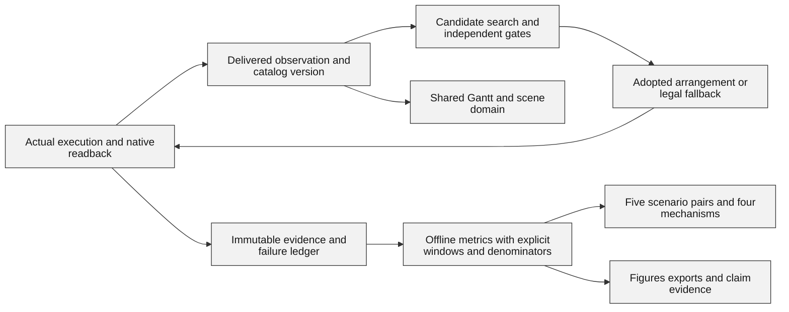

# P07 feedback architecture

```mermaid
%%{init: {"theme":"base","htmlLabels":false,"themeVariables":{"primaryColor":"#f2f2f2","primaryTextColor":"#171717","primaryBorderColor":"#333333","lineColor":"#333333"}}}%%
flowchart LR
  A[Actual execution and native readback] --> B[Delivered observation and catalog version]
  B --> C[Candidate search and independent gates]
  C --> D[Adopted arrangement or legal fallback]
  D --> A
  B --> E[Shared Gantt and scene domain]
  A --> F[Immutable evidence and failure ledger]
  F --> G[Offline metrics with explicit windows and denominators]
  G --> H[Five scenario pairs and four mechanisms]
  G --> I[Figures exports and claim evidence]
```

This is an explanatory architecture. It does not claim current performance targets,
unseen changes, whole-Kit equivalence, or a new production execution.
